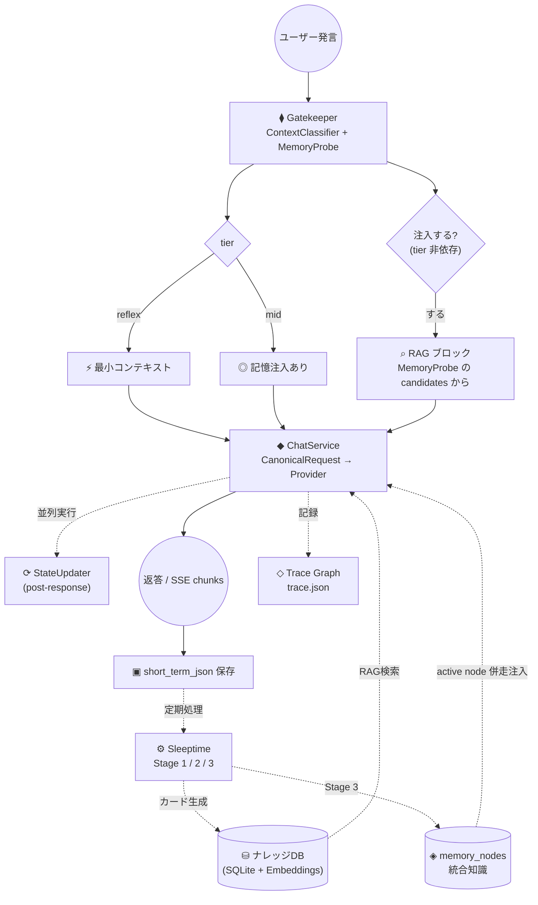

# Butly 🤵

🌐 **日本語** | [English](README.md)

> ⚠️ 本プロジェクトは現在開発中です。

**Butly** は多層的な記憶システムを持つパーソナル AI アシスタント基盤です。
過去の会話を記憶し、時間とともにナレッジを蓄積し、
現在のメッセージだけでなく蓄積されたコンテキストに基づいて応答を適応させます。

**マルチプロバイダー対応**（Google Gemini / OpenAI / xAI / Ollama / 任意の OpenAI 互換 API）、
**複数 AI インスタンス**（ペルソナ）管理、会話履歴からの **RAG ベース知識検索**、
リアルタイム描画のための **SSE ストリーミング**、
応答生成の内部フローを可視化する **Trace Graph** を備えています。

---

## 主な機能

### 記憶システム

Butly は複数の記憶レイヤーを連携させて動作します。

| レイヤー | 実体 | 説明 |
|---|---|---|
| **短期記憶** | `short_term_json/` | 直近の会話ターン（JSON）。既定 6 ターンを履歴として渡す |
| **会話圧縮ログ** | `session_digests/` | 溢れた会話のローリング要約（相対時刻ヘッダー付き） |
| **中期記憶 RAW** | `raw_memory_cache.txt` | `2_knowledgeized/` の会話原文を新しい順に `max_raw_tokens`（既定 4096）まで詰め直したキャッシュ。Sleeptime が再生成 |
| **中期ダイジェスト** | `mid_term_digest.txt` | エピソード付き事実ダイジェスト（日次更新） |
| **近況スナップショット** | `recent_snapshot.txt` | AI から見た近況・関係性の認識（既定 7 日ごとに更新） |
| **ナレッジカード** | `butly_memory.db` | ベクトル埋め込み付きで SQLite に保存された蒸留知識（RAG 検索用） |
| **統合知識ノード** | `memory_nodes` テーブル | Stage 3 がカード群から蒸留する「現在解釈」。opt-in |
| **Glossary / Lorebook** | `glossary.yaml` | インスタンス別の用語・別名辞書。毎ターン走査されて意味記憶として注入 |
| **根幹記憶** | `Key_Memory.txt` | ユーザーとペルソナに関する永続的な核心情報 |

詳細は [記憶ライフサイクル](docs/reference/memory_lifecycle.ja.md)。

### Gatekeeper（メタ認知エンジン）

応答生成の前に、Gatekeeper がユーザーメッセージを分類し、どの程度の記憶コンテキストを注入するかを判断します。

- **reflex** — 最小コンテキストで十分な軽い応答
- **mid** — 記憶注入が有効な会話

tier 閾値（`tier_rc_threshold` / `tier_cn_threshold`）はインスタンス単位で設定可能です。

RAG 注入は **tier とは独立** で、**検索の実行**と**プロンプトへの注入**が分離されています。

- **検索の実行**（`memory_probe.retrieval_execution`、既定 `always`）:
  分類器の意図に関わらず毎ターン検索する。
- **注入の判定**（`memory_probe.injection_policy`、既定 `intent_gated`）:
  ContextClassifier が出す `need_intent`（`past_fact` / `glossary` / `relationship` / `null`）と
  **MemoryProbe** の事実裏付け（ベクトル検索 / 用語集マッチ / 条件付き deep search）の
  両方が成立した時のみ RAG ブロックを注入する。

Glossary scan は regex のみ・~ms オーダーなので、`need_intent` に関わらず毎ターン実行されます。
また **SessionState**（トピック、ムード、ターン数）はセッション全体で永続化されます。

詳細は [Gatekeeper 入出力仕様](docs/reference/gatekeeper_io_summary.ja.md)。

### Sleeptime（記憶の定期整理）

生の会話ログを構造化されたナレッジに蒸留するバックグラウンドプロセスです。

| Stage | タイミング | 内容 |
|---|---|---|
| **Stage 1** | 日次 | short_term_json を `1_integrated/` へ flush、`raw_memory_cache.txt` 再生成、日次ダイジェスト生成、ヘッドライン更新、近況スナップショット（7 日間隔）、Key Memory 提案（既定 OFF） |
| **Stage 2** | 日次 | `1_integrated/` の RAW からナレッジカードを生成し、埋め込み付きで DB へ登録。完了分は `2_knowledgeized/` へ移動 |
| **Stage 3** | 日次（既定 OFF） | Knowledge Maturation。カード群から統合知識ノードを蒸留し、confidence / status を更新 |

各 Stage はインスタンス `config.json` の `sleeptime.update_targets`
（`digest` / `recent_snapshot` / `raw_memory_cache` / `knowledge_cards` /
`knowledge_maturation` / `key_memory`）で個別に無効化できます。

一日の会話がひと段落したタイミングで手動実行、または Web UI から実行できます。
Stage 3 は `memory.knowledge_maturation_enabled` と
`sleeptime.update_targets.knowledge_maturation` の両方を有効にした場合のみ走ります。

### 統合知識ノード（Stage 3 / Knowledge Maturation・opt-in）

Stage 1/2 がエピソードを「溜める」層なのに対し、Stage 3 はカード群から
**現在解釈（`memory_nodes`）を蒸留**する層です。

- content hash 式のレビューキューで、本文が変わったカードは自動で再キューされる
- node / source 更新・run counters・カード版 stamp を **単一 SQLite transaction** で確定
- confidence の staleness 減衰と、Key Memory 昇格候補の提案出力（`memory_node_proposals.json`）
- 有効時は RAG でヒットしたカードに紐づく `status='active'` node を最大 5 件併走注入

### マルチインスタンス

複数の AI ペルソナを作成・切り替え可能。それぞれ独自の性格、記憶、会話履歴、DB を持ちます。

### マルチプロバイダー LLM

ロールごとにプロバイダーを混在可能 — 例: チャットは OpenAI、埋め込みは Gemini、Gatekeeper は Ollama。

| プロバイダー | built-in connection | APIキー |
|---|---|---|
| **Gemini** | `google` | `GEMINI_API_KEY` / `GOOGLE_API_KEY` |
| **OpenAI** | `openai` | `OPENAI_API_KEY`（`OPENAI_BASE_URL` で proxy 可） |
| **xAI (Grok)** | `xai` | `XAI_API_KEY` |
| **Ollama** | `ollama` | 不要（ローカル実行） |

Groq / Together / DeepInfra / OpenRouter / NanoGPT のような **OpenAI 互換 provider は
`user_config.json` の `LLM_CONNECTIONS` にエントリを足すだけ**で使えます（Provider クラスの追加は不要）。

**Canonical Request と Capability 解決**

Core / 評価コードは provider 固有のパラメータ名を直接選びません。

- `butly_core/llm/canonical.py` — provider 非依存の `CanonicalRequest`。
  chat / summary / classify / stream はこの経路を通る。
- `butly_core/llm/capabilities.py` — connection + model 単位で
  `token_limit_parameter`（`max_tokens` / `max_completion_tokens` / `max_output_tokens`）、
  `supports_reasoning`、`reasoning_efforts`、`temperature_supported`、
  `structured_outputs_supported` を解決する。
  provider metadata → 観測キャッシュ → `LLM_CAPABILITY_OVERRIDES` の順で上書きされ、
  **モデル名の prefix では判定しない**。

詳細は [LLM Connection / APIキー管理](docs/reference/llm_connections.ja.md)。

### RAG 検索（ButlyBrain）

ベクトルコサイン類似度に時間減衰スコアリングを掛けた検索を基本とし、
クロスインスタンス DB 検索にも対応します。各レイヤーの診断情報は
chat の debug ログと Trace に記録されます。

`brain.search_mode` で検索方式を切り替えられます（既定は `vector`）。

| モード | 内容 |
|---|---|
| `vector` | ベクトル単独（既定） |
| `hybrid` | BM25（FTS5/trigram）とベクトル候補を RRF 融合 |
| `dual_query` | 元発話と Gatekeeper の自己完結検索文を各 15 件検索し、RRF で融合 |
| `hybrid_evidence_fusion` | hybrid 候補を Episode / RAW 本文で再評価し、hybrid 順位と重み付き融合 |

`vector` 以外は評価で効果を確認してから昇格させる方針です。
オプションで Cross-Encoder / LLM による reranker（`butly_core/core/reranker.py`）も使えます
（`requirements-reranker.txt`。fail-open で、失敗時は元のベクトル順位に戻る）。

RAG 注入ソースは `memory.rag_source_mode` で切り替えます:
`cards`（既定・カードのみ） / `raw`（当時の会話原文のみ） / `both`。

### Trace Graph

1 回の応答生成を「ノード + エッジ」のグラフとして `trace.json` に保存し、
どこがスキップ・分岐・フォールバック・失敗したかを可視化します。
デスクトップ UI では Mermaid フローチャートとして描画されます。
`SYSTEM_CONFIG["trace"]` の `enabled` / `detail` / `hidden_nodes` で制御します。

### ストリーミング応答 (SSE)

正式デスクトップ UI は typed `POST /api/v1/chat/stream` を使い、
`metadata` → `chunk` → `done`（失敗時は `error`）を逐次処理します。
生成停止、冪等な再送、引用元、画像添付、接続復旧、Gatekeeper / RAG の安全な診断要約に対応します。
legacy `POST /chat/stream` は Streamlit 互換のため移行中も維持します。

### 正式デスクトップ UI（開発中）

正式 frontend は Tauri v2 + React + TypeScript で、FastAPI sidecar と
OpenAPI 生成クライアントだけを通じて通信します。現在の Chat vertical slice では、
インスタンス選択、会話履歴、SSE chat、停止・再送、Markdown レンダリング、画像貼り付け、
引用元、Trace Graph、Connection / Embedding preflight、日本語 / 英語 UI を利用できます。

Streamlit は移行中の管理・評価 UI として残します。LoCoMo、日本語対話 A/B、
検索方式比較などの評価画面はデスクトップ UI へ移さず、引き続き Streamlit で実行します。

### 外部チャット連携

Discord bot と LINE Messaging API webhook から同じ記憶・同じインスタンスへ接続できます。
`ButlyRuntime` を直接呼ぶため、HTTP ルータを import せずに応答を得られます。
話者の同定は `persons.json` の PersonRegistry と外部アカウントのペアリングで行います。

- [Discord 連携セットアップ](docs/guides/discord_integration_setup.ja.md)
- [LINE 連携セットアップ](docs/guides/line_integration_setup.ja.md)

### Web 検索

- **Gemini モデル使用時**: Google Search Grounding（組み込み）
- **その他のプロバイダー**: Tavily API または Ollama Cloud Web Search（`OLLAMA_WEB_SEARCH_API_KEY`）

### 評価基盤

記憶と検索の変更を数値で検証するための評価コードを `evals/` に隔離しています
（採点形式に本体実装を寄せないため、評価専用の細工は `evals/` の外に出しません）。

| ツール | 内容 |
|---|---|
| **LoCoMo 評価** | 公式 JSON の固定会話を隔離 workspace へ Replay → Sleeptime → QA → 採点。checkpoint 付きで中断・再開可能 |
| **offline retrieval replay** | 回答を生成せず、検索方式ごとの Recall@k だけを比較する |
| **日本語対話 A/B** | 実記憶を使った本番相当の対話で注入ポリシーを比較 |
| **Semantic Judge** | 公式スコアを変更しない任意の意味判定。厳格 JSON・prompt injection 耐性・fingerprint 再開 |

Streamlit の Evaluation 画面から実行・停止・履歴比較ができます。
詳細は [LoCoMo Evaluation Web Console](docs/reference/evaluation_web_console.ja.md) と
[LoCoMo 評価のデータ保存・QA 実行フロー](docs/reference/locomo_evaluation_flow.ja.md)。

### 設定レイヤー

設定は pydantic-settings ベースの `butly_core/settings/` に集約中です。

```
settings/defaults.py            ← AI_CONFIG / SYSTEM_CONFIG の既定値
        ↓ recursive merge
<data_dir>/user_config.json     ← AI_CONFIG / SYSTEM_CONFIG / LLM_CONNECTIONS
        ↓                          / LLM_CAPABILITY_OVERRIDES
get_settings() → RootSettings（typed・キャッシュ付き）
        ↓ apply_runtime_settings(data_dir)
butly_core.config.AI_CONFIG / SYSTEM_CONFIG（互換シム・in-place 更新）
+ ConnectionRegistry + Capability runtime
        ↓
インスタンス config.json → リクエスト単位 override
```

新規コードは `butly_core.settings.get_settings()` を使い、
テストでの差し替えは `override_settings()` / `clear_settings_cache()` を使います。
`butly_core.config` の legacy global は移行が終わるまでの互換シムです。

> `RootSettings` は `BUTLY_*` 環境変数を宣言していますが、設定値は init kwargs として
> 渡されるため **env による上書きは現状効きません**。設定変更は `user_config.json` か
> インスタンス `config.json` で行ってください。APIキーだけは `.env` から
> `os.environ` へ別経路で読み込まれます。

> 補足: legacy Streamlit の設定画面が書く `system_config.json` はこのチェーンとは別系統で、
> `routers/settings.py` が直接読み書きします。

詳細は [設定レイヤー](docs/reference/configuration.ja.md)。

---

## クイックスタート

### 1. クローン

```bash
git clone https://github.com/unagisann/Butly.git
cd Butly
```

### 2. 依存パッケージのインストール

**Linux / macOS:**

```bash
python -m venv venv
source venv/bin/activate
pip install -r requirements.txt
```

**Windows:**
`01_setup_requirements.bat` をダブルクリック — `.venv` の作成と依存パッケージのインストールが自動で行われます。

任意の追加依存:

| ファイル | 用途 |
|---|---|
| `requirements-dev.txt` | pytest / flake8（push 前チェック用） |
| `requirements-reranker.txt` | ローカル Cross-Encoder reranker（CPU ビルドの torch） |
| `requirements-discord.txt` | Discord adapter |
| `requirements-line.txt` | LINE webhook |

### 3. APIキーの設定

**Linux / macOS:**

```bash
cp .env.example .env
```

**Windows:** バッチファイル実行時に自動で処理されます。

`.env` に使用するプロバイダーのキーを設定します。

```env
# Google Gemini（デフォルト）
GOOGLE_API_KEY=AIza...

# OpenAI
OPENAI_API_KEY=sk-...

# xAI (Grok)
XAI_API_KEY=xai-...

# Web 検索（非 Gemini 時）
TAVILY_API_KEY=tvly-...
OLLAMA_WEB_SEARCH_API_KEY=...

# Ollama — キー不要（ローカル実行）
```

APIキーは Web UI の **⚙️ → LLMプロバイダー** タブからも保存できます。

### 4. 設定ファイルの準備

**Linux / macOS:**

```bash
cp user_config.json.example user_config.json
```

**Windows:** バッチファイル実行時に自動で処理されます。

`user_config.json` でモデル、パラメータ、エージェント名、ユーザー定義 Connection、
Capability の manual override をカスタマイズできます。

> **注意**: プロバイダーを切り替えると Embedding の次元が変わり、RAG 検索精度が低下します。
> 以下のコマンドで埋め込みを再生成してください。
> ```bash
> python migrate_embeddings.py --all
> ```

### 5. 起動

**正式デスクトップ UI（開発モード）:**

```bash
# ターミナル 1: versioned API
venv/bin/python -m butly_api.server --dev-cors --port 8000

# ターミナル 2: Tauri + React
cd frontend
pnpm install --frozen-lockfile
BUTLY_DEV_BACKEND_PORT=8000 pnpm tauri dev
```

Windows PowerShell では最後の行を
`$env:BUTLY_DEV_BACKEND_PORT="8000"; pnpm tauri dev` とします。

**正式デスクトップ UI（Tauri なしで browser 確認）:**

Tauri（WebKitGTK / WebView2）を使わず、UI だけをブラウザで確認する開発モードです。
Raspberry Pi のような headless 環境でも使えます。

```bash
# ターミナル 1: versioned API（8000 は legacy Streamlit が使うので別 port）
venv/bin/python -m butly_api.server --port 8010

# ターミナル 2: Vite dev server（http://127.0.0.1:1420 を開く）
cd frontend
BUTLY_DEV_BACKEND_URL=http://127.0.0.1:8010 pnpm dev
```

起動モードの使い分け、SSH port forward、制約は
[デスクトップ UI の起動手順](docs/guides/desktop_dev_setup.ja.md)、
sidecar と installer の詳細は
[Desktop sidecar 仕様](docs/reference/desktop_sidecar.ja.md)を参照してください。

**legacy Streamlit（評価・未移行の設定画面）:**

**Linux / macOS:**

```bash
# バックエンド（FastAPI）
uvicorn main:app --port 8000 --reload

# フロントエンド（Streamlit）— 別ターミナルで
streamlit run app.py
```

ブラウザで `http://localhost:8501` を開きます。

**Windows:**
`02_start_webui.bat` をダブルクリック — 両サーバーが起動しブラウザが自動で開きます。

---

## 初回起動後の設定

### ① 言語設定

**⚙️**（右上）→ **基本設定** → 言語を選択 → **💾 保存**

### ② LLM / APIキー設定

**⚙️** → **LLMプロバイダー** タブ:

1. APIキーを入力 → **💾 保存**（秘密値は再表示されません）
2. 各ロール（Chat / Summary / Knowledge / Gatekeeper / Embedding）に
   **Connection → モデル** の順で割り当て
   - プリセットから選択、または **「✏️ カスタム入力...」** で任意のモデル ID を入力
3. **💾 モデル設定を保存**

### ③ AIインスタンスの作成

1. ホーム画面の **➕ 新しいインスタンスを作成** を展開
2. **インスタンス名**（半角英数字・`_`）を入力
3. **性格テンプレート** を選択（Butly / Creator / Analyst / Friendly / Caring / カスタム）
4. **AIの名前** を入力（必須）
5. **作成** をクリック → AI名をクリックしてチャット開始

---

## アーキテクチャ



図の一覧は [アーキテクチャ図集](docs/reference/DIAGRAMS.ja.md)。

### 設計原則

| 原則 | 説明 |
|------|------|
| **状態中心** | 発話に反応するのではなく、会話ごとに内部状態を更新する |
| **不足前提中心** | 似ている記憶ではなく、今の判断に必要な前提を探す |
| **統合記憶中心** | 生エピソードだけでなく、反省・要約・一般化を別層で持つ |
| **メタ認知中心** | ルール決め打ちではなく、AI 自身に「何を知る必要があるか」を考えさせる |

---

## デフォルトモデル（Gemini）

| ロール | モデル | 用途 | 頻度 |
|--------|-------|------|------|
| Chat | `gemini-3.5-flash` | 応答生成 | 1回/ターン |
| Gatekeeper | `gemini-3.1-flash-lite` | tier 判定・メタ認知 | 1回/ターン |
| Summary | `gemini-3.1-flash-lite` | ダイジェスト・関係性・会話圧縮ログ | 日次バッチ + 溢れ時 |
| Knowledge | `gemini-3.1-pro-preview` | ナレッジカード生成・Stage 3 | 日次バッチ |
| Embedding | `gemini-embedding-2` | ベクトル検索 | カード生成時 |

すべて `user_config.json` の `AI_CONFIG` で変更可能（ロールごとに Connection を混在可）。

---

## 技術スタック

- **LLM**: Google Gemini / OpenAI / xAI (Grok) / Ollama / 任意の OpenAI 互換 API
- **バックエンド**: FastAPI + Uvicorn（typed `/api/v1` REST + POST SSE）
- **設定**: pydantic-settings（`butly_core/settings/`）
- **正式フロントエンド**: Tauri v2 + React + TypeScript + Vite
- **legacy / 評価 UI**: Streamlit
- **DB**: SQLite（ベクトル検索: コサイン類似度 + NumPy、BM25: FTS5/trigram）
- **Web検索**: Tavily API / Ollama Cloud Web Search / Google Search Grounding

---

## 開発

push 前チェックの唯一の正は `./scripts/check_before_push.sh` です
（compileall → flake8 fatal → pytest → `pip check` → frontend lint/typecheck/test/build）。

```bash
# 単体テストだけ
venv/bin/python -m pytest -m "not integration"

# push 前フルチェック
./scripts/check_before_push.sh
```

`-m integration` は実 API を叩くため、通常は回しません。
コーディング規約は [コーディング規約](docs/reference/coding_conventions.ja.md)。

---

## ドキュメント

- [ドキュメント一覧](docs/README.ja.md)

**セットアップ**
- [デスクトップ UI の起動手順](docs/guides/desktop_dev_setup.ja.md)
- [Discord 連携セットアップ](docs/guides/discord_integration_setup.ja.md)
- [LINE 連携セットアップ](docs/guides/line_integration_setup.ja.md)

**アーキテクチャ・仕様**
- [アーキテクチャ図集](docs/reference/DIAGRAMS.ja.md)
- [ファイル構成](docs/reference/FILE_STRUCTURE.ja.md)
- [設定レイヤー](docs/reference/configuration.ja.md)
- [記憶ライフサイクル](docs/reference/memory_lifecycle.ja.md)
- [Gatekeeper 入出力仕様](docs/reference/gatekeeper_io_summary.ja.md)
- [context_levels 仕様](docs/reference/context_levels.ja.md)
- [LLM Connection / APIキー管理](docs/reference/llm_connections.ja.md)
- [Desktop sidecar 仕様](docs/reference/desktop_sidecar.ja.md)
- [正式 Chat フロントエンド仕様](docs/reference/frontend_chat.ja.md)
- [コーディング規約](docs/reference/coding_conventions.ja.md)

**評価**
- [LoCoMo Evaluation Web Console](docs/reference/evaluation_web_console.ja.md)
- [LoCoMo 評価のデータ保存・QA 実行フロー](docs/reference/locomo_evaluation_flow.ja.md)
- [RAG 評価・改善レポート](docs/history/rag_evaluation_report.ja.md)

---

## ライセンス

MIT License
