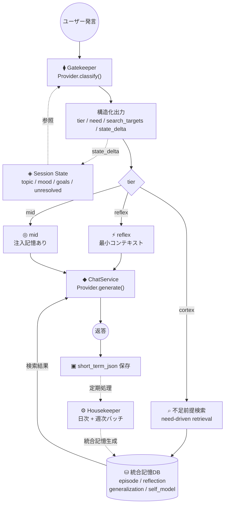
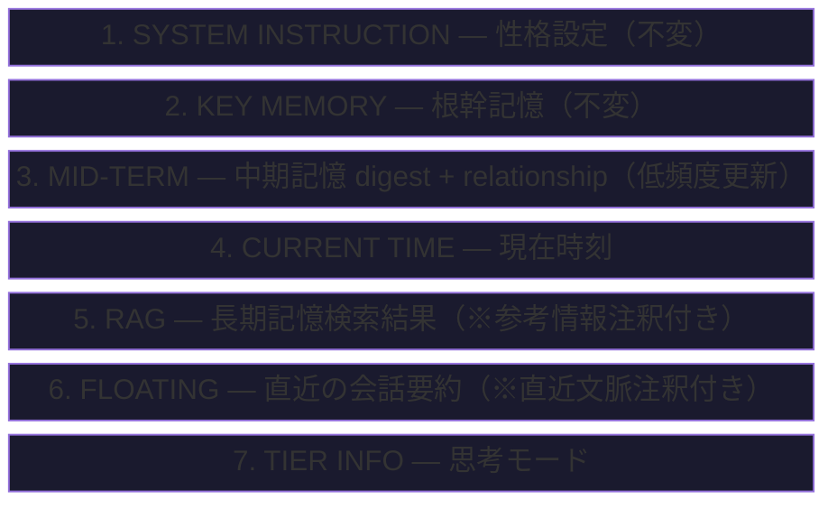
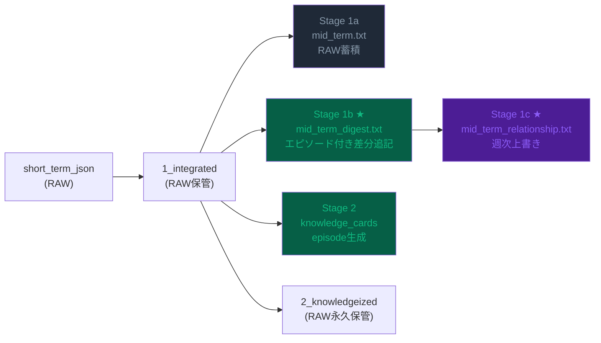
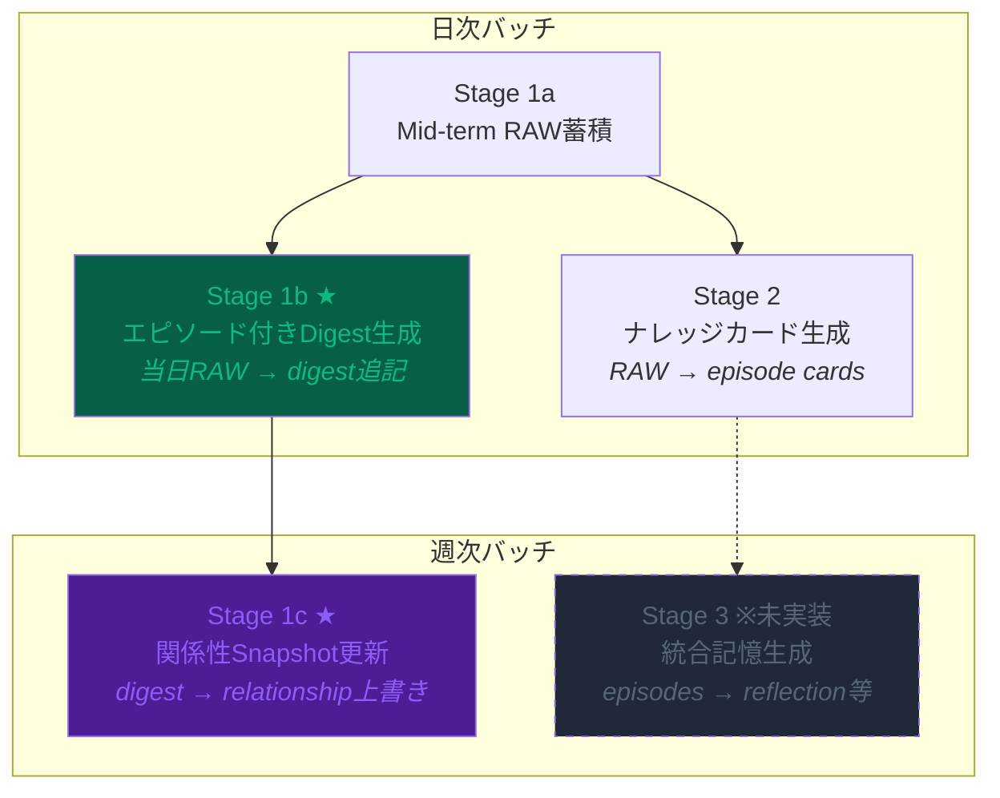
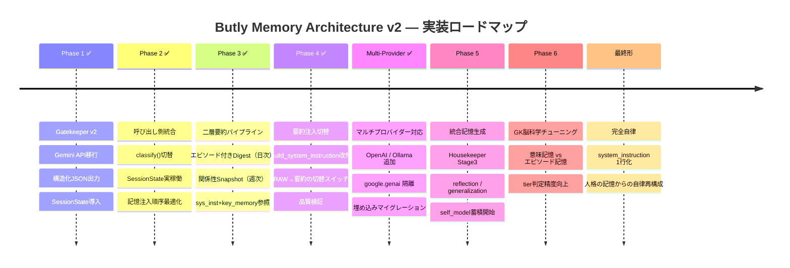

# Butly 🤵
⚠ This project is currently under active development. / 本プロジェクトは開発中です。

🌐 **日本語** | [English](README.md)

**多層的記憶システムを持つパーソナルAIアシスタント**プラットフォームです。
**マルチプロバイダー対応**（Google Gemini / OpenAI / Ollama）で、
複数のAIインスタンス（ペルソナ）を管理でき、過去の会話から知識を蓄積・検索（RAG）する機能を備えています。

---

## 特徴

- 🧠 **多層記憶システム** — 短期・浮動要約・中期（二層要約）・長期(RAG)・根幹記憶
- 🎭 **マルチインスタンス** — 複数のAIペルソナを作成・切り替え
- 🔍 **RAG検索** — Embedding + コサイン類似度による知識検索
- 🧹 **Housekeeper** — 記憶の自動整理・ナレッジ化・エピソード付きダイジェスト生成
- 🧬 **Gatekeeper** — メタ認知エンジンによるtier判定と不足前提分析
- 📊 **SessionState** — セッション全体の内部状態を追跡・永続化

---

## セットアップ

### 1. リポジトリのクローン

```bash
git clone https://github.com/unagisann/Butly.git
cd Butly
```

### 2. 環境構築

**Linux / macOS:**

```bash
python -m venv venv
source venv/bin/activate
pip install -r requirements.txt
```

**Windows（バッチファイルで自動化）:**  
`01_setup_requirements.bat` をダブルクリックして実行してください。  
仮想環境 `.venv` の作成・依存パッケージのインストールが自動で行われます。

### 3. APIキーの設定

**Linux / macOS:**

```bash
cp .env.example .env
```

**Windows:** バッチファイル実行時に自動でコピーされます。

使用するプロバイダーに応じて必要なキーを設定します：

```env
# Google Gemini（デフォルト）
GOOGLE_API_KEY=AIza...

# OpenAI を使う場合
OPENAI_API_KEY=sk-...

# Ollama はローカル実行のためキー不要
# OLLAMA_BASE_URL=http://localhost:11434/v1  （デフォルト）
```

### 4. 設定ファイルの準備

**Linux / macOS:**

```bash
cp user_config.json.example user_config.json
```

**Windows:** バッチファイル実行時に自動でコピーされます。

`user_config.json` でAIモデル名やパラメータ、エージェント名を自由にカスタマイズできます。  
`user_config.json.example` に Gemini / OpenAI / Ollama の設定例が含まれています。

> **注意**: プロバイダーを切り替えた場合、Embedding の次元が異なるため
> RAG 検索の精度が低下します。以下のコマンドで埋め込みを再生成してください：
> ```bash
> python migrate_embeddings.py --all
> ```

### 5. 起動

**Linux / macOS — バックエンド（FastAPI）を起動：**

```bash
uvicorn main:app --port 8000 --reload
```

**Linux / macOS — フロントエンド（Streamlit）を起動：**

```bash
streamlit run app.py
```

ブラウザで `http://localhost:8501` を開きます。

**Windows（バッチファイルで自動起動）:**  
`02_start_webui.bat` をダブルクリックして実行してください。  
FastAPI と Streamlit が別ウィンドウで自動起動し、ブラウザが自動で `http://127.0.0.1:8501` を開きます。

### 使用モデル（デフォルト: Gemini）

| 役割 | デフォルトモデル | 用途 | 呼び出し頻度 |
|------|-------|------|-------------|
| Gatekeeper | gemini-3.1-flash-lite-preview | tier判定・メタ認知 | 1回/ターン |
| Brain (Chat) | gemini-3-flash-preview | 最終応答生成 | 1回/ターン |
| Summary/Digest | gemini-3.1-flash-lite-preview | 要約・digest・relationship | 日次バッチ |
| Knowledge | gemini-3.1-pro-preview | ナレッジカード生成 | 日次バッチ |
| Embedding | gemini-embedding-001 | ベクトル検索 | カード生成時 |
| Floating要約 | gemini-3.1-flash-lite-preview | 短期記憶の溢れ圧縮 | リアルタイム |

#### 対応プロバイダー

`user_config.json` の `model_name` プレフィックスでプロバイダーが自動判定されます:

| プロバイダー | model_name プレフィックス | 必要な環境変数 | 例 |
|---|---|---|---|
| **Gemini** | `gemini-*` / `models/gemini-*` | `GOOGLE_API_KEY` | `gemini-3-flash-preview` |
| **OpenAI** | `gpt-*` / `o1` / `o3` / `o4` | `OPENAI_API_KEY` | `gpt-4o`, `gpt-4o-mini` |
| **Ollama** | `ollama/*` | （不要・ローカル実行） | `ollama/llama3.1:8b` |

各ロールで異なるプロバイダーを混在させることも可能です（例: chat=OpenAI, embedding=Gemini）。

---

### 6. 初回起動後の設定

ブラウザで `http://localhost:8501` が開いたら、以下の順で設定してください。

#### ① 言語設定

1. 画面右上の **⚙️** → **基本設定** タブ
2. **Language / 言語** で `日本語` または `English` を選択し **💾 言語設定を保存** をクリック

#### ② LLM / APIキー設定

1. **⚙️ → LLMプロバイダー** タブを開く
2. **APIキー設定** に使用するプロバイダーのキーを入力して **💾 保存**
3. **モデル割り当て** で Chat / Summary / Gatekeeper / Embedding の各ロールにモデルを選択
4. **💾 モデル設定を保存** をクリック

> Ollama はローカル実行のためAPIキー不要。**Ollama (ローカルLLM)** セクションで接続URLを確認してください。

#### ③ 最初のAIインスタンスを作成

1. ホーム画面の **➕ 新しいインスタンスを作成** を展開
2. **インスタンス名**（半角英数字・_）を入力 — 例: `my_agent`
3. **性格テンプレート** を選択:

   | テンプレート | 特徴 |
   |---|---|
   | Butly | 知的で協働的なパートナー（デフォルト） |
   | Creator | 創造的・発散的思考 |
   | Analyst | 論理・分析重視 |
   | Friendly | カジュアルで親しみやすい |
   | Caring | 共感・寄り添い型 |
   | カスタム | 自由入力 |

4. **AIの名前** を入力（例: `Jarvis`）— **必須**
5. **あなたの名前** と **呼ばれたい名前** を入力（任意）
6. **作成** をクリック → インスタンス一覧にAIが表示されたら完了
7. AIの名前をクリックしてチャット開始！

---

## Housekeeper（記憶の定期整理）

短期記憶をナレッジDB（SQLite）へ変換し、エピソード付きダイジェストを生成する定期処理です。

```bash
python housekeeper.py
```

または Web UI の「🧹 記憶の整理」ボタンから実行できます。

> **推奨**: 一日の終わりなど会話がひと段落した後に実行をお願いします。

---

## アーキテクチャ



### 設計原則

| # | 原則 | 説明 |
|---|------|------|
| 1 | **状態中心** | 発話に反応するのではなく、会話ごとに内部状態を更新する |
| 2 | **不足前提中心** | 似ている記憶を探すのではなく、今の判断に必要な前提が何かを探す |
| 3 | **統合記憶中心** | 生エピソードだけでなく、反省・要約・一般化・自己理解を別層で持つ |
| 4 | **メタ認知中心** | ルール決め打ちではなく、AI自身に「何を知る必要があるか」を考えさせる |

---

## 記憶システム

### system_instruction 注入順序

LLMに渡すコンテキストは以下の順序で構築されます（上部が不変、下部が可変）:



### Mid-term 二層要約構造

mid_term.txt（RAW会話ログ）は既存パイプラインで蓄積を維持しつつ、別ファイルとして二層の要約を生成します。



| ファイル | 更新頻度 | 内容 | 上限 |
|---------|---------|------|------|
| `mid_term.txt` | 日次（追記） | RAW会話ログ（既存・不変） | 30,000文字 |
| `mid_term_digest.txt` | 日次（差分追記） | エピソード付き事実ダイジェスト | 8,000文字 |
| `mid_term_relationship.txt` | 週次（上書き） | 関係性スナップショット | ~1,500文字 |
| `archive_digest.txt` | 随時 | digestから溢れた古い要約 | 無制限 |

### Housekeeper ステージ構成



---

## ロードマップ



---

## ファイル構成

```
butly_core/
├── config.py          ← AI/システム設定のデフォルト値
├── prompts.py         ← プロンプトローダー
├── prompts/           ← プロンプト管理
│   ├── locales/ja/templates/  ← 日本語性格テンプレート
│   └── locales/en/templates/  ← 英語性格テンプレート
├── chat/
│   ├── service.py     ← チャットオーケストレーション（ChatService）
│   └── types.py       ← DTO（ChatRequest / ChatResponse / Attachment）
├── llm/
│   ├── base.py        ← プロバイダー抽象基底クラス（BaseProvider）
│   ├── factory.py     ← モデル名→プロバイダー自動ルーティング
│   └── providers/
│       ├── gemini.py   ← Google Gemini（検索リトライ、キャッシュ）
│       ├── openai.py   ← OpenAI（GPT-4o 等、Vision 対応）
│       └── ollama.py   ← Ollama（ローカル LLM、OpenAI 互換 API）
└── core/
    ├── brain.py       ← RAG検索エンジン（キーワード抽出 + ベクトルリランキング）
    ├── memory.py      ← 記憶の読み書き管理
    ├── database.py    ← SQLite操作（知識カード）
    ├── gatekeeper/         ← Gatekeeper（メタ認知エンジン）
    │   ├── tier_classifier.py  ← tier判定・スコアリング
    │   ├── search_planner.py   ← 不足前提の検索計画
    │   ├── session_state.py    ← SessionState 定義
    │   ├── state_updater.py    ← state_delta 適用
    │   └── memory_builder.py   ← MemoryBlock 構築
    ├── instance_manager.py ← インスタンスの作成・管理
    ├── chronos.py     ← 時刻コンテキスト生成
    └── fire_tv.py     ← Fire TV 連携（ADB over TCP）

butly_core/instances/{instance_name}/
├── config.json                ← インスタンス固有設定
├── system_instruction.txt     ← 性格設定（system prompt）
├── Key_Memory.txt             ← 根幹記憶（不変の事実）
├── mid_term.txt               ← 中期記憶（RAW累積テキスト）
├── mid_term_digest.txt        ← エピソード付き事実ダイジェスト（日次差分追記）
├── mid_term_relationship.txt  ← 関係性スナップショット（週次上書き）
├── session_state.json         ← セッション状態（Gatekeeper用）
├── butly_memory.db            ← 長期記憶 SQLite DB
├── short_term_json/           ← 直近の会話ログ (JSON)
├── floating_summaries/        ← 浮動要約（一時的な要約）
└── memory_archive/
    ├── 1_integrated/          ← Housekeeper処理待ちログ
    ├── 2_knowledgeized/       ← ナレッジ化済みログ（RAW永久保管）
    └── 3_log/
        ├── archive_long_term.txt  ← mid_termから溢れた古いRAW
        └── archive_digest.txt     ← digestから溢れた古い要約
```

---

## ドキュメント

- [アーキテクチャ図集](docs/DIAGRAMS.ja.md)
- [Gatekeeper 入出力仕様](docs/gatekeeper_io_summary.ja.md)

---

## 設計メモ

### system_instructionに記憶を全注入する設計の課題

Gemini APIではsystem_instructionが「絶対的な前提」として扱われるため、RAG結果や古い記憶が直近の会話より優先されてしまうことがあります。対策として各セクションに注釈（「※参考情報。直近の会話と矛盾する場合は直近を優先」）を付与しています。将来的にはsystem_instructionをIdentity Core（不変層）のみに絞る設計を検討中です。

### digestにエピソード感情を含める理由

無味乾燥な事実要約は「確定した事実」としてLLMに固定的に扱われるリスクがあります。AIの所感を添えることで「主観的な記憶」というニュアンスが付与され、LLMが柔軟に（誤りの修正余地を持って）扱えます。

### 関係性snapshotを週次にする理由

関係性は本来ゆっくり変化するものです。毎日書き換えると不安定になり、むしろ不自然。Key Memoryが「不変の核」、snapshotが「緩やかに変化するステータス」という役割分担です。

### Gatekeeperの将来方向

現在は「認知負荷の大きさ」で tier を分類していますが、本来は「エピソード記憶へのアクセス要否」で分類すべきと考えています。LLMは一般知識（意味記憶）を既に持つため、cortexが必要なのは「ユーザーとAIの間でしか存在しない情報」の時だけです。

---

## 技術スタック

- **LLM**: Google Gemini (`google-genai`) / OpenAI (`openai`) / Ollama（ローカル）— マルチプロバイダー対応
- **バックエンド**: FastAPI + Uvicorn
- **フロントエンド**: Streamlit
- **DB**: SQLite（ベクトル検索: Cosine Similarity + Numpy）
- **Embedding**: プロバイダー依存（デフォルト: `gemini-embedding-001` / `text-embedding-3-small`）

---

## ライセンス

MIT License
