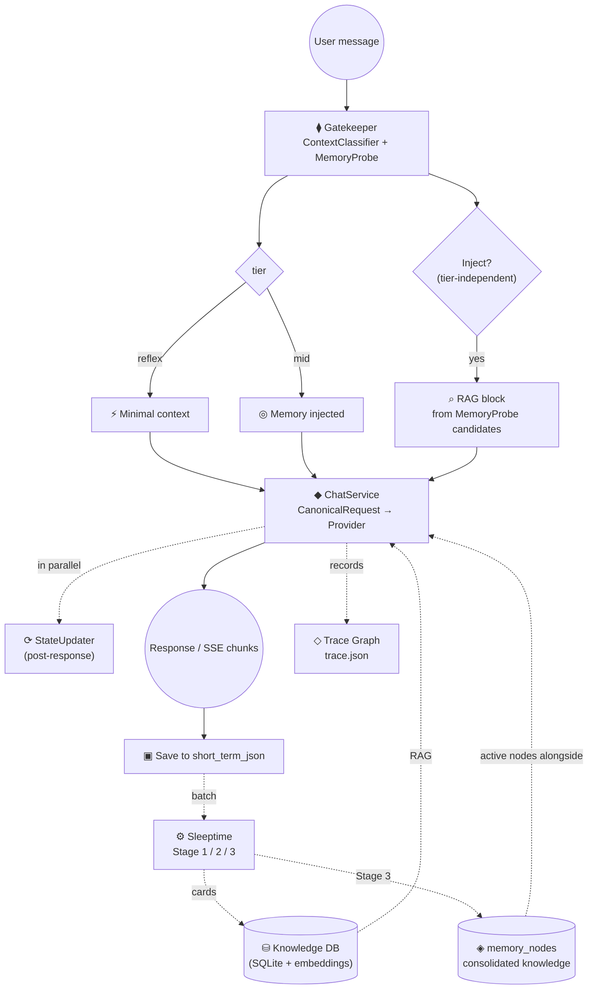

# Butly 🤵

[日本語](README.ja.md) | 🌐 **English**

> ⚠️ This project is under active development.

**Butly** is a personal AI assistant platform built around a layered memory system.
It remembers past conversations, accumulates knowledge over time, and adapts its
responses based on that accumulated context rather than the current message alone.

It supports **multiple providers** (Google Gemini / OpenAI / xAI / Ollama / any
OpenAI-compatible API), **multiple AI instances** (personas), **RAG-based knowledge
retrieval** over conversation history, **SSE streaming** for real-time rendering, and a
**Trace Graph** that visualizes the internal flow of each response.

---

## Features

### Memory System

Butly runs several memory layers in concert.

| Layer | Backing store | Description |
|---|---|---|
| **Short-term** | `short_term_json/` | Recent conversation turns (JSON). The last 6 turns are passed as history by default |
| **Session digests** | `session_digests/` | Rolling summaries of overflowed conversation, with relative-time headers |
| **Mid-term RAW** | `raw_memory_cache.txt` | Original conversation text from `2_knowledgeized/`, packed newest-first up to `max_raw_tokens` (default 4096). Rebuilt by Sleeptime |
| **Mid-term digest** | `mid_term_digest.txt` | Fact digest with episodes (updated daily) |
| **Recent snapshot** | `recent_snapshot.txt` | The AI's read on recent events and the relationship (refreshed every 7 days by default) |
| **Knowledge cards** | `butly_memory.db` | Distilled knowledge stored in SQLite with vector embeddings (for RAG) |
| **Memory nodes** | `memory_nodes` table | The "current interpretation" Stage 3 distills from cards. Opt-in |
| **Glossary / Lorebook** | `glossary.yaml` | Per-instance term and alias dictionary, scanned every turn and injected as semantic memory |
| **Key memory** | `Key_Memory.txt` | Durable core facts about the user and the persona |

See [Memory Lifecycle](docs/reference/memory_lifecycle.md) for details.

### Gatekeeper (metacognition engine)

Before generating a response, the Gatekeeper classifies the user message and decides
how much memory context to inject.

- **reflex** — light replies that need minimal context
- **mid** — conversations where memory injection helps

The tier thresholds (`tier_rc_threshold` / `tier_cn_threshold`) are configurable per instance.

RAG injection is **independent of tier**, and **running retrieval** is separated from
**injecting its results**.

- **Running retrieval** (`memory_probe.retrieval_execution`, default `always`):
  search every turn regardless of the classifier's intent.
- **Injection decision** (`memory_probe.injection_policy`, default `intent_gated`):
  the RAG block is injected only when both the `need_intent` emitted by the
  ContextClassifier (`past_fact` / `glossary` / `relationship` / `null`) and the factual
  backing from **MemoryProbe** (vector search / glossary match / conditional deep search)
  agree.

The glossary scan is regex-only and runs in milliseconds, so it executes every turn
regardless of `need_intent`. **SessionState** (topic, mood, turn count) persists across
the whole session.

See [Gatekeeper I/O Specification](docs/reference/gatekeeper_io_summary.md) for details.

### Sleeptime (periodic memory consolidation)

A background process that distills raw conversation logs into structured knowledge.

| Stage | Cadence | What it does |
|---|---|---|
| **Stage 1** | Daily | Flush `short_term_json` into `1_integrated/`, rebuild `raw_memory_cache.txt`, generate the daily digest, update headlines, refresh the recent snapshot (7-day interval), propose Key Memory updates (off by default) |
| **Stage 2** | Daily | Generate knowledge cards from the RAW in `1_integrated/` and store them with embeddings, then move processed files to `2_knowledgeized/` |
| **Stage 3** | Daily (off by default) | Knowledge Maturation. Distill memory nodes from cards and update confidence / status |

Each stage can be disabled individually through `sleeptime.update_targets` in the
instance `config.json` (`digest` / `recent_snapshot` / `raw_memory_cache` /
`knowledge_cards` / `knowledge_maturation` / `key_memory`).

Run it manually once the day's conversation has settled, or trigger it from the Web UI.
Stage 3 only runs when both `memory.knowledge_maturation_enabled` and
`sleeptime.update_targets.knowledge_maturation` are enabled.

### Memory Nodes (Stage 3 / Knowledge Maturation, opt-in)

Where Stages 1 and 2 *accumulate* episodes, Stage 3 distills a **current
interpretation** (`memory_nodes`) out of the accumulated cards.

- A content-hash review queue automatically re-queues any card whose body changed
- Node/source updates, run counters, and card-version stamps commit in a **single SQLite transaction**
- Staleness decay on confidence, plus promotion proposals for Key Memory (`memory_node_proposals.json`)
- When enabled, up to 5 `status='active'` nodes tied to RAG-hit cards are injected alongside them

### Multi-instance

Create and switch between multiple AI personas, each with its own personality, memory,
conversation history, and database.

### Multi-provider LLM

Providers can be mixed per role — for example chat on OpenAI, embeddings on Gemini, and
the Gatekeeper on Ollama.

| Provider | Built-in connection | API key |
|---|---|---|
| **Gemini** | `google` | `GEMINI_API_KEY` / `GOOGLE_API_KEY` |
| **OpenAI** | `openai` | `OPENAI_API_KEY` (proxy via `OPENAI_BASE_URL`) |
| **xAI (Grok)** | `xai` | `XAI_API_KEY` |
| **Ollama** | `ollama` | None (runs locally) |

OpenAI-compatible providers such as Groq, Together, DeepInfra, OpenRouter, and NanoGPT
work by **adding an entry to `LLM_CONNECTIONS` in `user_config.json`** — no new provider
class required.

**Canonical requests and capability resolution**

Core and evaluation code never picks provider-specific parameter names directly.

- `butly_core/llm/canonical.py` — a provider-agnostic `CanonicalRequest`.
  chat / summary / classify / stream all go through this path.
- `butly_core/llm/capabilities.py` — resolves, per connection + model,
  `token_limit_parameter` (`max_tokens` / `max_completion_tokens` / `max_output_tokens`),
  `supports_reasoning`, `reasoning_efforts`, `temperature_supported`, and
  `structured_outputs_supported`. Provider metadata, then an observed cache, then
  `LLM_CAPABILITY_OVERRIDES` — **never inferred from the model name prefix**.

See [LLM Connections and API-key management](docs/reference/llm_connections.md).

### RAG retrieval (ButlyBrain)

Retrieval is vector cosine similarity with time-decay scoring, and it can read across
instance databases. Per-layer diagnostics land in the chat debug log and the Trace.

`brain.search_mode` selects the retrieval strategy (default `vector`).

| Mode | Description |
|---|---|
| `vector` | Vector only (default) |
| `hybrid` | BM25 (FTS5/trigram) and vector candidates fused with RRF |
| `dual_query` | Retrieves 15 candidates each for the raw utterance and the Gatekeeper's self-contained query, then fuses with RRF |
| `hybrid_evidence_fusion` | Re-scores hybrid candidates against Episode / RAW text and fuses with the hybrid rank |

Anything other than `vector` is promoted only after evaluation confirms it helps.
An optional Cross-Encoder / LLM reranker (`butly_core/core/reranker.py`) is also available
(`requirements-reranker.txt`; it is fail-open and falls back to the original vector order).

The RAG injection source is controlled by `memory.rag_source_mode`:
`cards` (default, cards only) / `raw` (original conversation text only) / `both`.

### Trace Graph

Each response is recorded as a node-and-edge graph in `trace.json`, showing what was
skipped, branched, fell back, or failed. The desktop UI renders it as a Mermaid
flowchart. Control it via `enabled` / `detail` / `hidden_nodes` under `SYSTEM_CONFIG["trace"]`.

### Streaming responses (SSE)

The official desktop UI uses the typed `POST /api/v1/chat/stream` and processes
`metadata` → `chunk` → `done` (or `error` on failure). It supports cancellation,
idempotent retry, sources, image attachments, reconnection, and safe diagnostic
summaries for the Gatekeeper and RAG. The legacy `POST /chat/stream` stays for Streamlit
compatibility during the migration.

### Official desktop UI (in progress)

The official frontend is Tauri v2 + React + TypeScript and talks to the FastAPI sidecar
only through the OpenAPI-generated client. The current chat vertical slice covers
instance selection, conversation history, SSE chat, cancel/retry, Markdown rendering,
image paste, sources, the Trace Graph, connection/embedding preflight, and a Japanese /
English UI.

Streamlit remains as the admin and evaluation UI during the migration. Evaluation
screens — LoCoMo, the Japanese dialogue A/B, retrieval-mode comparison — are staying in
Streamlit rather than moving to the desktop UI.

### External chat integrations

A Discord bot and a LINE Messaging API webhook can reach the same memory and the same
instances. They call `ButlyRuntime` directly, so no HTTP router import is needed.
Speaker attribution uses the `persons.json` PersonRegistry plus external-account pairing.

- [Discord Integration Setup](docs/guides/discord_integration_setup.md)
- [LINE Integration Setup](docs/guides/line_integration_setup.md)

### Web search

- **With Gemini models**: Google Search Grounding (built in)
- **With other providers**: Tavily API or Ollama Cloud Web Search (`OLLAMA_WEB_SEARCH_API_KEY`)

### Evaluation harness

Evaluation code is isolated in `evals/` so that scoring formats never leak into the
product implementation.

| Tool | Description |
|---|---|
| **LoCoMo evaluation** | Replays the official fixed conversations into an isolated workspace: Replay → Sleeptime → QA → scoring, with checkpoints so runs can be interrupted and resumed |
| **Offline retrieval replay** | Compares Recall@k across retrieval modes without generating answers |
| **Japanese dialogue A/B** | Compares injection policies over production-like dialogue against real memory |
| **Semantic Judge** | An optional semantic verdict that never alters the official score. Strict JSON, prompt-injection resistant, fingerprint-resumable |

Runs, cancellation, and history comparison are driven from the Streamlit Evaluation
screen. See [LoCoMo Evaluation Web Console](docs/reference/evaluation_web_console.md) and
[LoCoMo Evaluation Data and QA Flow](docs/reference/locomo_evaluation_flow.md).

### Settings layer

Configuration is consolidating into `butly_core/settings/`, built on pydantic-settings.

```
settings/defaults.py            <- defaults for AI_CONFIG / SYSTEM_CONFIG
        | recursive merge
<data_dir>/user_config.json     <- AI_CONFIG / SYSTEM_CONFIG / LLM_CONNECTIONS
        |                          / LLM_CAPABILITY_OVERRIDES
get_settings() -> RootSettings (typed, cached)
        | apply_runtime_settings(data_dir)
butly_core.config.AI_CONFIG / SYSTEM_CONFIG (compatibility shim, updated in place)
+ ConnectionRegistry + capability runtime
        |
instance config.json -> per-request override
```

New code should use `butly_core.settings.get_settings()`; tests should substitute via
`override_settings()` / `clear_settings_cache()`. The legacy globals in
`butly_core.config` are a compatibility shim until the migration finishes.

> `RootSettings` declares `BUTLY_*` environment variables, but settings values are
> passed as init kwargs, so **env overrides do not currently take effect**. Change
> settings through `user_config.json` or an instance `config.json`. API keys are the
> exception: they are loaded from `.env` into `os.environ` through a separate path.

> Note: `system_config.json`, written by the legacy Streamlit settings screen, is a
> separate channel read and written directly by `routers/settings.py`.

See [Configuration Layer](docs/reference/configuration.md).

---

## Quick Start

### 1. Clone

```bash
git clone https://github.com/unagisann/Butly.git
cd Butly
```

### 2. Install dependencies

**Linux / macOS:**

```bash
python -m venv venv
source venv/bin/activate
pip install -r requirements.txt
```

**Windows:**
Double-click `01_setup_requirements.bat` — it creates `.venv` and installs dependencies.

Optional extras:

| File | Purpose |
|---|---|
| `requirements-dev.txt` | pytest / flake8 (for the pre-push check) |
| `requirements-reranker.txt` | Local Cross-Encoder reranker (CPU torch build) |
| `requirements-discord.txt` | Discord adapter |
| `requirements-line.txt` | LINE webhook |

### 3. Configure API keys

**Linux / macOS:**

```bash
cp .env.example .env
```

**Windows:** handled automatically by the batch file.

Set the keys for the providers you use in `.env`:

```env
# Google Gemini (default)
GOOGLE_API_KEY=AIza...

# OpenAI
OPENAI_API_KEY=sk-...

# xAI (Grok)
XAI_API_KEY=xai-...

# Web search (non-Gemini)
TAVILY_API_KEY=tvly-...
OLLAMA_WEB_SEARCH_API_KEY=...

# Ollama — no key needed (runs locally)
```

Keys can also be saved from the Web UI under **⚙️ → LLM Providers**.

### 4. Prepare the config file

**Linux / macOS:**

```bash
cp user_config.json.example user_config.json
```

**Windows:** handled automatically by the batch file.

`user_config.json` customizes models, parameters, agent names, user-defined connections,
and manual capability overrides.

> **Note**: switching providers changes the embedding dimension and degrades RAG
> retrieval accuracy. Regenerate embeddings with:
> ```bash
> python migrate_embeddings.py --all
> ```

### 5. Run

**Official desktop UI (development mode):**

```bash
# Terminal 1: versioned API
venv/bin/python -m butly_api.server --dev-cors --port 8000

# Terminal 2: Tauri + React
cd frontend
pnpm install --frozen-lockfile
BUTLY_DEV_BACKEND_PORT=8000 pnpm tauri dev
```

On Windows PowerShell, the last line becomes
`$env:BUTLY_DEV_BACKEND_PORT="8000"; pnpm tauri dev`.

**Official desktop UI (browser preview, no Tauri):**

A development mode that renders the UI in a browser without Tauri (WebKitGTK / WebView2),
so it works on headless hosts such as a Raspberry Pi.

```bash
# Terminal 1: versioned API (port 8000 is taken by legacy Streamlit, so use another)
venv/bin/python -m butly_api.server --port 8010

# Terminal 2: Vite dev server (open http://127.0.0.1:1420)
cd frontend
BUTLY_DEV_BACKEND_URL=http://127.0.0.1:8010 pnpm dev
```

For when to use each mode, SSH port forwarding, and current limitations see
[Desktop UI Startup](docs/guides/desktop_dev_setup.md); for sidecar and installer details
see [Desktop sidecar specification](docs/reference/desktop_sidecar.md).

**Legacy Streamlit (evaluation and not-yet-migrated settings screens):**

**Linux / macOS:**

```bash
# Backend (FastAPI)
uvicorn main:app --port 8000 --reload

# Frontend (Streamlit) — in another terminal
streamlit run app.py
```

Open `http://localhost:8501`.

**Windows:**
Double-click `02_start_webui.bat` — both servers start and the browser opens.

---

## First-run setup

### 1. Language

**⚙️** (top right) → **General** → pick a language → **💾 Save**

### 2. LLM / API keys

**⚙️** → **LLM Providers** tab:

1. Enter the API key → **💾 Save** (secrets are never displayed again)
2. Assign each role (Chat / Summary / Knowledge / Gatekeeper / Embedding) by picking a
   **connection first, then a model**
   - Choose a preset, or use **"✏️ Custom input..."** to type any model ID
3. **💾 Save model settings**

### 3. Create an AI instance

1. Expand **➕ Create new instance** on the home screen
2. Enter an **instance name** (alphanumerics and `_`)
3. Pick a **personality template** (Butly / Creator / Analyst / Friendly / Caring / Custom)
4. Enter the **AI's name** (required)
5. Click **Create**, then click the AI's name to start chatting

---

## Architecture



The full set of diagrams is in [Architecture Diagrams](docs/reference/DIAGRAMS.md).

### Design principles

| Principle | Description |
|---|---|
| **State-centric** | Update internal state each conversation instead of reacting to utterances |
| **Missing-premise-centric** | Look for the premises the current decision needs, not for similar memories |
| **Consolidated-memory-centric** | Keep reflection, summary, and generalization in layers of their own, not just raw episodes |
| **Metacognition-centric** | Let the AI decide what it needs to know instead of hard-coding rules |

---

## Default models (Gemini)

| Role | Model | Purpose | Frequency |
|---|---|---|---|
| Chat | `gemini-3.5-flash` | Response generation | Once per turn |
| Gatekeeper | `gemini-3.1-flash-lite` | Tier classification / metacognition | Once per turn |
| Summary | `gemini-3.1-flash-lite` | Digest, relationship, session digest | Daily batch + on overflow |
| Knowledge | `gemini-3.1-pro-preview` | Knowledge card generation, Stage 3 | Daily batch |
| Embedding | `gemini-embedding-2` | Vector search | On card creation |

All are configurable through `AI_CONFIG` in `user_config.json`, and connections can be
mixed per role.

---

## Tech Stack

- **LLM**: Google Gemini / OpenAI / xAI (Grok) / Ollama / any OpenAI-compatible API
- **Backend**: FastAPI + Uvicorn (typed `/api/v1` REST + POST SSE)
- **Settings**: pydantic-settings (`butly_core/settings/`)
- **Official frontend**: Tauri v2 + React + TypeScript + Vite
- **Legacy / evaluation UI**: Streamlit
- **DB**: SQLite (vector search: cosine similarity + NumPy; BM25: FTS5/trigram)
- **Web search**: Tavily API / Ollama Cloud Web Search / Google Search Grounding

---

## Development

`./scripts/check_before_push.sh` is the single source of truth for pre-push checks
(compileall → flake8 fatal → pytest → `pip check` → frontend lint/typecheck/test/build).

```bash
# Unit tests only
venv/bin/python -m pytest -m "not integration"

# Full pre-push check
./scripts/check_before_push.sh
```

`-m integration` hits real APIs and is not part of the normal loop.
See [Coding Conventions](docs/reference/coding_conventions.md).

---

## Documentation

- [Documentation index](docs/README.md)

**Setup**
- [Desktop UI Startup](docs/guides/desktop_dev_setup.md)
- [Discord Integration Setup](docs/guides/discord_integration_setup.md)
- [LINE Integration Setup](docs/guides/line_integration_setup.md)

**Architecture and reference**
- [Architecture Diagrams](docs/reference/DIAGRAMS.md)
- [File Structure](docs/reference/FILE_STRUCTURE.md)
- [Configuration Layer](docs/reference/configuration.md)
- [Memory Lifecycle](docs/reference/memory_lifecycle.md)
- [Gatekeeper I/O Specification](docs/reference/gatekeeper_io_summary.md)
- [Context Levels](docs/reference/context_levels.md)
- [LLM Connections and API-key management](docs/reference/llm_connections.md)
- [Desktop sidecar specification](docs/reference/desktop_sidecar.md)
- [Official Desktop Chat UI](docs/reference/frontend_chat.md)
- [Coding Conventions](docs/reference/coding_conventions.md)

**Evaluation**
- [LoCoMo Evaluation Web Console](docs/reference/evaluation_web_console.md)
- [LoCoMo Evaluation Data and QA Flow](docs/reference/locomo_evaluation_flow.md)
- [RAG evaluation report (Japanese)](docs/history/rag_evaluation_report.ja.md)

---

## License

MIT License
