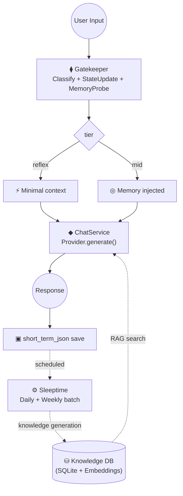

# Butly 🤵

🌐 [日本語](README.ja.md) | **English**

> ⚠️ This project is currently under active development.

**Butly** is a personal AI assistant platform with a multi-layered memory system.
It remembers past conversations, builds knowledge over time, and adapts its responses
based on accumulated context — not just the current message.

Supports **multiple LLM providers** (Google Gemini / OpenAI / Ollama),
**multiple AI instances** (personas), and **RAG-based knowledge retrieval** from conversation history.

---

## Key Features

### Memory System

Butly maintains several layers of memory that work together:

| Layer | Description |
|-------|-------------|
| **Short-term** | Recent conversation turns (JSON) |
| **Floating Summary** | Rolling summary of the current conversation |
| **Mid-term Digest** | Episode-tagged fact digest, updated daily |
| **Relationship Snapshot** | How the AI perceives its relationship with the user, updated weekly |
| **Knowledge Cards** | Distilled knowledge stored in SQLite with vector embeddings for RAG search |
| **Key Memory** | Core persistent facts about the user and persona (YAML) |

### Gatekeeper (Metacognitive Engine)

Before generating a response, the Gatekeeper classifies each user message and decides how much memory context to inject:

- **reflex** — Simple exchanges that need minimal context
- **mid** — Conversations that benefit from memory injection

It also maintains a **SessionState** (topic, mood, turn count) that persists across the conversation and runs a **MemoryProbe** for fact-based memory retrieval without extra LLM calls.

### Sleeptime (Scheduled Memory Maintenance)

A background process that distills raw conversation logs into structured knowledge:

- **Daily**: Mid-term digest generation + knowledge card creation
- **Weekly**: Relationship snapshot update

Run it manually or from the Web UI when conversations wind down for the day.

### Multi-Instance

Create and switch between multiple AI personas, each with its own personality, memory, and conversation history.

### Multi-Provider LLM

Mix and match providers per role — e.g., chat on OpenAI, embeddings on Gemini, gatekeeper on Ollama:

| Provider | Model prefix | API Key |
|----------|-------------|---------|
| **Gemini** | `gemini-*` / `models/gemini-*` | `GOOGLE_API_KEY` |
| **OpenAI** | `gpt-*` / `o1` / `o3` / `o4` | `OPENAI_API_KEY` |
| **Ollama** | `ollama/*` | Not required (local) |

### RAG Search (ButlyBrain)

Hybrid retrieval combining keyword filtering (SQLite LIKE) with vector cosine similarity reranking, time decay scoring, and cross-instance DB search.

### Web Search

- **Gemini models**: Google Search Grounding (built-in)
- **Other providers**: Tavily API fallback

---

## Quick Start

### 1. Clone

```bash
git clone https://github.com/unagisann/Butly.git
cd Butly
```

### 2. Install Dependencies

**Linux / macOS:**

```bash
python -m venv venv
source venv/bin/activate
pip install -r requirements.txt
```

**Windows:**
Double-click `01_setup_requirements.bat` — creates `.venv` and installs dependencies automatically.

### 3. Configure API Keys

**Linux / macOS:**

```bash
cp APIkey.env .env
```

**Windows:** Automatically handled by the batch file.

Set the keys for your chosen provider in `.env`:

```env
# Google Gemini (default)
GOOGLE_API_KEY=AIza...

# OpenAI
OPENAI_API_KEY=sk-...

# Ollama — no key needed (local)
```

### 4. Prepare Config

**Linux / macOS:**

```bash
cp user_config.json.example user_config.json
```

**Windows:** Automatically handled by the batch file.

Customize models, parameters, and agent names in `user_config.json`.
See `user_config.json.example` for Gemini / OpenAI / Ollama configuration examples.

> **Note**: Switching providers changes embedding dimensions, which degrades RAG accuracy.
> Regenerate embeddings with:
> ```bash
> python migrate_embeddings.py --all
> ```

### 5. Start

**Linux / macOS:**

```bash
# Backend (FastAPI)
uvicorn main:app --port 8000 --reload

# Frontend (Streamlit) — in a separate terminal
streamlit run app.py
```

Open `http://localhost:8501` in your browser.

**Windows:**
Double-click `02_start_webui.bat` — starts both servers and opens the browser automatically.

---

## First Launch

### ① Language

**⚙️** (top right) → **Basic Settings** → Select language → **💾 Save**

### ② LLM / API Key

**⚙️** → **LLM Provider** tab:

1. Enter your API key → **💾 Save**
2. Assign models to each role (Chat / Summary / Gatekeeper / Embedding)
   - Select from presets or choose **"✏️ Custom Input..."** for any model name
   - Ollama models: prefix with `ollama/` (e.g. `ollama/phi3`)
3. **💾 Save Model Settings**

### ③ Create an AI Instance

1. Expand **➕ New Instance** on the home screen
2. Enter an **Instance Name** (alphanumeric & `_`)
3. Select a **Personality Template** (Butly / Creator / Analyst / Friendly / Caring / Custom)
4. Enter an **AI Name** (required)
5. Click **Create** → click the AI name to start chatting

---

## Architecture



### Design Principles

| Principle | Description |
|-----------|-------------|
| **State-centric** | Update internal state with each turn, not just react to utterances |
| **Missing-prerequisite-centric** | Search for what the current judgment needs, not just similar memories |
| **Integrated-memory-centric** | Maintain reflection, summary, and generalization beyond raw episodes |
| **Metacognition-centric** | Let the AI reason about what it needs to know, rather than hardcoding rules |

---

## Default Models (Gemini)

| Role | Model | Purpose | Frequency |
|------|-------|---------|-----------|
| Chat | gemini-3-flash-preview | Response generation | 1×/turn |
| Gatekeeper | gemini-3.1-flash-lite-preview | Tier classification / metacognition | 1×/turn |
| Summary | gemini-3.1-flash-lite-preview | Digest / relationship | Daily batch |
| Knowledge | gemini-3.1-pro-preview | Knowledge card generation | Daily batch |
| Embedding | gemini-embedding-001 | Vector search | On card generation |
| Floating | gemini-3.1-flash-lite-preview | Overflow compression | Real-time |

All configurable via `user_config.json`.

---

## Tech Stack

- **LLM**: Google Gemini / OpenAI / Ollama — multi-provider
- **Backend**: FastAPI + Uvicorn
- **Frontend**: Streamlit
- **DB**: SQLite (vector search via cosine similarity + NumPy)
- **Web Search**: Tavily API / Google Search Grounding

---

## Documentation

- [Architecture Diagrams](docs/DIAGRAMS.md)
- [Gatekeeper I/O Specification](docs/gatekeeper_io_summary.md)
- [Memory Lifecycle](docs/memory_lifecycle.md)

---

## License

MIT License
