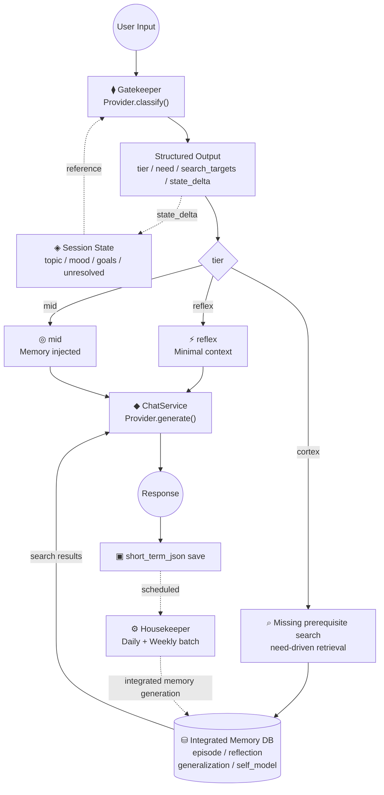
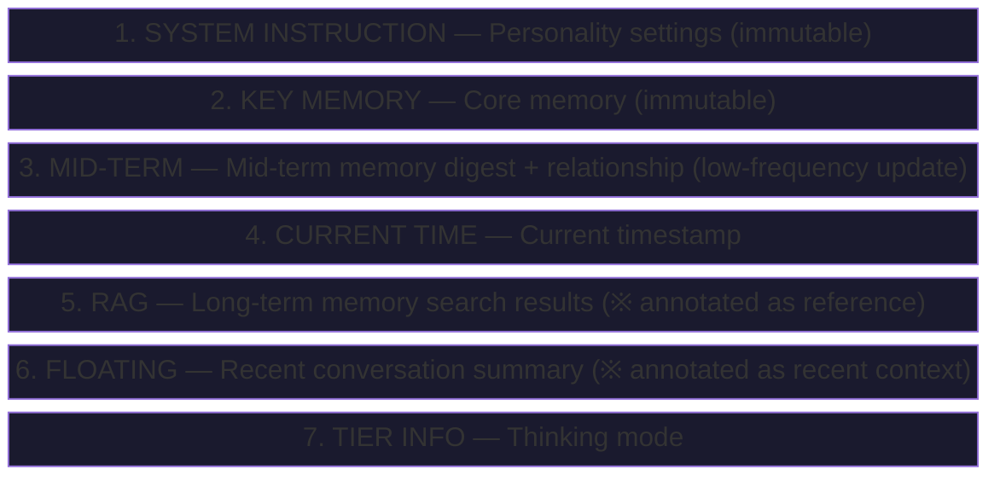
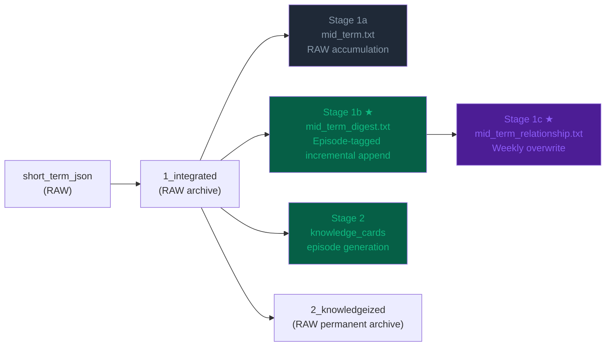
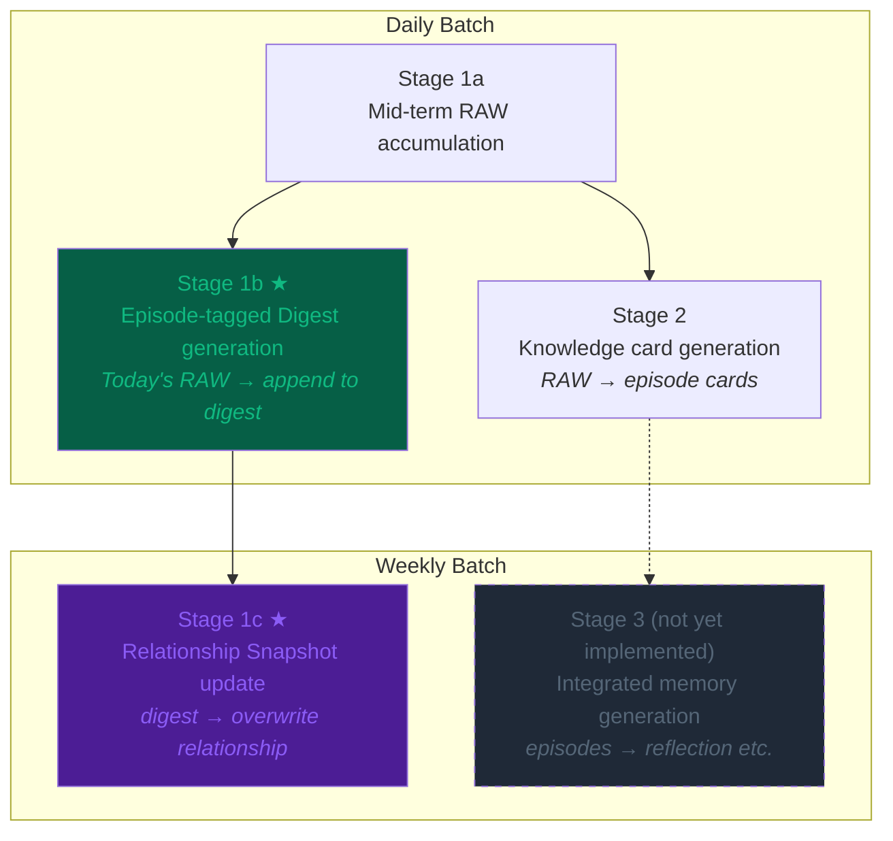
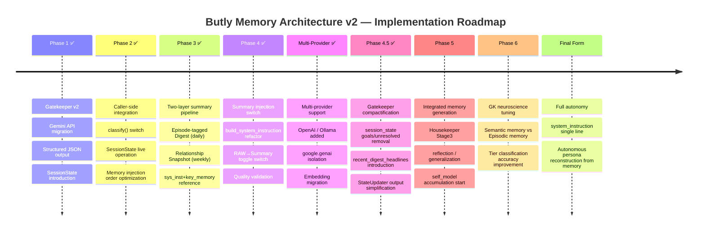

# Butly 🤵
⚠ This project is currently under active development. 
🌐 [日本語](README.ja.md) | **English**

**A personal AI assistant platform with a multi-layered memory system.**
Supports **multiple providers** (Google Gemini / OpenAI / Ollama),
manages multiple AI instances (personas), and accumulates & retrieves knowledge from past conversations (RAG).

---

## Features

- 🧠 **Multi-layer Memory System** — Short-term, floating summary, mid-term (two-layer summary), long-term (RAG), glossary (semantic memory), and core memory
- 🎭 **Multi-instance** — Create and switch between multiple AI personas
- 🔍 **RAG Search** — Knowledge retrieval via Embedding + cosine similarity
- 🧹 **Housekeeper** — Automatic memory organization, knowledge card generation, and episode-tagged digest creation
- 🧬 **Gatekeeper** — Tier classification and prerequisite gap analysis via metacognitive engine
- 📊 **SessionState** — Track and persist internal state throughout a session

---

## Setup

### 1. Clone the repository

```bash
git clone https://github.com/unagisann/Butly.git
cd Butly
```

### 2. Set up the environment

**Linux / macOS:**

```bash
python -m venv venv
source venv/bin/activate
pip install -r requirements.txt
```

**Windows (automated with batch file):**  
Run `01_setup_requirements.bat` by double-clicking.  
The `.venv` virtual environment will be created and dependencies installed automatically.

### 3. Configure API keys

**Linux / macOS:**

```bash
cp .env.example .env
```

**Windows:** Automatically copied when the batch file runs.

Set the required keys for your chosen provider:

```env
# Google Gemini (default)
GOOGLE_API_KEY=AIza...

# For OpenAI
OPENAI_API_KEY=sk-...

# Ollama requires no key (local execution)
# OLLAMA_BASE_URL=http://localhost:11434/v1  (default)
```

### 4. Prepare the config file

**Linux / macOS:**

```bash
cp user_config.json.example user_config.json
```

**Windows:** Automatically copied when the batch file runs.

Customize AI model names, parameters, and agent names freely in `user_config.json`.  
`user_config.json.example` includes configuration examples for Gemini / OpenAI / Ollama.

> **Note**: If you switch providers, the embedding dimensions will differ and RAG search accuracy may degrade.
> Regenerate embeddings with the following command:
> ```bash
> python migrate_embeddings.py --all
> ```

### 5. Start

**Linux / macOS — Start the backend (FastAPI):**

```bash
uvicorn main:app --port 8000 --reload
```

**Linux / macOS — Start the frontend (Streamlit):**

```bash
streamlit run app.py
```

Open `http://localhost:8501` in your browser.

**Windows (automated with batch file):**  
Run `02_start_webui.bat` by double-clicking.  
FastAPI and Streamlit will start in separate windows, and your browser will automatically open `http://127.0.0.1:8501`.

### 6. First Launch Configuration

Once `http://localhost:8501` opens in your browser, configure in the following order:

#### ① Language Settings

1. Click the **⚙️** icon (top right) → **Basic Settings** tab
2. Select `日本語` or `English` under **Language / 言語**, then click **💾 Save Language Settings**

#### ② LLM / API Key Setup

1. Open **⚙️ → LLM Provider** tab
2. Enter your API key for the chosen provider under **API Key Settings** and click **💾 Save**
3. Assign models to Chat / Summary / Gatekeeper / Embedding roles under **Model Assignment**
   - Select from the preset list, or choose **"✏️ Custom Input..."** to enter any model name manually
   - This is useful for using the latest API models, older models, or local LLMs via Ollama
   - For Ollama models, prefix with `ollama/` (e.g. `ollama/phi3`, `ollama/gemma2`)
4. Click **💾 Save Model Settings**

> For Ollama, no API key is required. Check the connection URL under the **Ollama (Local LLM)** section.

#### ③ Create Your First AI Instance

1. Expand **➕ New Instance** on the home screen
2. Enter an **Instance Name** (alphanumeric & _) — e.g. `my_agent`
3. Select a **Personality Template**:

   | Template | Character |
   |---|---|
   | Butly | Intellectual collaborative partner (default) |
   | Creator | Creative, divergent thinking |
   | Analyst | Logic and analysis focused |
   | Friendly | Casual and approachable |
   | Caring | Empathetic and supportive |
   | Custom | Free input |

4. Enter an **AI Name** (e.g. `Jarvis`) — **required**
5. Enter **Your Name** and **Preferred Name** (optional)
6. Click **Create** → once the AI appears in the instance list, you’re all set
7. Click the AI’s name to start chatting!

---

## Housekeeper (Scheduled Memory Maintenance)

A scheduled process that converts short-term memory into the knowledge DB (SQLite) and generates episode-tagged digests.

```bash
python housekeeper.py
```

Or run it from the Web UI via the "🧹 記憶の整理" button.

> **Recommendation**: Run during low-activity hours such as after conversations wind down for the day.

---

## Architecture



### Design Principles

| # | Principle | Description |
|---|-----------|-------------|
| 1 | **State-centric** | Update internal state with each conversation, not just react to utterances |
| 2 | **Missing-prerequisite-centric** | Search for what the current judgment needs as premises, not just similar memories |
| 3 | **Integrated-memory-centric** | Hold reflection, summary, generalization, and self-understanding in separate layers beyond raw episodes |
| 4 | **Metacognition-centric** | Let the AI itself reason about "what it needs to know", rather than hardcoding rules |

---

## Memory System

### system_instruction Injection Order

Context passed to the LLM is constructed in the following order (upper = immutable, lower = variable):



### Mid-term Two-layer Summary Structure

mid_term.txt (RAW conversation log) continues accumulating through the existing pipeline, while two separate summary layers are generated as additional files.



| File | Update Frequency | Content | Limit |
|------|-----------------|---------|-------|
| \`mid_term.txt\` | Daily (append) | RAW conversation log (existing, unchanged) | 30,000 chars |
| \`mid_term_digest.txt\` | Daily (incremental append) | Episode-tagged fact digest | 8,000 chars |
| \`mid_term_relationship.txt\` | Weekly (overwrite) | Relationship snapshot | ~1,500 chars |
| \`archive_digest.txt\` | As needed | Older summaries that overflowed from digest | Unlimited |

### Housekeeper Stage Configuration



---

## Roadmap



### Models Used (Default: Gemini)

| Role | Default Model | Purpose | Call Frequency |
|------|---------------|---------|---------------|
| Gatekeeper | gemini-3.1-flash-lite-preview | Tier classification / metacognition | 1x/turn |
| Brain (Chat) | gemini-3-flash-preview | Final response generation | 1x/turn |
| Summary/Digest | gemini-3.1-flash-lite-preview | Summary / digest / relationship | Daily batch |
| Knowledge | gemini-3.1-pro-preview | Knowledge card generation | Daily batch |
| Embedding | gemini-embedding-001 | Vector search | On card generation |
| Floating Summary | gemini-3.1-flash-lite-preview | Short-term memory overflow compression | Real-time |

#### Supported Providers

The provider is automatically determined by the \`model_name\` prefix in \`user_config.json\`:

| Provider | model_name prefix | Required env var | Example |
|----------|------------------|-----------------|---------|
| **Gemini** | \`gemini-*\` / \`models/gemini-*\` | \`GOOGLE_API_KEY\` | \`gemini-3-flash-preview\` |
| **OpenAI** | \`gpt-*\` / \`o1\` / \`o3\` / \`o4\` | \`OPENAI_API_KEY\` | \`gpt-4o\`, \`gpt-4o-mini\` |
| **Ollama** | \`ollama/*\` | (not required – local execution) | \`ollama/llama3.1:8b\` |

You can mix different providers per role (e.g., chat=OpenAI, embedding=Gemini).

---

## File Structure

```
butly_core/
├── config.py          ← AI/system configuration defaults
├── prompts.py         ← Prompt loader
├── prompts/           ← Prompt management
│   ├── locales/ja/templates/  ← Japanese personality templates
│   └── locales/en/templates/  ← English personality templates
├── chat/
│   ├── service.py     ← Chat orchestration (ChatService)
│   └── types.py       ← DTOs (ChatRequest / ChatResponse / Attachment)
├── llm/
│   ├── base.py        ← Provider abstract base class (BaseProvider)
│   ├── factory.py     ← Model name → provider auto-routing
│   └── providers/
│       ├── gemini.py   ← Google Gemini (search retry, cache)
│       ├── openai.py   ← OpenAI (GPT-4o etc., Vision support)
│       └── ollama.py   ← Ollama (local LLM, OpenAI-compatible API)
└── core/
    ├── brain.py       ← RAG search engine (keyword extraction + vector reranking)
    ├── memory.py      ← Memory read/write management
    ├── database.py    ← SQLite operations (knowledge cards)
    ├── gatekeeper/         ← Gatekeeper (metacognitive engine)
    │   ├── tier_classifier.py  ← Tier classification & scoring
    │   ├── search_planner.py   ← Missing-prerequisite search planning
    │   ├── session_state.py    ← SessionState definition
    │   ├── state_updater.py    ← state_delta application
    │   └── memory_builder.py   ← MemoryBlock construction
    ├── instance_manager.py ← Instance creation and management
    ├── chronos.py     ← Time context generation
    └── fire_tv.py     ← Fire TV integration (ADB over TCP)

butly_core/instances/{instance_name}/
├── config.json                ← Instance-specific configuration
├── system_instruction.txt     ← Personality settings (system prompt)
├── Key_Memory.txt             ← Core memory (immutable facts)
├── mid_term.txt               ← Mid-term memory (RAW accumulated text)
├── mid_term_digest.txt        ← Episode-tagged fact digest (daily incremental append)
├── mid_term_relationship.txt  ← Relationship snapshot (weekly overwrite)
├── session_state.json         ← Session state (for Gatekeeper)
├── butly_memory.db            ← Long-term memory SQLite DB
├── short_term_json/           ← Recent conversation logs (JSON)
├── floating_summaries/        ← Floating summaries (temporary summaries)
└── memory_archive/
    ├── 1_integrated/          ← Logs awaiting Housekeeper processing
    ├── 2_knowledgeized/       ← Knowledgeized logs (RAW permanent archive)
    └── 3_log/
        ├── archive_long_term.txt  ← Old RAW that overflowed from mid_term
        └── archive_digest.txt     ← Old summaries that overflowed from digest
```

---

## Documentation

- [Architecture Diagrams](docs/DIAGRAMS.md)
- [Gatekeeper I/O Specification](docs/gatekeeper_io_summary.md)

---

## Design Notes

### Challenges of injecting all memory into system_instruction

In the Gemini API, system_instruction is treated as an "absolute premise," so RAG results and older memories can take precedence over recent conversation. As a mitigation, each section is annotated (e.g., "※ Reference info. If it conflicts with recent conversation, prefer recent."). In the future, we are considering a design where system_instruction is limited to the Identity Core (immutable layer) only.

### Why episode emotions are included in the digest

A dry fact summary risks being treated as "confirmed fact" by the LLM in a rigid way. Adding AI impressions gives the memory a nuance of "subjective recollection," allowing the LLM to handle it more flexibly (with room to revise if incorrect).

### Why the relationship snapshot is updated weekly

Relationships naturally change slowly. Rewriting them daily introduces instability and feels unnatural. Key Memory serves as the "immutable core" while the snapshot serves as the "gradually changing status."

### Future direction for Gatekeeper

Currently, tiers are classified by "cognitive load magnitude," but ideally they should be classified by "whether episodic memory access is needed." Since LLMs already possess general knowledge (semantic memory), cortex is only needed for "information that exists exclusively between the user and the AI."

---

## Tech Stack

- **LLM**: Google Gemini (`google-genai`) / OpenAI (`openai`) / Ollama (local) — multi-provider support
- **Backend**: FastAPI + Uvicorn
- **Frontend**: Streamlit
- **DB**: SQLite (vector search: Cosine Similarity + Numpy)
- **Embedding**: Provider-dependent (default: `gemini-embedding-001` / `text-embedding-3-small`)

---

## License

MIT License
