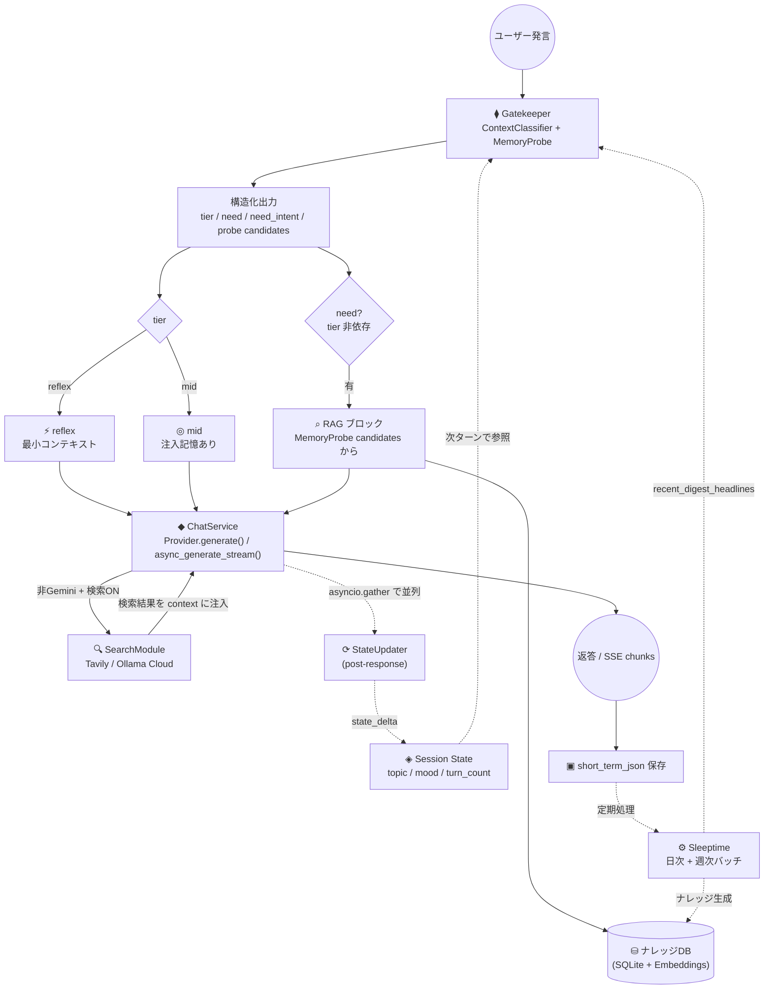
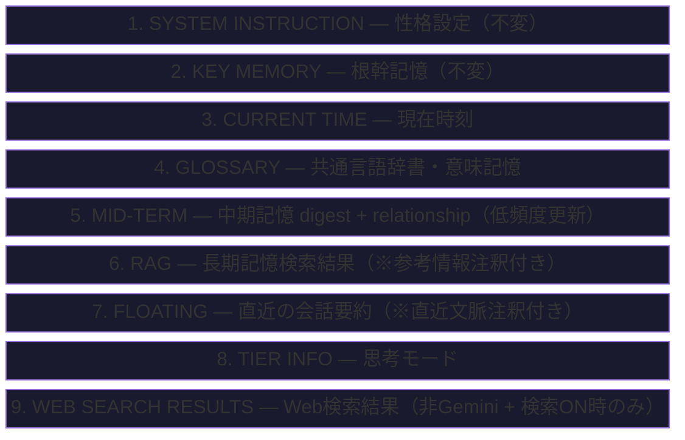
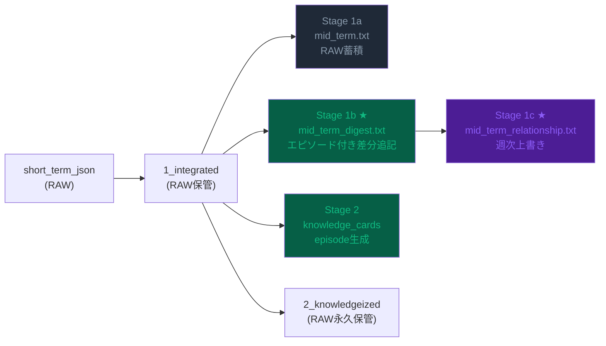
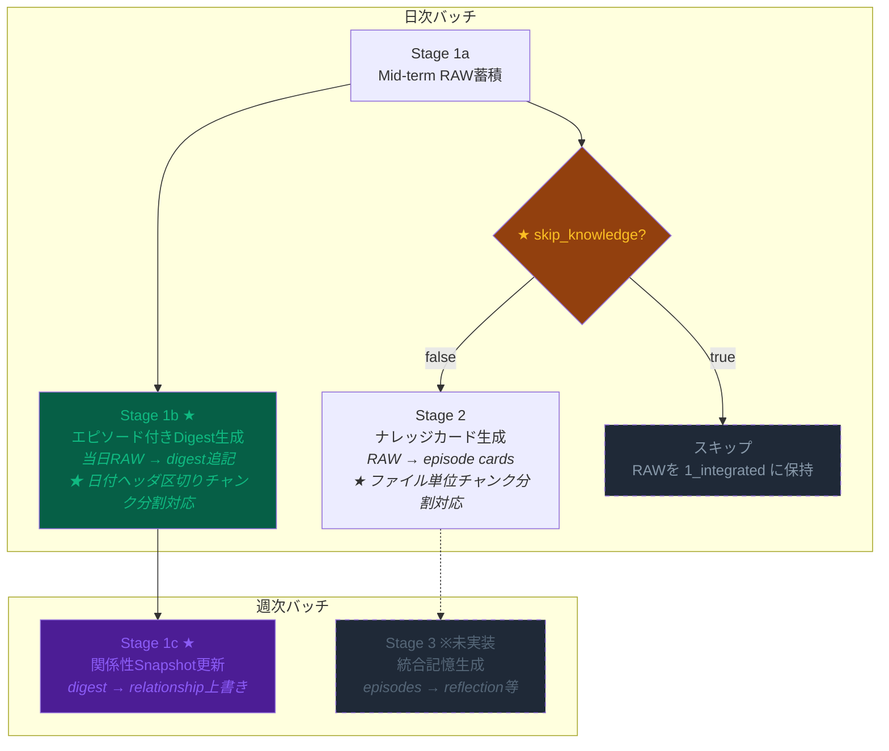
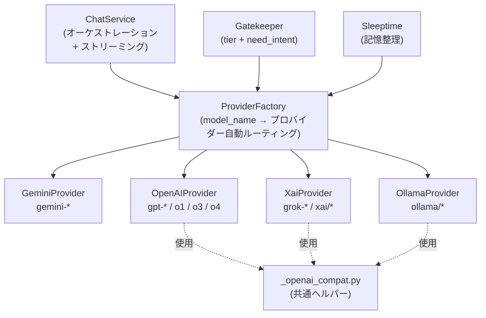
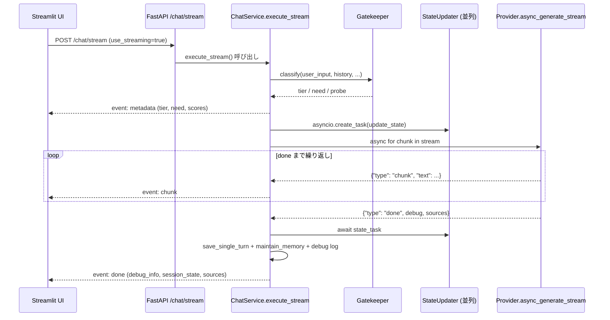
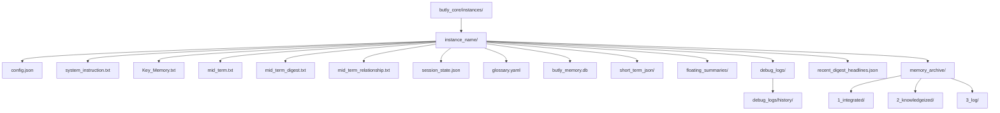

# Butly — アーキテクチャ図集

🌐 **日本語** | [English](DIAGRAMS.md)

このファイルには Butly のシステム設計を可視化した Mermaid 図をまとめています。

---

## 1. 全体アーキテクチャ（メインフロー）

ユーザー発言から返答生成・記憶保存までの処理フローです。

---

## 2. system_instruction 注入順序

LLM に渡すコンテキストブロックの構築順序（上部が不変、下部が可変）です。

---

## 3. Mid-term 二層要約構造

short_term_json（RAW）からの記憶パイプラインです。

---

## 4. Sleeptime ステージ構成

日次・週次バッチ処理の構成です。

---

## 5. マルチプロバイダー構成

LLM プロバイダー抽象化レイヤーの構成です。

---

## 5b. SSE ストリーミングフロー (`POST /chat/stream`)

`ChatService.execute_stream()` と Provider の `async_generate_stream()` の協調動作。

---

## 6. インスタンス別ディレクトリ構成

各 AI インスタンスの記憶ファイル配置です。

