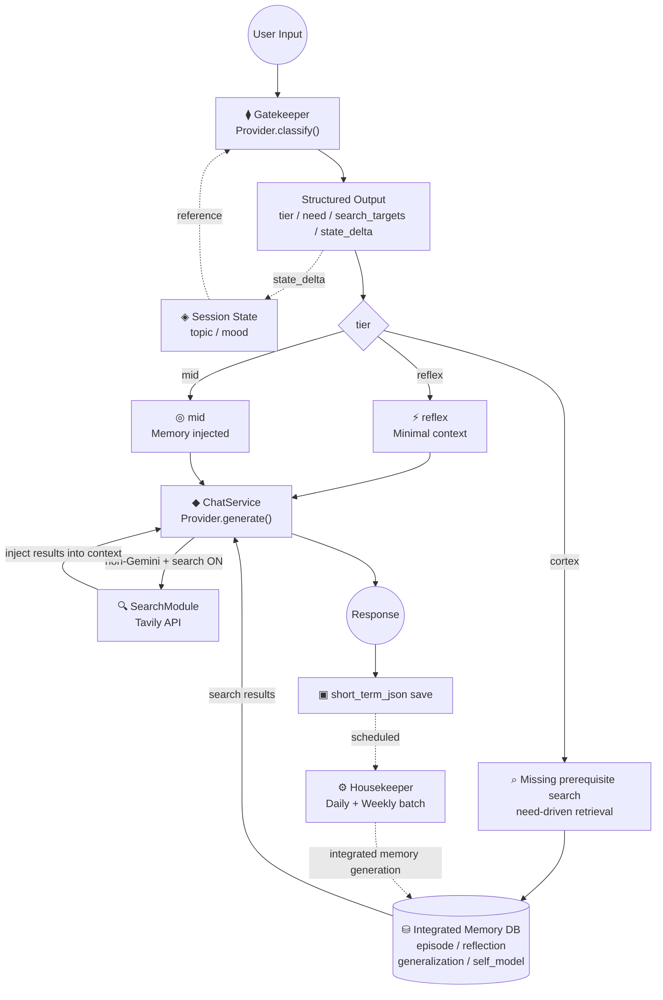
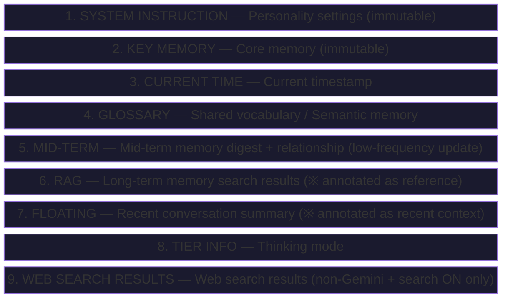
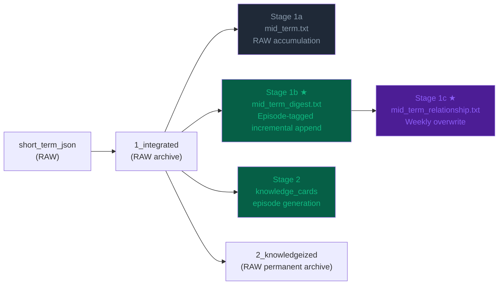
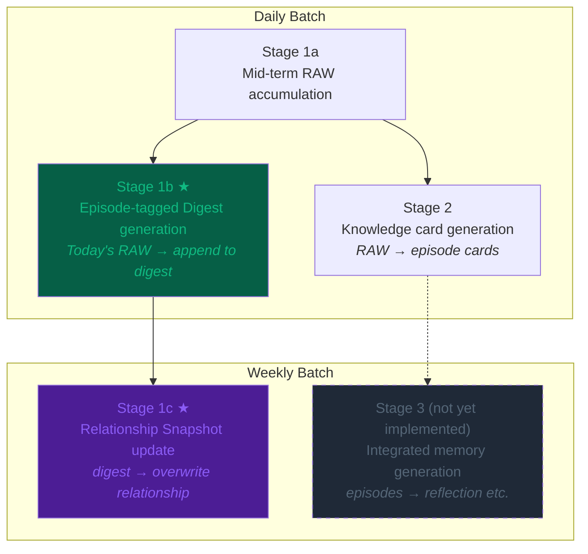
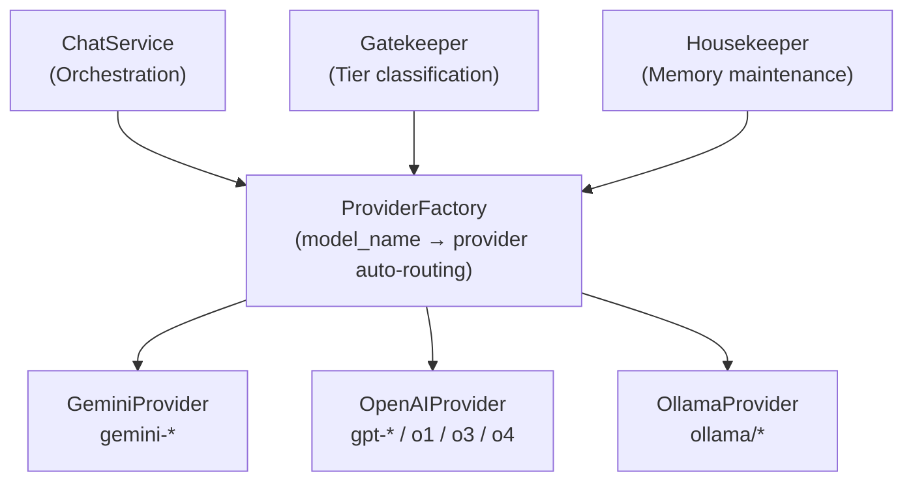
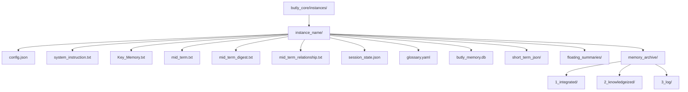
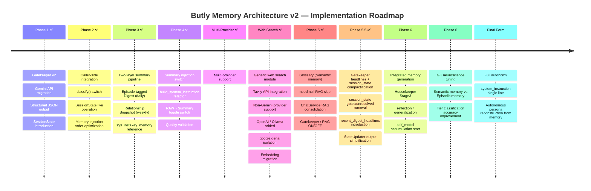

# Butly — Architecture Diagrams

🌐 [日本語](DIAGRAMS.ja.md) | **English**

This file compiles Mermaid diagrams that visualize the system design of Butly.

---

## 1. Overall Architecture (Main Flow)

The processing flow from user input to response generation and memory storage.

---

## 2. system_instruction Injection Order

The order in which context blocks are built when passed to the LLM (upper = immutable, lower = variable).

---

## 3. Mid-term Two-layer Summary Structure

The memory pipeline from short_term_json (RAW).

---

## 4. Housekeeper Stage Configuration

The configuration of daily and weekly batch processing.

---

## 5. Multi-provider Configuration

The structure of the LLM provider abstraction layer.

---

## 6. Per-instance Directory Structure

The memory file layout for each AI instance.

---

## 7. Implementation Roadmap

