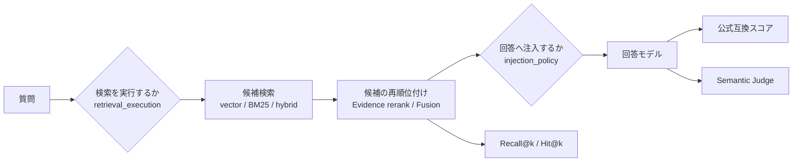

# RAG評価・改善レポート — Web Console移行以降

対象期間: 2026-07-26〜2026-08-23

起点: LoCoMo Evaluation Web Console導入（commit `3f0ffa3`）

集計日: 2026-08-23（JST）

この文書は、Colab上の試行錯誤を扱わず、評価をWeb Consoleへ移した時点からの
RAG（Retrieval-Augmented Generation、検索拡張生成）の課題、テスト結果、改善、
未解決点を将来の比較用に固定する。
埋め込みtask prefixのv22→v25実測だけは、Web移行時に持ち越した診断値として掲載する。
Colab上の実行手順や試行履歴を再掲するものではない。

数値の閲覧・グラフ化には
[Google Sheets版](https://docs.google.com/spreadsheets/d/17ZfRuA2IUy7GlfMTT8zbHfZBKfQl60kptTSdEwxD9Io/edit)
を使う。リポジトリには再利用可能なCSVも保存する。

- [LoCoMo run一覧](rag_evaluation_data/locomo_runs.csv)
- [検索方式比較](rag_evaluation_data/retrieval_comparisons.csv)
- [日本語対話A/B](rag_evaluation_data/dialogue_ab.csv)
- [改善履歴](rag_evaluation_data/improvements.csv)

## 1. 結論

1. **最初の最大要因は検索アルゴリズムではなくGatekeeperの崩壊だった。**
   Gatekeeperは、質問が過去記憶を必要とするかなどを判定する前段モデルである。
   評価run profileの最大出力を512から2048へ増やしたv25→v26で、
   classifier fallback率は77.9%から0%、
   RAG発火率は33.2%から90.5%、LoCoMo公式互換スコアは40.36%から48.15%へ上がった。
2. **検索実行と記憶注入は別々に制御する必要がある。** v27では検索を常時実行し、
   候補があれば注入する評価条件に変更した。同じ107カードで公式互換スコアは
   48.15%→49.49%、cat1-4は38.04%→39.79%、Evidence取得率は54.31%→60.41%となった。
   policy単体のcat1-4寄与は約+1.9ポイントだった。
3. **BM25＋RRFの単純なハイブリッド検索は既定にしない。** 同じ107カードで
   Recall@3はvector 69.06%に対し、等重みhybrid 64.57%だった。BM25が救った5問より、
   融合で落とした8問の方が多い。
4. **Evidence Fusionは検索段階では有望だが、回答改善はまだ未証明。** 全10 sample・
   oracle 1,405問ではRecall@3が67.61%→70.84%（rescue 74、harm 14）になった。
   一方、同一107カードのv31はv27よりRecall@3が+3.45ポイントでも、公式互換スコアは
   49.49%→49.47%で横ばいだった。
5. **日本語では埋め込み空間の適合性が検索方式と同じくらい重要だった。**
   実記憶155カードで、Nomic v1.5再embeddingは必須記憶のhit@3が2/10、保存済み3072次元
   vectorはGemini Embedding設定と整合して9/10だった。ただし後者はmetadata欠落のため由来は推定である。
   日本語検索の失敗をvector方式そのものの失敗と解釈してはいけない。
6. **検索実行済みで非空候補を注入する`candidates`は、必須・補助質問を改善し得るが、
   不要記憶の持ち出しが増える。**
   完了した日本語Semantic Judgeのv7〜v9では、candidatesは必須カテゴリを改善した一方、
   不要カテゴリを27.5〜37.5ポイント悪化させ、全体Semanticも1.7〜6.7ポイント低下した。
   `candidates`昇格を支持する結果ではないため、現状の`intent_gated`を暫定維持する。
   本番モデルでの反復確認は未実施である。
7. **v33のモデル組合せは参考値として強い。** カード・検索条件を固定し、集計検索指標が
   同一だったv32比で、公式互換
   +8.79ポイント、Semantic +3.02ポイント、平均応答時間約81%減だった。ただし回答モデルと
   Gatekeeperを同時に変えているため、どちらの効果かはまだ分離できない。
8. **Fusion重みの引き下げと候補pool拡大は、いずれも採用に値しなかった。**
   conv-26（139問）では40/60がRecall@3で+3問に見えたが、all-10（1,405問）では
   70/30の1,115問に対し40/60は1,108問と逆に7問減で、10 sample中8 sampleで70/30以下だった。
   重みを下げるとrescue@3は74→111問へ増えるがharm@3が14→59問へ増える。
   候補poolの20→50はRecall@3で最大+1問、Recall@1では±0問だった。
   再現するのはRecall@1の改善のみ（50/50で+35問）だが、注入top3では順位改善が回答へ届かない。
9. **v34の公式互換+5.81ptは検索設定の成果ではない。** 検索結果が変わらなかった188問だけで
   +5.37ptが出ており、検索由来は+0.44ptにとどまる。同時にSemanticは68.3%→66.3%へ低下した。
   公式互換とSemanticが逆方向へ動いたrunを改善根拠にしてはいけない。
10. **注入top-kの3→5は小さいが実在の改善で、cat5を悪化させなかった。** v37→v38は
    profile差分が`vector_search_limit`の1行のみ、カードも検索順位も同一という
    QA側だけのA/Bである。cat1-4は公式互換+1.11pt（t=3.09）、Semantic +1.72pt（t=3.61）で
    両指標が同じ向きを指した。cat5は公式互換-0.22pt、Semantic -0.45ptでいずれも有意でなく、
    **Semantic Judgeのcontradiction件数はcat5で168件と完全に同一**だった。
    5.6で警戒した「top-kを増やすとcat5が下がる」は、少なくとも3→5では起きていない。
11. **公式互換のToken F1は、冗長化した回答に対して意味以上の減点をしていた。**
    v38がv37より6語以上長くなった84問で、Semanticは±0なのに公式互換は-14.06ptだった。
    v38全体の公式互換上げ幅16.1点分のうち11.8点分をこの層が相殺しており、
    これを除くと+1.40ptとなってSemanticの+1.23ptとほぼ一致する。
    **注入量を変えるA/Bでは回答長も動くため、公式互換の単独判定は誤差方向を持つ。**
12. **日本語LoCoMoで測ったactive node表記の3本は、どれも判定に足りなかった。**
    conv-26の199問では主語併記も注記も\|t\|<2で、唯一超えたSemantic cat5（t=-2.07）も
    47問中4問の変化である。同時に**Semantic Judgeの反転率を実測した**。予測文が完全一致
    した151〜161問のうち4〜6問（2〜4%）でJudgeの判定が反転し、その影響（最大-1.26pt）は
    観測したSemantic差（-0.75pt）より大きい。ja採点（F1）側の反転は0問だった。
    **単一sample 199問の日本語runでは、注入表記の採否は決められない。**
13. **注入top-kの曲線は5で寝る。top-10は採用しない。** v39はv37の記憶を三度目の再利用で
    固定し、`vector_search_limit`だけを10へ上げた（カードとdatasetのhashはv38とバイト一致）。
    cat1-4は3→5が+1.11pt（t=3.09）だったのに対し5→10は+0.42pt（t=1.17）で有意でなく、
    promptは+21.8%増える。cat5は0.610→0.608→0.596と単調に下がる。
    **ただし「効果ゼロ」ではない**: 公式互換で-13.83ptを課された87問を現行Judgeで
    再判定するとSemanticは+0.0057（t=0.10）＝意味は動いておらず、11の系統誤差がここでも
    再現した。同じ87問でcontradictionは15→26、missing_criticalは55→45で、
    **増えた分は情報を埋めると同時に矛盾も持ち込む**。伸びが有意でないうえ対価が
    prompt +21.8%と矛盾増なので、本番既定は3、評価系列の上限は5とする。
14. **Semantic Judge自身が2026-08-16 18:40に変わっており、それをまたぐ比較は無効だった。**
    `c2b612a`以後のJudgeは入力tokenが357→734になり、v38の同じ87問で5問（5.7%）が
    すべて下方向へ動いた（Semantic -3.45pt、t=-2.17）。現行経路で2回判定すると
    **0/87で完全に一致**したので、これは反転ノイズではなく経路変更の系統差である。
    v39のSemanticをv37・v38の保存値と並べてはいけない。**測定器の変更は、
    測定対象の変更と同じ厳しさで記録する。**
15. **gold evidenceだけを渡すとcat1-4は大きく伸びるが、厳密な上限ではない。** Oracle Reader
    （v41）は、v40と同一カード・同一dataset・同一Judge経路でcat1-4を
    0.4524→0.6258（t=16.84）、Semanticで0.6175→0.7753（t=12.48）まで上げた。
    これは検索・注入側に大きな改善余地があることを示す。一方、1,540問中262問（17.0%）が
    Semanticでincorrectだった値は、注記不足、近傍文脈不足、cat3の外部知識、Judge誤差も含む
    **gold-evidence-only条件の観測失敗率**であり、純粋な`utilization_miss`の床とはしない。
    1,531問のSemantic差を最初に落ちた段階へ診断的に割り当てると、provenance 41%、
    ランキング32%、候補top20落ち19%となるが、各施策で回収できる因果的な割合ではない。
    原文が全件届いた833問ではv40が0.859、v41が0.832（対応ありt=-2.06）で、RAW3 bundleの
    明確な害は見えなかった。ただしcat4中心の選択済み部分集合で、多重比較補正後に強い差では
    ないため、「渡し方は解決済み」とまでは言わない。cat5の-0.11（t=-3.78）はLoCoMo注記の
    構造に強く影響されるが、誤った具体化をして棄権をやめる実際のリスクとして残す（5.12）。

現行の本番既定は`search_mode=vector`、`retrieval_execution=always`、
`injection_policy=intent_gated`、`vector_search_limit=3`である。
評価系列ではtop-5が優位で、2026-08-23のtop-10 runにより上限は5と確定した（5.10）。
active nodeの主語併記（`eb470a5`）と注記（`999d05b`）は実装済みで本番でも描画されるが、
採否を支持する測定はまだ無い。

## 2. 評価結果の読み方

### 2.1 比較単位

同じ表に載っていても、次の条件が異なるrunは単純比較しない。

- dataset hash、対象sample、質問ID集合（質問数だけでは不十分）
- 記憶カード集合、その生成元run、oracle数、カード・provenance hash
- Sleeptime / Knowledge生成モデル・promptと、埋め込みモデル・次元・task prefix
- 回答モデル、Gatekeeperモデル、temperature、最大出力
- 検索方式、候補数、注入上限、threshold、time decay、検索実行policy、注入policy
- RAG source（カード、原文、または両方）、RAW top-k / 文字数上限、固定context
- QA mode（各問独立 / 前問の回答を引き継ぐ逐次）、回答prompt、コードrevision
- 公式scorer、Semantic Judgeのモデル・prompt・完了母数

このレポートでは比較を次のように分類する。

| 表示 | 意味 |
|---|---|
| 同一カード差分 | 同じ107カードなど、記憶を固定した比較 |
| 検索専用 | QAを行わず、検索順位だけを比較 |
| モデル変更参考 | 複数モデル要因を含み、単一要因へ帰属しない比較 |
| 停止 | 未完了。完了runとスコア比較しない |
| 実験 | 比較用の検索モードによる測定。採用値や確定仕様として扱わない |

### 2.2 評価パイプライン

検索順位の改善は`Recall@k`、最終回答の改善は公式互換スコアとSemantic Judgeで確認する。
検索が良くても、注入枠、読み手モデル、promptの使い方が悪ければ回答点は上がらない。

同じ`Recall@k`という表示でも分母に注意する。LoCoMo QA run内の推移は検索が実行され、
oracleカードがある全カテゴリの質問を集計する。一方、このレポートのoffline検索方式比較は実装既定どおり
cat5を除外し、conv-26ではoracleあり139問を分母にする。この2系列は直接横比較しない。

### 2.3 データの扱い

実行artifact、会話本文、QA本文、DB、個人用instanceはgitignore対象のローカルデータであり、
この文書やCSVへ複製していない。保存したのは集計値、run設定、判定に必要な件数だけである。
実行artifactは再実行で上書きされ得るため、本レポートとCSVは2026-08-15時点の
スナップショットとして扱う。

## 3. Web Console移行以降に顕在化した課題

| 課題 | 何が困るか | 対応 |
|---|---|---|
| 条件・履歴・比較が分散 | 過去runの再現条件を追いにくい | Web Consoleに設定、履歴、比較、診断を集約 |
| 異なる埋め込み記憶を再利用できる | 数値が出ても比較そのものが無効になる | 埋め込みモデル不一致を既定で事前拒否（明示overrideは診断用） |
| 評価保存経路が複数 | Webの履歴表示とCLI成果物がずれる | run保存を一つの経路へ統一 |
| 分類器の異常が集計で見えない | 「検索方式が悪い」と誤診する | fallback、空応答、RAG発火を表示 |
| 検索と注入が一つの判断 | 正解カードを取得済みでも回答へ渡らない | `retrieval_execution`と`injection_policy`を分離 |
| 検索評価と回答評価が混在 | 原因切り分けに毎回LLM費用が掛かる | `retrieval_prep`とoffline replayを追加 |
| 英語LoCoMoだけ | 日本語の表記、埋め込み、不要記憶混入を測れない | 日本語paired offline A/Bを追加 |
| Token F1だけ | 言い換え正答を過小評価する | Semantic Judgeを補助指標として追加 |

## 4. 改善履歴

| 日付 | commit / 状態 | 課題と改善 | 結果 | 判断 |
|---|---|---|---|---|
| 07-26 | `3f0ffa3` | LoCoMo Web Console導入 | LoCoMoの評価設定・job・履歴・比較を一か所へ統合 | 採用。本レポートの起点 |
| 07-26 | `9fa74c8` | query/document別の埋め込みprefix | card-card 0.756→0.690、query-best 0.733→0.756 | 採用 |
| 07-26 | `8bd2dfb` | 埋め込み不一致の記憶再利用を拒否 | 無効なA/Bを開始前に停止 | 採用 |
| 07-26 | `5b43e8f` | 評価runの保存を統一 | 履歴と成果物の参照先を一本化 | 採用 |
| 07-27 | `70cd7a5` | 分類器崩壊の警告・診断表示を追加 | v25をfallback 77.9%、RAG 33.2%と診断 | 可視化を採用 |
| 07-27 | v26 run設定 | reasoningモデル向け評価profileを512→2048 | v25比で公式+7.79pt、cat1-4 +14.81pt、fallback 0% | 評価条件へ反映。システム既定変更ではない |
| 07-27 | `fb16753` / `86c4d2b` / `e9fa5d7` | BM25、RRF hybrid、Web A/B、offline replay | 等重みhybridのRecall@3はvector比-4.50pt | 機能は保持、既定不採用 |
| 07-27 | `f4abba8` | `injection_policy=candidates`とPhase 1A結果を実装 | 候補がある場合のQA A/B armを追加 | A/B用に保持、本番既定不採用 |
| 07-28 | `ce3883d` / `71c41d4` | v27結果を記録し、policyと分類器ブレへ再帰属 | 公式+1.33pt、Evidence +6.10pt、policy単体cat1-4約+1.9pt | 帰属を修正 |
| 07-28 | `0980962` | summary/tagsが配列の時のカード保存を修正 | 日本語v1で10件中9件が失われる問題を解消 | 採用 |
| 07-29 | `47607a5` | 日本語必須・補助・不要、各10問のA/B | 30問のpaired offline評価が可能 | 採用 |
| 07-29 | `48aff84` | 実instanceのread-only snapshotをseed化 | 155カードの実運用ノイズで評価 | 採用 |
| 07-30 | `a046f50` | 日本語v2〜v4の結果と次工程を整理 | Nomic必須hit@3 2/10、保存3072次元vector（Gemini互換推定）9/10 | vector維持、candidatesは当時候補 |
| 08-08 | `babc29f` | arm別top-k・検索条件をWeb入力化 | top2対top3などを条件列つきで比較 | 採用 |
| 08-10 | `88fb1c4` | dual-query、一般reranker、Evidence rerank、Semantic Judge | Evidence rerankでRecall@1 48.62%→51.98% | Judge基盤は採用、検索方式は既定OFFの候補 |
| 08-12 | `b4a6b92` | retrieval prep、Evidence Fusion、full-QA比較経路を正式導入 | landing直前のworktree評価でall-10 Recall@3 67.61%→70.84% | 比較基盤は採用、Fusionは既定OFFの候補 |
| 08-12 | `e25d2c9` | 一時的QA失敗を1/2/4秒で最大3回再試行 | 大規模runの欠損耐性を改善 | 採用 |
| 08-12 | `bb83aa3` | Evidence=0を失敗段階へ分類 | v31の46問を11 / 12 / 23へ分解 | 採用 |
| 08-13 | `587d5f7` | Fusion重み、候補50、MMRを探索 | conv-26で40/60と50/50が@3 108問で並ぶ、MMR差なし | all-10で不再現 |
| 08-14 | `587d5f7` | 候補pool 20対50を2×2で分離 | pool効果は@3最大+1問、@1は±0問 | pool 50不採用 |
| 08-14 | `587d5f7` | all-10 oracle 1,405問で重みを再測定 | @3は70/30の1,115問が最良、40/60は-7問 | 40/60不採用、70/30維持 |
| 08-14 | `587d5f7` | v34の+5.81ptを検索変化の有無で帰属 | 検索由来は+0.44pt、残り+5.37ptはモデル差 | 帰属修正 |
| 08-16 | `eb470a5` | active nodeの主語が不明だったので注入行へ`[主語 \| トピック]`を併記 | ja_v01対ja_v02でja採点+1.02pt（t=0.85）、Semantic±0 | 判定保留。実装は`main`にあり |
| 08-16 | `a195baf` | active nodeだけ使い方の注記が無いので注記を新設し主語の一致確認を指示 | 未測定。実行前に`999d05b`が指示を撤去 | この版のまま評価したrunは無い |
| 08-16 | `999d05b` | 主語一致の指示が強すぎるため注記を説明と行形式だけへ縮小 | ja_v02対ja_v03でja採点-0.83pt、Semantic cat5 -8.51pt（4問） | 判定保留。母数不足 |
| 08-16 | `c2b612a` | Semantic Judgeのparameter解決をCapability経路へ移した | 事後測定: Judge入力token 357→734、同一予測87問で5問が下方向（Semantic -3.45pt、t=-2.17）。現行経路の2回判定は0/87で一致 | 経路差として記録。これをまたぐSemantic比較は無効（5.11） |

## 5. LoCoMo QAの推移

LoCoMo（Long Conversation Memory）は、長期間・複数セッションの会話を記憶し、
後から質問へ答えられるかを測るベンチマークである。ここでは同じconv-26、199問、
v25由来107カードを使うrunを主な比較系列とする。

| run | 主な差分 | 公式互換 | cat1-4 | cat5 | Semantic | Recall@3 | Prompt平均 | Latency平均 | 結果・課題 |
|---|---|---:|---:|---:|---:|---:|---:|---:|---|
| v25 | Web初回、Gatekeeper max 512 | 40.36% | 23.24% | 95.74% | — | — | 1,536 | 23.35秒 | fallback 77.9%。検索比較の健全な基準ではない |
| v26 | max 2048、同じ107カード | 48.15% | 38.04% | 80.85% | 62.31% | — | 1,769 | 27.44秒 | 分類器を正常化。検索前gateが残る |
| v27 | vector、always、candidates | **49.49%** | **39.79%** | 80.85% | 68.34% | 65.75% | 1,846 | 35.40秒 | Evidence=0を51→43。ただしprompt +4.3% |
| v28 | conv-30、retrieval prep | — | — | — | — | 方式別 | — | — | oracle 66問。別sampleの検索専用 |
| v29 | 全10 sample、retrieval prep | — | — | — | — | 方式別 | — | — | oracle 1,405問。大母数の検索専用 |
| v30 | Fusion初回QA | — | — | — | — | — | — | — | 143/199問で停止。比較対象外 |
| v31 | Fusion 70/30、同じ107カード | 49.47% | 39.11% | **82.98%** | 68.34% | **69.20%** | 1,889 | 39.47秒 | 検索改善に対し回答scoreは横ばい |
| v32 | v31からtemperature 0 | 47.75% | 39.49% | 74.47% | 67.09% | 69.20% | 1,897 | 30.37秒 | latency減、公式-1.72pt。単回では支持せず |
| v33 | Gemini 3.6 Flash回答＋Gemini 3.1 Flash Lite Gatekeeper | **56.53%** | **49.01%** | 80.85% | **70.10%** | 69.20% | 1,928 | **5.68秒** | 強い参考値だが2モデル同時変更 |
| v34 | gemma-4-12b-it回答・Gatekeeper、temp 0、Fusion 40/60、候補50 | 55.28% | 42.76% | **95.74%** | 66.33% | **71.27%** | 1,851 | 7.38秒 | 4変数同時変更。上昇の大半はモデル差でSemanticは低下 |

### 5.1 v25 → v26: まず評価パイプラインを正常化

v25ではカード生成自体は107枚、Sleeptime失敗0だったが、Gatekeeperの出力が途中で
切れ、空応答135件を含むclassifier fallback率77.9%となった。v26の評価run profileで
最大出力を2048へ増やすと、fallback 0%、RAG発火90.5%となった。公式+7.79ポイントの
大部分は、検索方式を変えずに前段分類を正常化した効果である。`70cd7a5`が追加したのは
この異常の警告と診断表示であり、システム全体のGatekeeper既定値を変えたcommitではない。

### 5.2 v26 → v27: 「検索しない失敗」をなくす

v26とv27は同じ107カード、モデル、temperature、contextを使い、主な差は
`retrieval_execution=always`と`injection_policy=candidates`である。

| 指標 | v26 | v27 | 差 |
|---|---:|---:|---:|
| 公式互換 | 48.15% | 49.49% | +1.33pt |
| cat1-4 | 38.04% | 39.79% | +1.74pt |
| cat5 | 80.85% | 80.85% | ±0.00pt |
| Evidence=0（cat1-4） | 51問 | 43問 | -8問 |
| Evidence=1（cat1-4） | 78問 | 86問 | +8問 |
| Evidence取得率 | 54.31% | 60.41% | +6.10pt |
| 平均prompt tokens | 1,769 | 1,846 | +4.3% |

`candidates` reasonでpolicyへ帰属できる16問では6問改善、1問悪化だった。全体では
19問の注入挙動が変わり、残る3問は分類器のブレである。policy単体の寄与はcat1-4で
約+1.9ポイントだった。一方、全体prompt増は事前目安の+3%を超えたため、
`candidates`をそのまま本番既定にはしなかった。

Evidence=0とEvidence=1は被覆率の両端だけであり、部分被覆やgold evidence自体がない行も
存在する。そのため上の0/1件数だけを足して全152問の内訳とはしない。

### 5.3 v27 → v31: 取得改善と回答改善は別

v31はBM25＋vectorで候補を作り、カードに紐づく原文Evidenceで順位を補正する
Fusion 70/30を使った。v27比でRecall@3は65.75%→69.20%、Evidence取得率は
60.41%→63.58%へ上がった。しかし公式互換は49.49%→49.47%、Semanticは同値だった。
v27とv31は同じ107カードだが、数週間と複数commitを隔てたrunであり、retrieval modeが
主要な観測差でも、同一コードの単一変数A/Bではない。Semanticは保存済み回答へ後から
同じJudgeを適用した補助系列として読む。

この結果から、次のどれかが残っている。

- 正しいカードがtop3へ入っても、必要な原文断片が十分に注入されない
- 注入された根拠を回答モデルが読み切れない
- 取得のrescueと別質問のharmが相殺する
- Token F1上は言い換え正答が十分に反映されない

### 5.4 v31のEvidence=0を失敗段階へ分ける

| 失敗段階 | 問数 | 構成比 | 次に変える場所 |
|---|---:|---:|---|
| `no_card` | 11 | 23.9% | Sleeptime、カード生成、source_files保持 |
| `not_in_candidates` | 12 | 26.1% | query、embedding、候補pool、BM25 |
| `rank_below_injection` | 23 | 50.0% | reranker、Fusion重み、注入top-k |
| 合計 | 46 | 100% | — |

最大の残課題は、候補にはあるが注入上限より下にいる23問である。ただしtop-kを増やすだけ
ではtoken量と不要記憶も増えるため、再順位付けを先に試す。

### 5.5 v34の帰属: 上昇は検索設定ではない

v34はv31に対して4つを同時に変更したため、単一変数のA/Bではない。

| 項目 | v31 | v34 |
|---|---|---|
| 回答・Gatekeeperモデル | qwen/qwen3-14b | gemma-4-12b-it |
| temperature | 0.7 | 0.0 |
| 候補pool | 20 | 50 |
| Fusion重み | 70/30 | 40/60 |

なお`run_id`は`qwen3_14b_web_v34`だが、profileの実体はgemma-4-12b-itである。
記録時にモデル名をrun_idから読み取らないこと。

199問をtop3検索結果が変わったかどうかで分割すると、公式互換+5.81ptの内訳は次のとおり。

| 群 | 問数 | 公式互換への寄与 |
|---|---:|---:|
| 検索結果が変わらなかった問題 | 188 | **+5.37pt** |
| 検索結果が改善した問題 | 8 | +0.80pt |
| 検索結果が悪化した問題 | 3 | -0.36pt |
| 合計 | 199 | +5.81pt |

**検索設定に帰属できるのは+0.44ptのみ**で、残りは検索が1件も変わっていない問題から
出ている。裏付けとして、検索指標がv31と完全同一だったv33はモデル変更だけで+7.06pt
動いており、この系列ではモデル差が5〜7pt動く。

カテゴリ別では、cat5（adversarial）が83.0%→95.7%で+3.02pt分を占める。これは
「No information available」と答える頻度が上がった結果（cat5でのno-info宣言39件→45件）で、
検索とは無関係である。同時にSemanticは68.3%→66.3%へ**低下**し、critical-missingは
25.1%→31.7%へ悪化した。公式互換が上がってSemanticが下がるのは、採点形式に有利な方向へ
振れた場合の典型であり、v34の+5.81ptを検索改善の根拠には使えない。

### 5.6 v37: 外部比較のためGPT-4o-miniへ統一した新系列

v25由来107カードの系列とは別に、**他の記憶システムの公開値と同じ軸で比較するための系列**を
2026-08-15に開始した。公開実装はreaderモデルを固定して比較するのが通例で、readerが違うと
比較そのものが成立しない（v31→v33はreader変更だけで+7.06pt動いた）。記憶抽出も回答も
同じモデルで行うのが通例のため、chat / gatekeeper / summary / knowledge をすべて
`gpt-4o-mini` に統一し、temperatureも全ロール0.0で揃えた。embeddingは他システムも独自の
ものを使うためnomicのまま据え置いた。

| 項目 | 値 |
|---|---|
| 対象 | 全10 sample、272 session、1,986問 |
| カード | 1,105枚（この run で新規生成） |
| 検索 | hybrid_evidence_fusion 70/30、候補pool 20、注入top-3 |
| 公式互換 | **0.4646** |
| cat1-4 | 0.4225 |
| cat5 | **0.6099** |

Recall@1 / @3 / @20は0.522 / 0.707 / 0.856で、qwen製カードのv29（0.511 / 0.708 / 0.844）と
ほぼ一致した。カードもモデルも違うのに検索指標が揃うのは、検索段の実装が安定していることを示す。

**最大の弱点はcat5である。** adversarial 446問のうち「情報がない」と答えられたのは61.0%で、
gemma-4-12b（95.7%）やqwen3-14b（83.0%）より大きく劣る。失敗内容は世界知識による作話ではなく
**注入された記憶の誤適用**だった。「祖父からの贈り物は」に対し祖母のネックレスの記憶を
当てはめる、といった形である。cat5は公式互換の22.5%を占めるため、ここが全体を押し下げている。

この性質は注入top-kの判断に直結する。**top-kを増やすとcat1-4は上がりうるが、誤適用できる
材料も増えるためcat5は下がりうる。** 公式互換だけで合否を決めると、v34で踏んだ罠の裏返しを
踏むことになる。top-k比較は**cat1-4を主判定**とし、cat5の下げ幅は併記する。

### 5.7 v38: 注入top-kを3→5にした単一変数A/B

v37の記憶をそのまま再利用し、`memory_probe.vector_search_limit`を3から5へ上げた。
profile差分はこの1行のみで（`diff`で確認）、カード1,105枚・Sleeptime token・
Recall@1 / @3 / @20 = 0.522 / 0.707 / 0.856 がすべて一致する。
記憶構築側は完全に固定され、**変わったのは注入枚数だけ**の条件である。

| 指標 | v37 top-3 | v38 top-5 | 差 | t |
|---|---:|---:|---:|---:|
| 公式互換 | 0.4646 | **0.4727** | +0.0081 | 2.19 |
| **cat1-4** | 0.4225 | **0.4336** | **+0.0111** | **3.09** |
| cat5 | 0.6099 | 0.6076 | -0.0022 | -0.21 |
| Semantic | 0.6088 | **0.6211** | +0.0123 | 2.81 |
| **Semantic cat1-4** | 0.6058 | **0.6231** | **+0.0172** | **3.61** |
| prompt tokens平均 | 1,822 | 1,996 | +9.5% | — |

すべて1,986問の対応ありt検定である。カテゴリ別Semanticではcat1 0.468→0.507（t=3.04）と
cat4 0.683→0.699（t=2.64）が動き、cat2・cat3・cat5は有意でない。
10 sample中8 sampleで改善した。

**効果の所在は機構的に説明できる。** gold evidenceの検索順位で層別すると、
3枚では届かず5枚なら届く「4〜20位」の層だけが伸びている。

| gold evidenceの位置 | 問数 | 公式互換の差 | 改善 / 悪化 |
|---|---:|---:|---:|
| top-3以内 | 1,316 | +0.0053 | 79 / 75 |
| **4〜20位** | **236** | **+0.0360** | **36 / 18** |
| top-20圏外 | 151 | -0.0002 | 10 / 7 |
| oracleなし | 283 | +0.0022 | 16 / 13 |

ただし**効果量は小さい**。1,986問中1,732問は公式互換が動かず、正味は+28問（改善141・悪化113）に
とどまる。top-3以内層の79対75は実質コイン投げで、同一設定の反復runがないため
この層の揺れ幅は測れていない。

**cat5の安全性はSemantic Judgeで確認した。** 公式互換のcat5は「情報がないと答えたか」しか
見ておらず、答えてしまった場合にどれだけ余計に述べたかを測れない。Judgeの`contradiction`は
全体0.172→0.174、**cat5では168件で完全に同一**、`missing_critical`はcat1-4で0.391→0.368へ
下がった。増えたのは饒舌ではなく、実際に欠けていた情報である。

**副産物として公式互換の系統誤差を実測した。** v38の回答語数がv37からどれだけ増えたかで
層別する。

| 回答長の変化 | 問数 | Semanticの差 | 公式互換の差 |
|---|---:|---:|---:|
| v38が短い | 147 | +0.1156 | +0.1494 |
| 同じ | 1,644 | +0.0021 | +0.0032 |
| +1〜5語 | 111 | +0.0360 | +0.0062 |
| **+6語以上** | **84** | **±0.0000** | **-0.1406** |

意味が変わっていない84問へ公式互換だけが-14.06ptを課している。逆にJudgeは最も冗長な層へ
±0しか与えておらず、事前に警戒した「LLM Judgeは長い回答を好む」バイアスは観測されなかった。
2指標は逆向きの誤差を持つため、**両方が同じ向きへ動いた時だけ採用判断に使う**。

なお当初は「公式互換が同点なのに予測文が変わった160問」に差が隠れていると想定したが、
Judgeでは-0.0094（改善6・悪化8・同一146）で空振りだった。実際の利得は公式互換も
動いた254問側にあり、そこで冗長ペナルティが削っていた、という構図である。

Judgeは`google/gemma-4-31b-it`（connection `nanogpt-sub`、temperature 0、
max_output_tokens 4096、prompt version `semantic-v1`）で両runとも1,986問すべてを判定し、
coverage 1.000・error 0だった。保存済み予測の再採点なのでQA再生成の揺れは混入しない。
「公式互換は不正解だがJudgeは正解」はv37 250問・v38 258問で、全体の約13%にあたる。

### 5.8 評価モデルは測定器として選ぶ

「どのモデルでLoCoMoを評価すべきか」を、根拠の有無で条件付けた正答率で実測した
（同一107カード、cat5除く、conv-26 119問。v37のみall-10 1,128問）。

| モデル | 根拠がtop3にある | 根拠がない | 差＝検索感度 | 根拠なしで正解 |
|---|---:|---:|---:|---:|
| gemma-4-12b | 0.594 | 0.125 | **0.469** | **9.7%** |
| gpt-4o-mini | 0.604 | 0.173 | 0.432 | 14.9% |
| Gemini 3.6 Flash | 0.650 | 0.260 | 0.390 | 25.7% |
| qwen3-14b | 0.545 | 0.227 | 0.318 | 20.0% |

「根拠なしで正解」はButlyの記憶を使わずモデル自身の知識で答えた分で、この率が高いほど
検索改善の差が埋もれる。**強いモデルほど測定器としては鈍い。** ただしqwen3-14bは弱いのに
混入20%・感度最低で、「弱い＝忠実」ではない点に注意する。

GPT-4o-miniは事前の懸念に反してgemma-4-12bに次ぐ感度を保っており、**外部比較用と
社内A/B用を1モデルで兼ねられる**。

### 5.9 日本語LoCoMo（conv-26）: active node表記の3本

2026-08-16に、日本語データセット`data/locomo10_ja.json`のconv-26（199問）で、
chat / Gatekeeper / summary / knowledgeをすべてGemini 2.5 Flash-Lite・temperature 0に
した系列を回した。測った対象は検索設定ではなく、**Stage 3の統合知識（active node）を
回答promptへ入れる時の表記**である。

3本は`judge`ブロックを除いてprofileが完全に一致し、記憶もja_v01の101カードを再利用して
いる。Recall@1 / @3 / @20 = 0.524 / 0.679 / 0.848、Evidence取得率0.645、注入カード3.00枚に
加えて、**注入されたactive nodeのidと件数も3本で同一**である（198/199問へ注入、うち154問は
上限5件）。変わったのは注入テキストの書式だけという条件になっている。

| run | 差分 | commit | ja採点 | cat1-4 | cat5 | Semantic | prompt平均 |
|---|---|---|---:|---:|---:|---:|---:|
| ja_v01 | 基準（`kind`と`topic`のみ） | `eb470a5`の前 | 0.3972 | 0.4214 | 0.3191 | 0.4497 | 2,994 |
| ja_v02 | `[主語 \| トピック]`を併記 | `eb470a5` | 0.4074 | 0.4215 | **0.3617** | 0.4497 | 3,030 |
| ja_v03 | ja_v02＋`note_active_nodes` | `999d05b` | 0.3991 | 0.4304 | 0.2979 | 0.4422 | 3,057 |

prompt平均の増分は追加した文字列と一致する（+35.3 tokenが主語併記、+27.9 tokenが注記）。
注入経路が意図どおり動いたことはtraceでも確認した（`active_node_injection_status=confirmed`、
ja_v01のnodeに`subject`が無く、ja_v02以降は同じnodeに`subject`が付く）。

**採点はja専用で、英語系列と比較できない。** `localized-ja-mixed-script-f1-v1`は
`official_compatible=False`であり、5.6・5.7の公式互換値と同じ軸へ置いてはいけない。

#### 対応ありt検定（199問）

| 比較 | 指標 | 差 | t | 改善 / 悪化 |
|---|---|---:|---:|---:|
| ja_v01→ja_v02 | ja採点 全体 | +0.0102 | +0.85 | 14 / 13 |
| ja_v01→ja_v02 | Semantic 全体 | ±0.0000 | 0.00 | 11 / 11 |
| ja_v01→ja_v02 | ja採点 cat5 | +0.0426 | +1.00 | 3 / 1 |
| ja_v02→ja_v03 | ja採点 全体 | -0.0083 | -0.72 | 16 / 15 |
| ja_v02→ja_v03 | Semantic cat1-4 | +0.0164 | +1.09 | 8 / 4 |
| ja_v02→ja_v03 | Semantic cat5 | -0.0851 | **-2.07** | 0 / 4 |
| ja_v01→ja_v03 | ja採点 全体 | +0.0019 | +0.17 | 17 / 14 |
| ja_v01→ja_v03 | Semantic 全体 | -0.0075 | -0.54 | 8 / 8 |

**どの差も採用根拠にならない。** 唯一\|t\|が2を超えたja_v02→ja_v03のSemantic cat5も、
47問中4問が動いただけであり、しかもそのうち1問（`conv-26_qa_179`）は**予測文が1文字も
違わないのにJudgeの判定が反転した問**である。

#### Judgeの反転率を実測した（この3本の最大の収穫）

同じ記憶・同じ質問なので、予測文が完全一致する問が151〜161問ある。その集合だけで
Judgeの判定がどれだけ動いたかを数えられる。

| 比較 | 予測文が完全一致 | うちJudge判定が反転 | Semantic平均への影響 | ja採点の反転 |
|---|---:|---:|---:|---:|
| ja_v01→ja_v02 | 161 | 6（cat5 2） | -0.0075 | 0 |
| ja_v02→ja_v03 | 159 | 4（cat5 1） | -0.0025 | 0 |
| ja_v01→ja_v03 | 151 | 5（cat5 1） | -0.0126 | 0 |

**`gpt-5.6-luna`・temperature 0でも、同一入力の2〜4%で判定が反転する。** 影響は最大
-1.26ptで、ja_v01→ja_v03で観測したSemantic差-0.75ptより大きい。つまりこの系列の
Semantic差は**すべてJudge自身のブレの内側にある**。一方ja採点（F1）は同一予測に対して
1問も動かず、決定的だった。反転の実例は`いいえ`（cat5、2文字）で、判定が
correct→incorrectとincorrect→correctの両方向に出ている。

5.7の英語A/Bでも`gemma-4-31b-it`で1,986問を判定しているが、**同一予測に対する反転率は
測っていない**。Semanticの小さい差を採用根拠にする前に、そのモデル・その言語で反転率を
測る（10章の13）。

#### 予測文は2割動いたが、集計値は動かない

表記変更で予測文が変わったのは38〜48問（19〜24%）で、5.7の英語2 run間の20.8%と同程度で
ある。それでも集計値はほぼ動かない。注入の書式は回答文を確かに書き換えるが、その大半は
採点上どちらでもよい変化である。

#### 未測定と事故

- **`a195baf`の強い指示版は一度も評価していない。** 注記の初版は「いま話題になっている
  対象と主語が一致しない項目は、その対象の根拠として使わないでください」というfilter指示を
  含んでいたが、実行前の同日19:09に`999d05b`がこれを外した。ja_v03が測ったのは、統合知識で
  あることと`[主語 \| トピック] 本文`という行形式だけを説明する緩和版である。
- **ja_v02で1問だけ生成が暴走した。** `conv-26_qa_090`でGemini 2.5 Flash-Liteが同じ一文を
  繰り返し、`max_output_tokens`の8,192を使い切った（11,873文字、ja採点0.2019→0.0035）。
  この1問だけでrunのcompletion token合計が1,567→9,759になる。予測文の平均長も
  14.3文字→73.9文字へ歪むが、中央値は3本とも8文字で、ja_v02が全体として冗長化した
  わけではない。**run単位の平均長とtoken合計は、1問の暴走で壊れる指標である。**
- 同じ`conv-26_qa_090`の回答には韓国語（`지난해`）が混じった。101カード・134 nodeと
  日本語datasetにハングルは0件なので、カード生成ではなく回答生成側の事故である。

#### 判断

conv-26単独199問（cat5は47問、1問が2.1ptに相当）では、主語併記も注記も**採否を決められ
ない**。両方とも実装は`main`に入っており本番でも描画されるが、それを支持する測定はまだ
無い、という状態で止まっている（8章と10章の14）。

### 5.10 v39: 注入top-kを10にして曲線を決めた

5.7の続きとして、v37の記憶をもう一度再利用し`memory_probe.vector_search_limit`だけを
10へ上げた。狙いは10.10に書いた2点、「3→5で見えた傾きが本物か」と「cat5とcontradictionが
どこで崩れ始めるか」である。

条件の同一性はrun成果物で確認した。`card_identity.json`と`dataset_manifest.json`はv38と
**バイト単位で一致**し、Recall@1 / @3 / @20 = 0.522 / 0.707 / 0.856、カード1,105枚、
Stage 3 bootstrapは`reviewed_cards: 0 / llm_calls: 0`のno-opである。profile差分は
`vector_search_limit`の1行と、後述のjudgeブロックだけだった。注入カードは10.00枚/問。

| 指標 | v37 top-3 | v38 top-5 | v39 top-10 |
|---|---:|---:|---:|
| 公式互換 | 0.4646 | 0.4727 | 0.4734 |
| **cat1-4** | 0.4225 | 0.4336 | **0.4378** |
| cat5 | 0.6099 | 0.6076 | **0.5964** |
| Evidence取得率 | 0.607 | 0.660 | 0.702 |
| prompt tokens平均 | 1,822 | 1,996 | 2,431 |
| latency平均 | 3,161 ms | 2,707 ms | 2,518 ms |

すべて1,986問の対応ありt検定である。

| 比較 | cat1-4 | t | cat5 | t | prompt |
|---|---:|---:|---:|---:|---:|
| v37→v38 | +0.0111 | **+3.09** | -0.0022 | -0.21 | +9.5% |
| **v38→v39** | +0.0042 | +1.17 | -0.0112 | -0.84 | **+21.8%** |
| v37→v39 | +0.0152 | **+3.57** | -0.0135 | -1.03 | +33.4% |

**傾きは本物だが、5で寝る。** 3→5がcat1-4 +1.11pt（t=3.09）だったのに対し、5→10は
+0.42pt（t=1.17）で有意でない。その代わりpromptは+21.8%増える。cat5は
0.610 → 0.608 → 0.596と単調に下がっており、方向は5.6で警戒したとおりだが、
3→10でもt=-1.03でまだ有意ではない。

#### 公式互換の系統誤差はここでも再現した

5.7と同じく回答語数の変化で層別する。

| 回答長の変化 | 問数 | 公式互換の差 | 全体への寄与 |
|---|---:|---:|---:|
| v39が短い | 186 | +0.1097 | +0.0103 |
| 同じ | 1,599 | -0.0004 | -0.0003 |
| +1〜5語 | 114 | -0.0559 | -0.0032 |
| **+6語以上** | **87** | **-0.1383** | **-0.0061** |

全体の正味は+1.41点/1,986問なのに、「+6語以上」の87問だけで-12.03点を引いている。
**正味の8.5倍である。** この層が本当に劣化しているのかを確かめるため、
87問だけをv38側も現行コードのJudgeで再判定して揃えた。

| 87問 | v38 top-5 | v39 top-10 | 差 | t |
|---|---:|---:|---:|---:|
| Semantic | 0.4023 | 0.4080 | +0.0057 | +0.10 |
| 公式互換 | 0.2949 | 0.1566 | -0.1383 | -2.96 |

**意味は動いていない。** 87問中51問はSemanticが完全に同じ（改善20・悪化16）で、
公式互換だけが-13.83ptを課している。v37→v38の84問（Semantic ±0）と同じ形である。
したがって**v38→v39の全体+0.0007は過小評価**で、意味レベルの差は+0.007前後になる。
「5→10は効果ゼロ」と書いてはいけない。

#### ただし増えた分は両刃だった

同じ87問を同じ現行コードのJudgeで見ると、内訳が動いている。

- **contradiction 15 → 26**（ほぼ倍）
- missing_critical 55 → 45

top-10で伸びた回答は、欠けていた情報を埋めると同時に矛盾も持ち込んでおり、
差し引きでSemantic ±0になっている。cat5が単調に下がっていることと整合する。

#### 判断: top-10は採用しない

cat1-4の伸びは有意でなく（t=1.17）、意味レベルで見ても+0.007程度、
その対価がprompt +21.8%と矛盾の増加である。**本番既定は3のまま、評価系列でも上限は5とする。**
10.10はこれで閉じる。

### 5.11 Judgeの経路が2026-08-16に変わっていた

5.10でv38側の87問を再判定した時に、**Judge自身が途中で変わっていた**ことが分かった。
`c2b612a`（2026-08-16 18:40）がSemantic Judgeのparameter解決をCapability経路へ移して
おり、v37とv38のJudgeはその日の16:37と16:53、つまり**この変更の前**に走っている。
v39のJudgeは後である。

記録上の差は`config_signature`（`a952427b…`→`4e802e9d…`）で、`public_dict()`へ
`parameter_policy`が入ったためである。しかし実際のリクエストも変わっていた。

| | 旧経路（v37・v38） | 現行経路（v39・再判定） |
|---|---:|---:|
| Judge入力token平均 | 357 | **734** |
| 入力tokenの回帰 | 331.1 + 0.179×文字数 | **710.3** + 0.176×文字数 |
| Judge出力token平均 | 47.5 | 64.7 |

Judgeへ渡すpayloadは`question` / `category` / `reference_answer` / `candidate_answer`の
4項目だけで、予測文の長さも6.61→6.72語とほぼ同じである。回帰の**傾きが一致して切片だけが
+379 token**なので、増えたのは中身ではなくリクエストの外枠にあたる。

#### 変化は片側で、しかも再現する

v38の同じ87問・同じ予測文を、旧経路の保存記録と現行経路で比べた。さらに現行経路で
**もう一度**判定して、経路差と反転ノイズを分離した。

| 比較 | Semantic | 判定が変わった問 | 向き |
|---|---:|---:|---|
| 旧経路 → 現行1回目 | 0.4368 → 0.4023（t=-2.17） | 5 / 87（5.7%） | **5問すべて下方向** |
| 旧経路 → 現行2回目 | 0.4368 → 0.4023（t=-2.17） | 5 / 87（同じ5問） | 5問すべて下方向 |
| **現行1回目 → 2回目** | 0.4023 → 0.4023 | **0 / 87（0.0%）** | — |

遷移は`partial→incorrect` 2、`correct→partial` 2、`correct→incorrect` 1。
**現行経路の`gemma-4-31b-it`はこの87問で完全に決定的**（2回とも同じ判定、同じ5問が旧と相違）
であり、5問の差は反転ノイズではなく**経路変更そのものの効果＝Judgeが厳しい側へ寄った**と
帰属できる。5.9の日本語`gpt-5.6-luna`が同一予測の2〜4%で反転したのとは対照的で、
**反転率はモデルと経路ごとに測るしかない**ことも同時に示している。

#### 何が無効になり、何が残るか

- **無効**: 2026-08-16 18:40をまたぐrun間のSemantic比較。v39の全体Semantic 0.6143を
  v37の0.6088やv38の0.6211と並べてはいけない。v39だけ厳しいJudgeで採点されている。
- **有効**: v37→v38のSemantic +1.72pt（5.7）は両方とも旧経路なので、比較として成立している。
- **有効**: 5.10の87問比較は、v38側を現行経路で取り直して両側を揃えてある。
- **未測定**: 全1,986問規模での経路差と、旧経路側の反転率。後者は旧commitへ戻さないと
  測れないため、**今後のSemantic比較はJudge経路のcommitをrun記録へ残して揃える**。

### 5.12 v41 Oracle Reader: 検索を外したgold-evidence-only基準

5.10・5.11は測定器の話だった。ここでは測定対象そのものを変える。
`rerun-qa --qa-memory-mode oracle`は検索・カード・RAW bundle・中期記憶・active nodeを
すべて止め、各問の`question.evidence`が指すLoCoMo原文ターンだけを注入する
（仕様は[LoCoMo評価フロー](../reference/locomo_evaluation_flow.ja.md)）。gold answerは渡さない。
このrunは検索・通常注入の失敗を外した**gold-evidence-only診断条件**である。ただしgold注記が
必要十分とは限らず、近傍発話も除くため、最適な読解コンテキストの厳密な上限ではない。

比較対象はv40（カード3枚＋RAW3、現行の最良条件）。v41はv40の記憶を`rerun-qa`で複製した
ものなので、`card_identity.json`の10 conv全てで`digest`が一致し（1,105カード）、
`dataset_manifest.json`はバイト一致、profileも同一ファイル（`5d5273bf…yaml`）である。
**差はQA時に何を注入するかだけ。** Judgeは両方とも現行経路（`config_signature: 4e802e9d…`）
なので5.11の制約には触れない。

注入の健全性も確認した。平均1.42ターン / 390文字、evidence解決の失敗は根拠0件が4問
（すべてcat3）、dialog ID欠落が2問、注記の不正が1問。全1,986問が`source_mode: oracle`で、
通常検索は`memory_injection_rate` / `rag_trigger_rate`ともに0.0だった。

| 指標 | v40 RAW3 | v41 Oracle | 差 | t |
|---|---:|---:|---:|---:|
| 公式互換 overall | 0.4828 | **0.5925** | +0.1097 | **+10.31** |
| **cat1-4** | 0.4524 | **0.6258** | **+0.1733** | **+16.84** |
| cat5 | 0.5874 | 0.4776 | -0.1099 | **-3.78** |
| Semantic overall | 0.6118 | **0.7085** | +0.0967 | **+8.03** |
| Semantic cat1-4 | 0.6175 | **0.7753** | +0.1578 | **+12.48** |
| prompt tokens平均 | 2,127 | 681 | -68.0% | — |
| latency平均 | 2,262 ms | 905 ms | -60.0% | — |

すべて1,986問の対応ありt検定である。公式互換のカテゴリ別は
cat1 +0.1893（t=9.78）、cat2 +0.0653（t=3.00）、cat3 +0.0764（t=2.07）、
cat4 +0.2203（t=14.94）で、全カテゴリが有意に上がっている。

#### gold-evidence-onlyでも0.63にとどまる

gold根拠を直接渡した条件のcat1-4は0.6258、Semanticは0.7753だった。
1,540問のうち262問（17.0%）はSemanticで`incorrect`のままである。ただしこの262問には、
不完全なgold注記、近傍文脈を除いた影響、cat3で必要な外部知識、Semantic Judgeの誤差も入り得る。
したがって17.0%は**現行readerのgold-evidence-only条件における観測失敗率**であり、検索以外を
すべて排除した純粋な[`utilization_miss`](../planning/active/raw_injection_plan.ja.md)の床ではない。

v40との差+0.1733は検索・通常注入側の改善余地を測る有力な基準だが、固定された回収上限とは
しない。reader側とretrieval側を分けるには、goldターンだけでなく必要な近傍も固定した
Oracle Bundleとの追加比較が要る。

#### cat5は読解基準から外し、棄権リスクとして残す

cat5は-0.1099（t=-3.78）と、5.7以降で警戒してきた方向へはっきり動いた。
LoCoMoは「No information available」が正解の問にもevidenceターンを付けており、指し先は
正解に似た別の発話である。そのためcat5をgold-evidence-onlyの読解基準へ含めるのは不適切である。
同時に、渡された関連情報からモデルが誤った具体値を作り、棄権をやめる挙動自体は実在する。

| cat5（446問） | v40 RAW3 | v41 Oracle |
|---|---:|---:|
| 「情報なし」と答えた | 262（58.7%） | 213（47.8%） |
| contradiction | 177 | 230 |

例えば`What country is Melanie's grandma from?`（正解: No information available）は、
v40が正しく棄権したのに対し、v41は注入された`D4:3`を根拠に`Sweden.`と答えている。

**よってv41をgold-evidence-only基準として読むときはcat1-4を使う。** cat5込みのoverall
0.5925はこの構造的な負荷を含む。cat5は通常runでの副作用と棄権能力を監視する安全指標として残す。

#### 伸びしろがどの段階にあるか

v41との差を「どの段階で落ちた問に集中しているか」という診断値として分ける。
cat1-4の1,531問（provenanceを解決できた問）を、**gold evidenceの原文が実際にpromptへ
入ったか**で排他分類する。表のスコアと寄与はSemantic normalized scoreであり、寄与率は
各層の差を全層の純差へ割り当てた値である。個々の段階だけを修正した介入実験ではないため、
施策で回収できる因果的な割合や保証された上限とは解釈しない。

| 落ちた段階 | 問数 | 割合 | v40 Semantic | v41 Semantic | 差 | 寄与 | 寄与率 |
|---|---:|---:|---:|---:|---:|---:|---:|
| **1 カードが根拠を指していない** | 205 | 13.4% | 0.302 | 0.785 | +0.483 | +0.0647 | **41%** |
| 2 候補top20に入らない（検索） | 115 | 7.5% | 0.283 | 0.687 | +0.404 | +0.0304 | 19% |
| **3 top3に来ない（ランキング）** | 173 | 11.3% | 0.249 | 0.699 | +0.451 | +0.0509 | **32%** |
| 4 top3なのにRAW展開されず | 9 | 0.6% | 0.278 | 1.000 | +0.722 | +0.0042 | 3% |
| 5 一部しか届かない（粒度） | 196 | 12.8% | 0.462 | 0.643 | +0.181 | +0.0232 | 15% |
| 6 全件届いた（利用） | 833 | 54.4% | **0.859** | 0.832 | **-0.027** | -0.0147 | -9% |

段階1〜3は`analyze-evidence`と同じ判定（`search_executed` / `oracle_available` /
`recall_at_20` / `recall_at_3`）で、4〜6は`diagnostics.rag.raw_reference.files`と
gold evidenceのファイルを突き合わせた実注入ベースである。

#### 完全被覆層ではRAW3 bundleの明確な害は見えない

原文が全件届いた833問では、v40の0.859がv41の0.832を上回った（対応ありt=-2.06）。
少なくともこの層では、`source_files`単位で近傍発話も渡すRAW3 bundleによる明確な害は見えない。

ただし833問は完全被覆できた問だけを選んだ部分集合で、cat4が541問を占め、必要evidenceも
平均1.12ターンと少ない。さらに6層を同時に比較したとき、この差は多重比較補正後の強い証拠では
ない。したがって「余分な発話は常に利益」「渡し方は解決済み」とは結論しない。

段階5「一部しか届かない」196問（診断寄与15%）は154問がcat1で、必要evidenceが平均
3.50ターンある。量不足が有力だが、近傍の選び方や提示形式の影響と分離できていないため、
Oracle Bundle比較を行うまで質と量のどちらかへ確定しない。

#### 換算率は完全被覆と部分被覆を分けて読む

v37→v40で原文が新しく届いた215問を、届いた完全性で割る（公式互換ベース）。

| | 問数 | 改善 | 換算率 |
|---|---:|---:|---:|
| **全件届いた** | 153 | 65 | **42.5%** |
| 一部だけ届いた | 62 | 17 | 27.4% |

**「根拠が届いた」を二値で数えると換算率を過小評価し得る。** 計画書§7の27.3%は
`evidence_coverage`（カードの`source_files`基準・部分被覆を含む）で数えた値であり、
実注入ベースで全件揃った層に限れば42.5%である。ただし両層はランダム化されておらず、
質問難度も異なるため、この差だけから完全性を唯一の原因とはしない。

なおv41のevidence=0層の換算率63.9%とこの42.5%を直接並べてはいけない。前者は
「v40が届けられなかった502問」、後者は「RAW3が届けられた215問」で母集団が排他であり、
差を届け方の優劣へ帰属できない。**比較できるのは同一母集団の段階別診断値（前掲の表）である。**

## 6. 検索方式のテスト

### 6.1 vector / BM25 / RRF hybrid

- **vector検索**: title・tags・summaryを埋め込みベクトルへ変換し、cosine類似度へ
  time decay、archive係数、閾値を適用してカードを探す。
- **BM25**: ButlyではSQLite FTS5 trigramでtitle・tags・summary・Episodeの字面を探す。
  3文字未満のASCII英数字は除外し、2文字CJKだけをLIKEで補助するため、短い数字まで
  一律に強いわけではない。
- **RRF**: Reciprocal Rank Fusion（逆順位融合）。異なる検索のscoreを直接足さず、順位を
  `weight / (rrf_k + rank)`へ変えて統合する。`rrf_k`の既定は60で、Recall@kとは別のkである。
- **hybrid検索**: vectorとBM25の候補をRRFで統合する方式。

同一107カード、oracleカードがある139問での結果:

| 方式 | Recall@1 | Recall@3 | Recall@20 | Hit@3 | Hit@20 | 結論 |
|---|---:|---:|---:|---:|---:|---|
| vector | **48.62%** | **69.06%** | 83.63% | **107** | 126 | 基準・既定維持 |
| BM25 | 41.01% | 52.70% | 73.02% | 79 | 113 | 単独では不足 |
| RRF 1:1 | 44.66% | 64.57% | **84.05%** | 99 | **127** | @3で-4.50pt、既定不採用 |
| RRF 2:1 | 47.42% | 65.77% | 83.63% | 100 | 126 | vector未満 |
| RRF 3:1 | 48.14% | 65.23% | 83.63% | 100 | 126 | vector未満 |

top3ではBM25だけが救う質問は5問、vectorだけが救う質問は33問だった。等重みRRFは
5問を救う代わりに8問を落とした。BM25は候補poolを広げる用途には残すが、単純融合を
本番既定へ昇格させない。

注意: vector cosineは大きいほど近く、SQLite FTS5のBM25値は小さいほど上位、RRF scoreは
順位から作る別尺度である。候補の生scoreを方式間で直接比較してはいけない。

### 6.2 Evidence rerank

Evidence rerankは、候補カード自身のEpisodeと、その`source_files`から逆引きしたRAW会話
断片を、質問と同じ埋め込み空間で比較して並べ直す。どちらもなければtitle/summaryを
fallbackに使う。MaxP（Maximum Passage）は、複数断片のうち最も近い断片のcosineを
カードの代表値にする方法である。

| 方式 | Recall@1 | Recall@3 | Recall@20 | rescue@3 | harm@3 | 結論 |
|---|---:|---:|---:|---:|---:|---|
| vector | 48.62% | **69.06%** | 83.63% | — | — | 基準 |
| vector＋Evidence rerank | **51.98%** | 68.82% | 83.63% | 9 | 12 | @1改善、@3微減 |
| hybrid | 44.66% | 64.57% | 84.05% | — | — | Fusion前基準 |
| hybrid＋Evidence rerank | **51.98%** | **69.54%** | 84.05% | 16 | 10 | @3はvector比+0.48pt |

Evidenceだけで全面的に並べ替えると、上位1件は改善してもtop3のharmが残った。そのため、
元のhybrid順位とEvidence順位を重み付きで混ぜるFusionへ進んだ。
別sampleのv28（conv-30、oracle 66問）でも、vector→Evidence rerankはRecall@1
50.51%→51.77%、Recall@3 67.68%→65.51%、Recall@20 86.46%→86.46%、
rescue / harmは5 / 5だった。@1改善と@3低下という傾向は同じである。

### 6.3 Hybrid Evidence Fusion

Hybrid Evidence Fusionは、vector＋BM25のRRF順位とEvidence順位をもう一度融合する方式である。
70/30は元のhybrid順位とEvidence順位から`0.7 / base_rank + 0.3 / evidence_rank`を作る
という意味で、cosine値を70/30で足す意味ではない。

全10 sample、質問manifest 1,986問、oracleあり1,405問での検索専用結果:

| 方式 | Recall@1 | Recall@3 | Recall@20 | Hit@3 | rescue@3 | harm@3 |
|---|---:|---:|---:|---:|---:|---:|
| hybrid | 51.09% | 67.61% | 84.36% | 1,067 | — | — |
| Fusion 70/30 | 51.09% | **70.84%** | 84.36% | **1,115** | 74 | 14 |

Recall@3は+3.23ポイント、Hit@3は+48問だった。一方、Recall@1と@20は同値なので、
新しい根拠を候補poolへ追加したのではなく、主にtop20内の順位をtop3へ持ち上げた改善である。

### 6.4 重み・MMR探索（conv-26）

MMR（Maximal Marginal Relevance）は、質問との関連度だけでなく候補同士の重複も抑え、
候補を多様化する方法である。以下は候補pool 50、同一107カードでの測定である。
比較用の検索モードは`587d5f7`でlandingした。conv-26単独の結果であり、
6.6のall-10で再現しなかった点に注意する。

| 条件 | Recall@1 | Recall@3 | Recall@5 | Recall@20 | 判断 |
|---|---:|---:|---:|---:|---|
| Fusion 40/60 | **51.26%** | 69.06% (108問) | **78.60%** | **86.51%** | @1重視なら候補 |
| Fusion 50/50 | 47.30% | **69.42%** (108問) | **78.60%** | 86.15% | @3のhit数は40/60と同数 |
| Fusion 60/40 | 46.10% | 68.35% | 77.16% | 86.15% | 50/50未満 |
| Fusion 70/30 | 44.66% | 67.09% | 76.20% | 86.15% | 比較基準 |
| 70/30＋MMR | 44.66% | 67.09% | 76.20% | 86.15% | Recall差なし |

50/50と40/60はRecall@3のhit数がともに108問で並んでおり、69.42%と69.06%の差は
139問中の端数にすぎない。Recall@1では40/60が77問対72問で明確に上回る。

### 6.5 候補poolと重みの分離（2026-08-14）

6.4はすべて候補pool 50で実施したため、pool拡大の寄与が分離できていなかった。
同一カードでpool 20を追加測定し、2×2で切り分けた結果が以下である（conv-26、oracle 139問）。

| Recall@3 | pool 20 | pool 50 |
|---|---:|---:|
| Fusion 70/30 | 67.09% (104問) | 67.09% (104問) |
| Fusion 40/60 | 68.35% (107問) | 69.06% (108問) |

| Recall@1 | pool 20 | pool 50 |
|---|---:|---:|
| Fusion 70/30 | 44.66% (68問) | 44.66% (68問) |
| Fusion 40/60 | 51.26% (77問) | 51.26% (77問) |

pool 20→50の寄与はRecall@3で最大+1問、Recall@1では両条件とも±0問だった。
候補を2.5倍にしてもtop3へ届いた質問は1問だけであり、注入がtop3固定である限り
候補pool 50は余剰コストである。pool拡大が効くのはRecall@20（127問→131問）のみで、
これは注入top-kを3より増やす場合にのみ意味を持つ。

### 6.6 重み変更のall-10再現（2026-08-14）

6.4・6.5はconv-26単独で、oracle 139問では1問がRecall@3の0.7ポイントに相当する。
そこでv29のall-10（oracle 1,405問）で同じ重み比較を再測定した。同一実行内の
70/30は2026-08-11の記録値と完全一致しており、コード状態の差異はない。

| 条件 | Recall@1 | Recall@3 | Recall@5 | rescue@3 | harm@3 |
|---|---:|---:|---:|---:|---:|
| Fusion 70/30 | 51.09% (820問) | **70.84%** (**1,115問**) | 75.18% | 74 | **14** |
| Fusion 50/50 | **53.23%** (**855問**) | 70.69% (1,112問) | 75.86% | 102 | 45 |
| Fusion 40/60 | 51.83% (831問) | 70.52% (1,108問) | **76.30%** | 111 | 59 |

**conv-26で観測した40/60のRecall@3改善は大母数では再現しない。** 40/60は
70/30に対して7問減であり、sample別に見ても10 sample中8 sampleで70/30以下だった。
重みを下げるとrescue@3は74問→111問へ増えるがharm@3が14問→59問へ増え、
差し引きでtop3は改善しない。

再現するのはRecall@1のみで、50/50が+35問と最大である。ただし注入top3では
3件すべてが投入されるため、top3内の順位改善は回答へ届かない。
**現時点ではFusion 70/30を維持し、40/60は採用しない。**

## 7. 日本語対話A/B

このA/Bは実ユーザーをランダム分割するオンライン実験ではない。同じ30問を独立コピーした
同じ記憶に対して実行するpaired offline評価である。質問は次の3カテゴリを各10問含む。

- **必須**: 過去記憶がないと答えられない
- **補助**: 記憶がなくても答えられるが、あれば具体化できる
- **不要**: 記憶を持ち出さない方がよい

各カテゴリ10問なので、単純な命中件数では1問が10ポイントに相当する。小さな差を安定した
母集団差として解釈しない。`Required recall`は回答文字列の自動proxyであり、検索の
`Recall@k`とは別指標である。

表の`Semantic不要`は「記憶が不要な質問へ適切に答えた意味スコア」であり、高いほど安全で
ある。別列の`不要記憶言及率`は低いほどよいので、向きを混同しない。

実記憶系列v3〜v9は、chat / GatekeeperにQwen3-14B、temperature 0を使った**弱い読み手の
ストレス評価**であり、本番モデル性能の再現ではない。両armはGatekeeperと回答を別々に
生成するため、policy以外の生成分散も混ざる。さらに次の条件を固定している。

- `time_decay_rate=0.0`。本番既定0.003では古いカードが強く減衰し、事前の15問で
  必須カードのtop3到達が14/15から4/15へ低下したためである。本番既定との差は未解消。
- profile上は`rag_source_mode=both`でも、実記憶155カードの`source_files`が全て空なので
  実効入力はcardsへfallbackする。この系列はRAW込み評価ではない。
- 保存vectorは3072次元でGemini Embedding設定と検索実測が整合するが、`embedding_meta`が
  空なのでモデル由来は証明されていない。「Gemini互換と推定」として扱う。
- QA isolationは`independent`で、前の質問・回答を次問へ引き継がない。

| run | 主な条件 | Required recall（intent→cand.） | Semantic全体 | Semantic不要 | Prompt平均増 | 結果・課題 |
|---|---|---:|---:|---:|---:|---|
| v1 | 合成10カード、途中停止 | — | — | — | — | 35/60 arm問で停止、生成カード1/10。最終scoreなし |
| v2 | 合成10カード、両arm top3 | 90.0%→90.0% | — | — | +32.4% | 必須は同点。小さい固定contextで増分が大きい |
| v3 | 実155カード、Nomic | 38.3%→33.3% | — | — | +5.5% | 日本語hit@3が2/10。policy判断に使わない |
| v4 | 保存3072次元vector（Gemini互換推定）、両arm top3 | 88.3%→70.0% | — | — | +4.2% | 検索hit@3は9/10。英語言い換えをproxyが誤判定 |
| v5 | intent top3 / cand. top2 | 53.3%→70.0% | — | — | +4.9% | 必須+16.7pt、Semanticなし |
| v6 | v5＋Semantic Judge | 60.0%→70.0% | 72.4%→86.2% | 67.5%→72.5% | +4.6% | Judge 29/30のみ。参考値 |
| v7 | v5条件、Judge完了 | 60.0%→70.0% | **84.2%→77.5%** | **87.5%→52.5%** | +4.7% | 必須・補助改善より不要記憶の害が大きい |
| v8 | vector、Deep OFF、両arm top3 | 63.3%→70.0% | **83.3%→81.7%** | **95.0%→67.5%** | +6.7% | 全体-1.7pt、不要-27.5pt |
| v9 | dual-query、Deep OFF、top3 | 63.3%→70.0% | **80.0%→75.0%** | **85.0%→47.5%** | +8.4% | 全体-5pt、不要-37.5pt |

### 7.1 埋め込みモデル

Nomic v1.5ではquery/document用prefixを正しく付けても、日本語の必須対象カードhit@3は
2/10、補助は1/10だった。保存済み3072次元vectorをGemini Embedding設定で問い合わせると、
必須hit@3が9/10、補助hit@20が9/10まで上がった。後者のモデル由来はmetadata欠落のため
推定だが、空間としての互換性は検索実測で確認している。検索方式を比較する前に、対象言語、
埋め込み空間、time decayを検証する。

### 7.2 注入policy

`candidates`はMemoryProbeのカード検索が実行され、非空候補が得られた時に注入するため、
必須・補助カテゴリの点を上げやすい。しかし、
v7〜v9では不要カテゴリを一貫して悪化させた。検索側のcosineやBM25一致だけでは、
「必要な似た記憶」と「もっともらしいが不要な記憶」を安全に分離できない。

このストレス評価からの暫定判断は次の通り。

- 検索自体は`always`で実行し、診断と候補を確保する
- `candidates`昇格を支持しないため、現状の`intent_gated`を暫定維持する
- 本番のchat / Gatekeeperモデルで複数回反復するまでは最終policy判断としない
- `candidates`は検索上限、不要カテゴリ、token予算を含む評価専用armとして残す
- `dual_query` runでも検索自体は100%実行したが、2本目のretrieval query利用率は10%に留まり、
  候補注入の害を解消しなかった

v5〜v7は`intent_gated` top3対`candidates` top2で、policyとtop-kが同時に違う。純粋な
policy比較に近いのは両arm top3のv8・v9であり、v7をpolicy単独の効果へ帰属しない。
またv6〜v9の成果物は関連実装のlanding前に作られ、`88fb1c4`で2026-08-10に正式導入された。

## 8. 現在の設定と採用状況

| 項目 | 現行本番既定 | 評価で使う値 | 状況 |
|---|---|---|---|
| 検索方式 | `vector` | `vector` / `hybrid` / Fusion等 | vector維持、Fusionは候補 |
| 検索実行 | `always` | 主に`always` | 採用済み |
| 注入policy | `intent_gated` | `intent_gated`対`candidates` | candidatesは評価用 |
| vector注入上限 | 3 | 2 / 3 / 5 / 10をA/B | 現行3。評価系列の上限は5（v38）。**10は不採用**: cat1-4 +0.42pt（t=1.17）に対しprompt +21.8%、cat5は単調低下、矛盾は増加（5.10） |
| システムRAG source | `cards` | Web LoCoMo request既定は`both` | runごとに必ず記録 |
| 単純hybrid | OFF | offline比較可能 | 既定不採用 |
| Evidence Fusion | OFF | 70/30ほか | 検索改善を確認、QA継続 |
| Fusion重み | 70/30 | 40/60・50/50をall-10で比較 | 70/30維持、40/60は@3-7問で不採用 |
| 候補pool | 20 | 20対50を2×2で分離 | 50は@3最大+1問のため不採用 |
| MMR | OFF | conv-26で70/30と比較 | Recall差0のため効果未確認 |
| active nodeの主語併記 | ON（`eb470a5`で実装） | ja_v01対ja_v02 | 判定保留。conv-26 199問では\|t\|<2 |
| active nodeの注記 | ON（`999d05b`の縮小版） | ja_v02対ja_v03 | 判定保留。強い指示版（`a195baf`）は未測定 |

`retrieval_execution`と`injection_policy`の両方に`intent_gated`という値があるが、意味が違う。
前者は主にMemoryProbe Layer 1のカード検索を「実行するか」、後者は検索した候補を
「回答へ入れるか」を制御する。`always`でもDeep Searchまで常時実行する意味ではない。

## 9. 指標・固有名詞の説明

| 用語 | 説明 | 注意点 |
|---|---|---|
| LoCoMo | 長期・複数セッション会話の記憶QAベンチマーク | 全問一律Token F1ではなくカテゴリ別規則を含む |
| RAG | 検索した外部・長期記憶を回答promptへ加える生成方式 | 検索と注入を分けて測る |
| Gatekeeper | 質問の種類、記憶必要性、検索文などを出す前段LLM | classifier fallback率と検索文生成率も監視する |
| Knowledge Card | Sleeptimeが会話から作る検索用の要約記憶 | title、tags、summary、Episode、埋め込み等を持つ |
| `source_files` | カードと保存済み会話ファイルを結ぶprovenance | file粒度。抽出不能時はchunk内全ファイルへfallbackし得る |
| Sleeptime | セッション後に要約・タグ・長期記憶を整理する処理 | LoCoMoは各sessionをreplayした直後に同期実行し、全session後にQA |
| Qwen3-14B | v25〜v32で主に回答・Gatekeeperへ使ったLLM | reasoning出力が512 token上限を使い切ったrunがある |
| Gemini Flash系 | v33で回答にGemini 3.6 Flash、GatekeeperにGemini 3.1 Flash Liteを使った高速LLM | 2モデルを同時変更したため、改善の寄与は分離できない |
| gemma-4-12b-it | v34で回答・Gatekeeperへ使ったLLM | run_idは`qwen3_14b_web_v34`だが実体はこのモデル |
| Nomic v1.5 | `nomic-embed-text:v1.5`という埋め込みモデル | 本評価の日本語155カードでは検索適合性が低かった |
| Gemini Embedding | Googleの埋め込みモデル。本評価の保存vectorは3072次元で設定・検索実測と整合 | 日本語v4以降はmetadata欠落のため「Gemini互換と推定」であり、由来を断定しない |
| MemoryProbe | Gatekeeper内で長期記憶カードを検索し、注入候補を組み立てる処理 | Layer 1のQuick Retrievalと条件付きLayer 2のDeep Searchを持つ |
| Episode | Knowledge Card自身に保存される出来事・状況の本文 | `source_files`がEpisodeを指すわけではない |
| RAW | 保存済みの原会話断片 | `source_files`から解決できない場合はcardsへfallbackし得る |
| Token F1 | 予測と正解のtoken重なりの調和平均 | 言い換えを過小評価し得る |
| 公式互換スコア | LoCoMo公式のカテゴリ別前処理を再現した点 | cat1列挙、cat3の区切り、cat5 no-information等を含む |
| cat1-4 | cat1 multi-hop、cat2 temporal、cat3 open-domain、cat4 single-hopの独自集約 | 本文では152問。公式の単独metric名ではない |
| cat5 | 会話に答えがない・主語をすり替えた質問 | 不要記憶注入の安全性を見る |
| Semantic Judge | 別LLMが意味一致をcorrect / partial / incorrect = 2 / 1 / 0で判定し0〜1へ正規化 | LoCoMoは1回答を判定。公式scoreは置換しない |
| A/B Judge | 日本語A/Bの両回答を順序反転して2回判定し平均する | LoCoMoの単一回答Semantic Judgeとは別 |
| Oracle card | gold evidenceの保存ファイルと`source_files`が重なるカード | file-level近似。カード生成やprovenanceで分母が変わる |
| Oracle Reader | 検索を全て止め、gold evidenceが指す原文ターンだけを注入する評価専用モード（`rerun-qa --qa-memory-mode oracle`） | gold answerは渡さない。gold-evidence-only診断用で、本番経路には公開しない。厳密な読解上限ではなく、cat5は主比較から外す |
| `utilization_miss` | 必要十分な根拠がpromptに入っているのに答えられない失敗 | Oracle Readerのincorrectは候補抽出に使うが、注記・近傍不足も含むため直接の正解ラベルにはしない。v41の観測値は262/1,540問（17.0%） |
| Recall@k | 上位k候補がgold evidenceファイルを覆った質問単位0〜1部分点の平均 | QA runは検索実行済みのoracleあり問、offlineは既定でcat5除外。oracle数も併記 |
| Hit@k | 上位kに根拠カードが1枚でもある質問数 | Recall@kとは別の二値指標 |
| rescue / harm@k | 質問単位のevidence coverageが基準より増加 / 減少した件数 | 0→1だけでなく0.5→1等の部分被覆変化も含む |
| RAG発火率 | 実際に記憶を回答promptへ注入した質問の割合 | `memory_injection_rate`と同値。検索実行率ではない |
| Evidence取得率 | 注入カードの`source_files`がgold evidenceファイルを覆った割合を、算出可能な質問で平均 | 注入policyと集計分母の影響を受け、199問全体の率や注入前順位のRecall@kとは別 |
| vector | title・tags・summary埋め込みのcosineに時間減衰・archive係数・閾値を適用する検索 | 対象言語、モデル、prefix、decay、thresholdを固定する |
| 埋め込みtask prefix | query用とdocument用の接頭辞で用途をモデルへ知らせる | 同一空間でなければ比較無効。LoCoMo再利用runは既定拒否、明示overrideあり |
| BM25 | ButlyではSQLite FTS5 trigramでtitle・tags・summary・Episodeを探す字面検索 | SQLite値は小さいほど上位。3文字未満ASCII英数字は除外、2文字CJKだけLIKE補助 |
| hybrid | vectorとBM25を統合する検索 | 融合方法と候補数で結果が変わる |
| RRF | `weight / (rrf_k + rank)`で異なる検索順位を融合 | `rrf_k`既定60。Recall@kのkとは別 |
| Quick Retrieval | MemoryProbeの第一段で行う通常のカード検索 | `vector_search_limit`が注入候補上限になる |
| Deep Search | Layer 1 missに加え、過去参照intent等の条件を満たす時だけ動く第二段検索 | 表の`Deep OFF`はこのfallbackを無効にした条件 |
| Dual-query | 元質問とGatekeeperのstandalone rewriteをvector検索しRRF融合 | 現行runtimeは追加生成呼び出しなし、通常embeddingが2回。旧run offlineは生成し得る |
| 一般reranker | vector top-NをCross-EncoderまたはLLMで再採点する仕組み | thresholdでabstain可能。Evidence rerankとは別 |
| Evidence rerank | カード自身のEpisodeと`source_files`で逆引きしたRAW断片をembedding MaxPで再順位付け | pool外のカードは救えない |
| Hybrid Evidence Fusion | vector＋BM25のRRF順位とEpisode/RAW順位を逆順位で再融合 | 70/30なら`0.7/base_rank + 0.3/evidence_rank`。`+k`なし |
| MMR | 関連度と候補の多様性を両立する選択法 | conv-26ではRecall差0。効果未確認 |
| `retrieval_execution` | 主にMemoryProbe Layer 1カード検索を常時行うか、intentで絞るか | GlossaryやDeepを含む全検索の総スイッチではない |
| `intent_gated` | Gatekeeperが必要と判断した時だけ記憶を注入 | 同名の検索実行値とは意味が違う |
| `retrieval_assisted` | intentがnullでもhybrid候補にvector・BM25双方が支持するカードがあれば注入 | hybrid専用。vectorやdual-queryの両query一致では発火しない |
| `candidates` | 検索実行済みで非空候補があれば記憶を注入する評価policy | 検索がskipなら注入しない。不要記憶とtoken増に注意 |
| `retrieval_prep` | 各sessionのReplay・Sleeptime後に質問manifestを保存し、QA・Judge・採点を省略 | 比較はその後のoffline replayで行う |
| offline replay | 回答を生成せず、保存カードの検索順位だけ再計算 | 最終回答品質は直接保証しない |
| classifier fallback | Gatekeeper分類JSONを得られず代替分類へ入る状態 | 他にもreranker等のfallbackがあるためprefixを確認 |
| `cards/raw/both` | 要約カード、原会話断片、または両方をRAGへ渡す | RAW解決失敗時はcardsへfallback。システムとWeb評価の既定差にも注意 |
| active node | Stage 3が複数カードから統合した知識。`[主語 \| トピック] 本文`の行で注入する | カード注入とは別枠。件数はtraceの`active_node_prompt_included_count`に出る |
| ja採点 | 日本語回答向けの混在表記F1（`localized-ja-mixed-script-f1-v1`） | `official_compatible=False`。英語の公式互換値と同じ軸へ置かない |
| Judge反転 | 予測文が同一なのにSemantic Judgeの判定が変わること | 日本語`gpt-5.6-luna`・temperature 0で同一予測の2〜4%。差の解釈前に測る |

完全な用語集はGoogle Sheetsの「用語集」タブに置く。

## 10. 次の評価計画

### 評価レイヤーの位置づけ

LoCoMo は本番会話の品質を直接推定するためではなく、固定会話を用いた記憶パイプラインの
off-policy評価として使う。現在の主対象は、RAW保存 / カード生成、候補検索、カード・RAW注入、
回答での利用を段階別に測り、write / retrieval / injection / utilization のどこで失敗したかを
question単位で特定することである。RAW注入の直近方針と失敗分類は
[RAW 注入の見直し計画](../planning/active/raw_injection_plan.ja.md)を正とする。

LoCoMo の段階評価が安定した後は、AMemGymを使ってon-policyの対話的評価へ進む。
そこではアシスタント自身が参加した会話から記憶を書き、状態変化や訂正を反映し、後続会話で
適切に利用できるかを測る。AMemGymも構造化状態を持つシミュレートユーザーによる環境であり、
実ユーザーでの有用性・安全性評価はさらに別段階とする。

この整理により、LoCoMoの結果だけから本番の設定既定を決めることは本節の目的外とする。

- [AMemGym 公式サイト](https://agi-eval-official.github.io/amemgym/)
- [AMemGym ICLR 2026 論文](https://openreview.net/forum?id=sfrVLzsmlf)

### LoCoMo 内の優先順

優先順は次の通り。

1. **比較条件manifestを固定する。** dataset hash、質問ID、source memory run、カード件数と
   hash、埋め込みrecipe、モデル、temperature、prompt、検索候補数、注入上限、Fusion重み、
   RAG source、Judge設定を一つの比較キーとして保存する。
2. **Fusion重みの再評価は完了した（6.6）。** all-10で40/60・50/50はRecall@3を改善せず、
   70/30を維持する。残るのは同じ107カードでのvector対Fusion 70/30のfull QA比較である。
3. **回答品質を主判定にする。** Recall@3に加え、cat1-4、cat5、Semantic、prompt tokens、
   latency、rescue/harmを同時に合格条件へ入れる。
4. **Evidence=0の段階別に直す。** 11問はカード生成、12問は候補生成、23問はrerankを改善し、
   一つの検索パラメータで全部を解こうとしない。
5. **日本語の注入安全性を反復する。** v7〜v9の30問を複数回実行し、必須向上と不要カテゴリ
   悪化の信頼区間を出す。可能なら不要カテゴリを増やす。
6. **v33の要因を分離する。** 回答モデルだけ、Gatekeeperだけを順に変更した2つのrunを作り、
   公式、Semantic、fallback、latencyを比較する。
7. **v34の検索寄与を確定する。** gemma-4-12b-it・temperature 0を固定したまま、
   Fusion 70/30・候補pool 20へ戻したfull-QA runを作る。v34との差が検索設定の純寄与になる。
   6.6の結果からは差が出ない見込みで、出た場合はconv-26特有の効果を疑う。
8. **run_idとprofileの不一致を防ぐ。** v34は`qwen3_14b_web_v34`という名前でgemma-4-12b-itを
   使っていた。記録時はrun_idではなくprofileのモデル名を正とする。
9. **運用耐久指標を追加する。** retry件数、最終失敗率、artifact hash、同一run再実行時の
   上書き防止を記録する。
10. **注入top-kの曲線を確定する。→ 完了（5.10）。** v39で`vector_search_limit=10`を実測した。
    傾きは本物だが5で寝る（cat1-4は3→5 +1.11pt / 5→10 +0.42pt）。cat5は単調低下、
    矛盾は増加。**top-10は不採用**で、評価系列の上限は5とする。
11. **同一設定の反復runでノイズ床を測る。** v37→v38の正味は+28問で、gold evidenceが
    top-3以内にある1,316問では79対75とコイン投げだった。反復runがないため
    この層の揺れ幅が未知で、+0.008程度の差は現状では反証できない。
12. **公式互換の単独判定をやめる。** 5.7で回答長6語以上増の84問に-14.06ptの
    系統誤差を実測した。注入量・prompt・モデルを変えるrunは、公式互換とSemanticを
    必ず併記し、両者が逆向きなら採用しない（9のv34と同じ判定基準）。
13. **Judgeの反転率を測ってから小さいSemantic差を使う。→ 一部完了（5.11）。**
    英語`gemma-4-31b-it`は現行経路の87問で**反転0%**（2回判定が完全一致）だった。
    一方で日本語`gpt-5.6-luna`は同一予測の2〜4%が反転する（5.9）。反転率はモデルと
    経路ごとに測るしかない。残るのは全1,986問規模での確認と、Judge経路のcommitを
    run記録へ残して比較対象を揃える運用である。
14. **日本語の表記変更は母数を増やしてから判定する。** conv-26単独199問ではcat5が47問しか
    なく、1問が2.1ptに相当する。他sampleの日本語化か、同一設定の反復runで床を測るまで、
    主語併記と注記の採否は保留する。

13は保存済み成果物の再判定だけで済み、10と11の解釈にも効くため先に実施してよい。

次のFusion昇格判定では、少なくとも次を満たすまで本番既定を変えない。

- 同じカード・同じモデルでvectorよりRecall@3が再現して改善する
- 公式cat1-4またはSemanticが改善し、検索改善だけで終わらない
- cat5と日本語不要カテゴリを悪化させない
- prompt tokenとlatencyの増分を明記し、運用予算内に収める
- rescueだけでなくharmの問題一覧を確認する

## 11. 数値資料の更新方法

Google Sheetsには次のタブとグラフを用意している。

| タブ | 内容 | グラフ |
|---|---|---|
| 概要 | 主要結論、読み方、現在の判断 | — |
| LoCoMo推移 | v25〜v34のQA・検索・コスト | スコア推移、平均latency |
| 検索比較 | vector、BM25、RRF、rerank、Fusion、MMR | all-10比較、Fusion重み探索 |
| 日本語A-B | 停止したv1と、v2〜v9の両arm | カテゴリ別Semantic、必須対不要のトレードオフ |
| 改善履歴 | 課題、改善、結果、判断、残課題 | — |
| 用語集 | 固有名詞と指標の日本語説明 | — |

新しいrunを追加する時は、既存行を書き換えず次の行へ追加し、未完了・部分Judge・
後続結果に置き換えられた行を状態列で区別する。グラフには比較可能な完了runだけを含める。
`improvements.csv`の`commit_or_status`には測定に使ったコードのcommitを入れ、
run名からモデルを推定しない（v34は`qwen3_14b_web_v34`という名前でgemma-4-12b-itを使っていた）。
ja採点のrun（`Gemini_Flash-Lite_web_ja_*`）は`official_compatible=False`なので、
英語runと同じスコア軸のグラフへ載せない。`comparison_group`列で分けて集計する。
Semanticの列は、Judge経路が`c2b612a`（2026-08-16 18:40）で変わっているため、
それ以前のrun（v25〜v38、ja_v01〜ja_v03）と以後のrun（v39〜）を同じ系列に並べない。
`semantic_judge_model`列に経路を書き添える。

## 12. 根拠

現行仕様はコード、テスト、`docs/reference/`を優先し、計画書は判断履歴として参照した。

- [LoCoMo Evaluation Web Console](../reference/evaluation_web_console.ja.md)
- [LoCoMo評価フロー](../reference/locomo_evaluation_flow.ja.md)
- [ハイブリッド検索計画・実測](../planning/active/retrieval_hybrid_search_plan.ja.md)
- [現行設定既定値](../../butly_core/settings/defaults.py)
- [公式互換scorer](../../evals/locomo/scorer.py)
- [offline retrieval replay](../../evals/locomo/retrieval_replay.py)
- [Evidence reranker](../../evals/locomo/evidence_reranker.py)
- [Semantic Judge集計](../../evals/locomo/semantic_judge_runner.py)
- [統合知識（active node）の注入](../reference/memory_lifecycle.ja.md)
- [Stage 3 知識成熟計画](../planning/active/stage3_knowledge_maturation_plan.ja.md)

なお、`docs/planning/active/`は設計・評価判断の履歴を含むが、2026-08-09以降の変更を
すべて反映しているとは限らない。現在の既定値や実装可能な方式は現行コードを正とする。
