# Butly — アーキテクチャ図集

🌐 **日本語** | [English](DIAGRAMS.md)

> 最終更新: 2026-08-22

このファイルには Butly のシステム設計を可視化した Mermaid 図をまとめています。
図はあくまで俯瞰用です。数値・キー名の正は
[ファイル構成](FILE_STRUCTURE.ja.md) /
[記憶ライフサイクル](memory_lifecycle.ja.md) /
[設定レイヤー](configuration.ja.md) と、最終的には現行コードです。

---

## 1. 全体アーキテクチャ（メインフロー）

ユーザー発言から返答生成・記憶保存までの処理フローです。

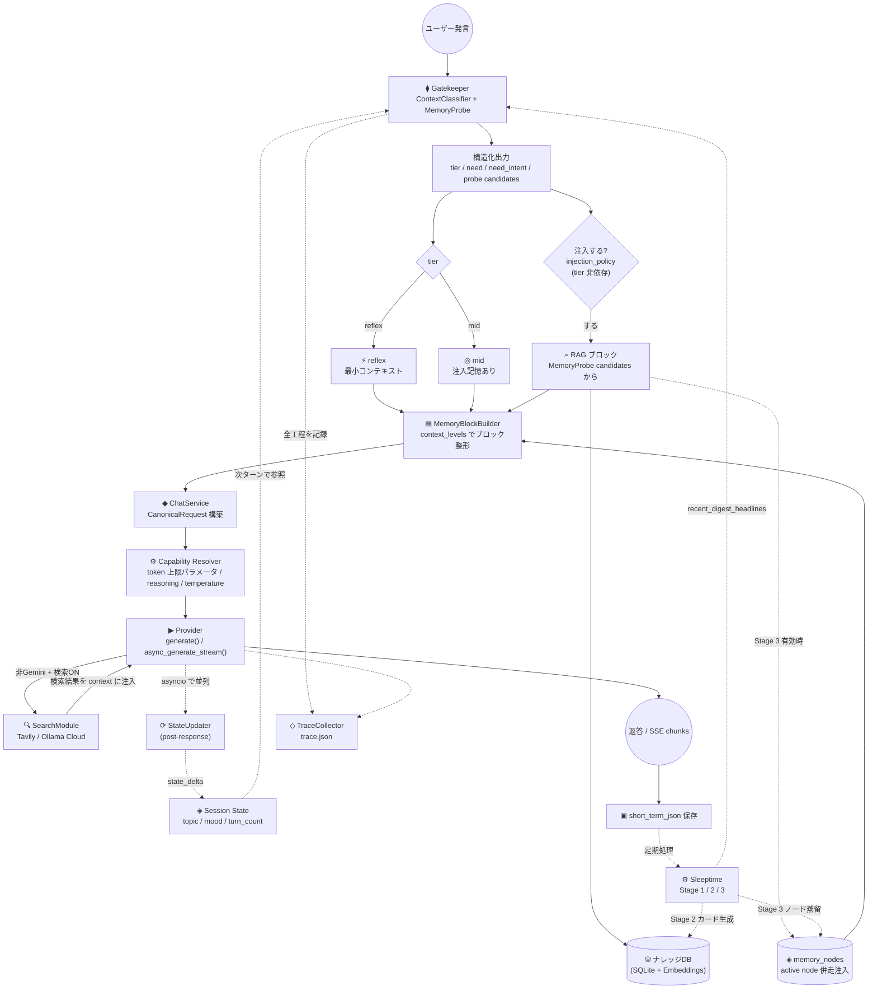

---

## 2. コンテキスト注入順序

LLM に渡すコンテキストの構築順序です。
`system_instruction`（不変）と `context_prefix`（可変）の 2 系統に分かれ、
順序の既定は `memory_builder.DEFAULT_CONTEXT_ORDER` が持ちます。

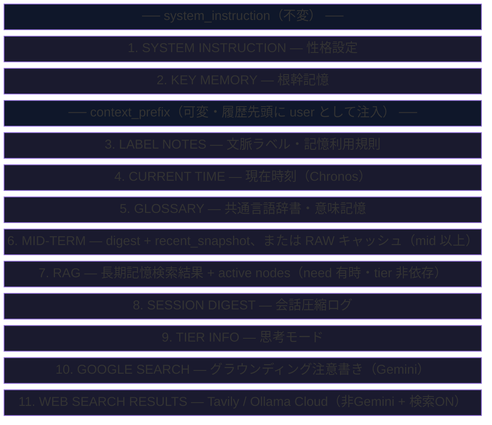

各ブロックは `context_levels`（`high` / `mid` / `low` / `off`）で詳細度を切り替えられます。
プリセットは `normal` / `compact` / `low` の 3 種。詳細は
[context_levels 仕様](context_levels.ja.md)。

---

## 3. 記憶パイプライン

short_term_json（RAW）から各層への流れです。
`mid_term.txt` への追記方式は廃止され、RAW は `2_knowledgeized/` から
`raw_memory_cache.txt` へ**再構築**されます。

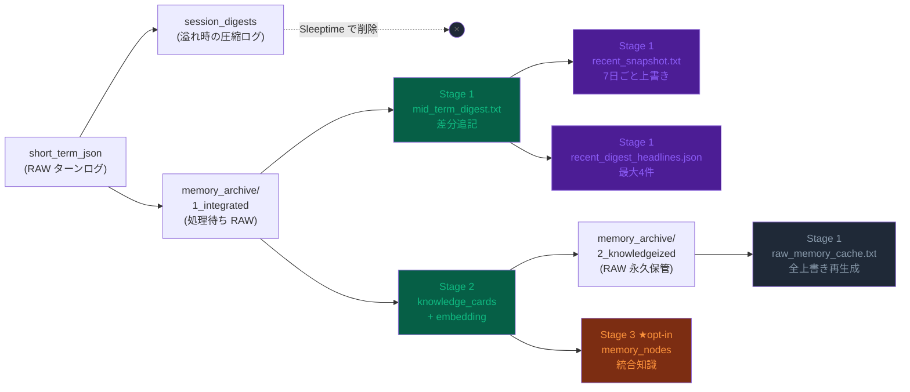

> Stage 1 は Stage 2 より先に走るため、`raw_memory_cache.txt` に載るのは
> **前回までにナレッジ化済み**の会話です。

---

## 4. Sleeptime ステージ構成

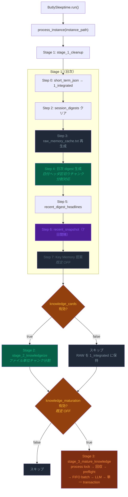

各ゲートはインスタンス `config.json` の `sleeptime.update_targets` で制御します。

---

## 5. Stage 3: Knowledge Maturation（opt-in）

content hash 式レビューキューと、単一 transaction での適用。

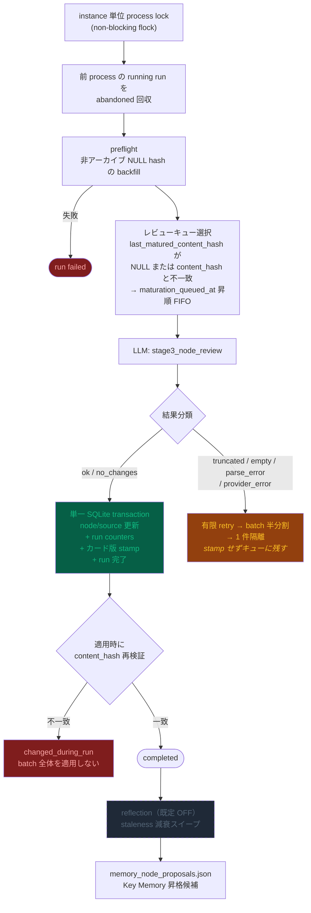

---

## 6. LLM レイヤー構成（Canonical + Capability）

Core / 評価コードは provider 固有のパラメータ名を選びません。

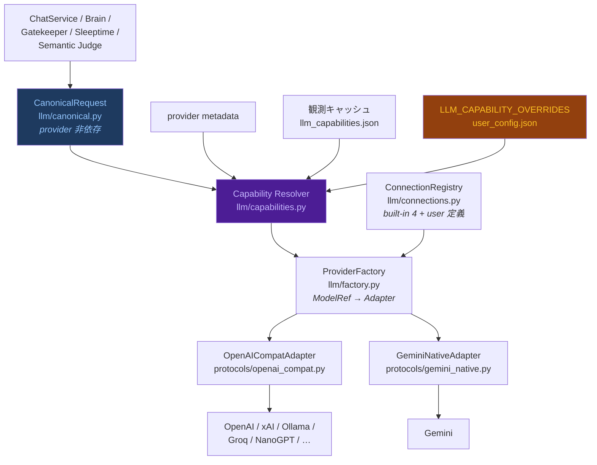

Capability の解決順は **provider metadata → 観測キャッシュ → manual override**。
モデル名の prefix では判定しません。詳細は
[LLM Connection / APIキー管理](llm_connections.ja.md)。

---

## 7. 検索モード（`brain.search_mode`）

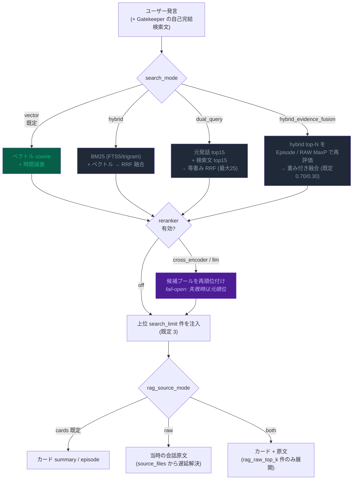

`vector` 以外と reranker は**評価で効果を確認してから昇格**させる方針です。
比較手順は [LoCoMo Evaluation Web Console](evaluation_web_console.ja.md)。

---

## 8. SSE ストリーミングフロー（`POST /api/v1/chat/stream`）

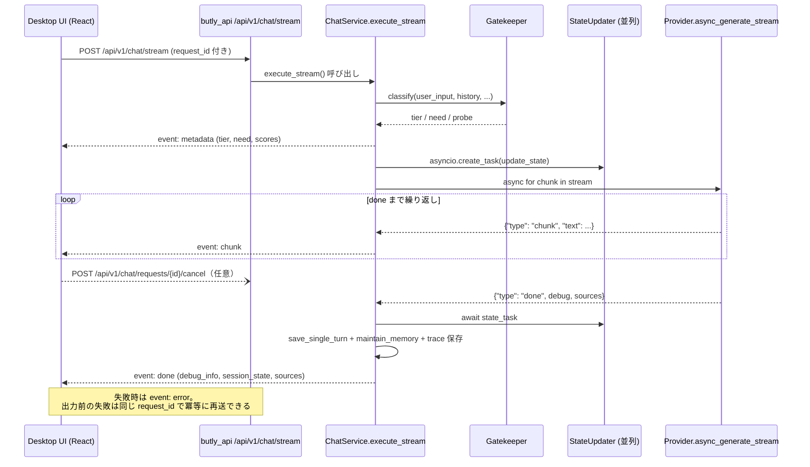

legacy `POST /chat/stream`（Streamlit 互換）も同じ `ChatService.execute_stream()` を通ります。

---

## 9. Trace Graph

1 応答の内部フローをノード + エッジで保存します（`trace.json`、schema version 1）。

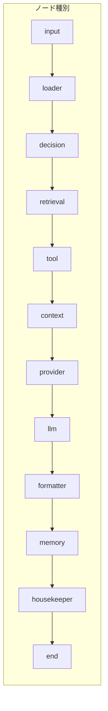

| status | 意味 | Mermaid での表現 |
|---|---|---|
| `active` | 実際に通った処理 | 緑塗り・実線 |
| `skipped` | 候補だったが使われなかった | 灰色・破線 |
| `fallback` | フォールバックとして使われた | 橙塗り・破線 |
| `error` | 失敗した処理 | 赤塗り |
| `warning` | 成功したが注意が必要 | 黄塗り |

保存は常に full。表示側のフィルタは `SYSTEM_CONFIG["trace"]` の
`detail`（`full` / `summary`）と `hidden_nodes` で制御します。
`butly_core/trace/mermaid.py` が frontend 非依存の Mermaid 文字列を生成し、
デスクトップ UI と評価画面の両方が同じ出力を描画します。

---

## 10. 設定の解決順

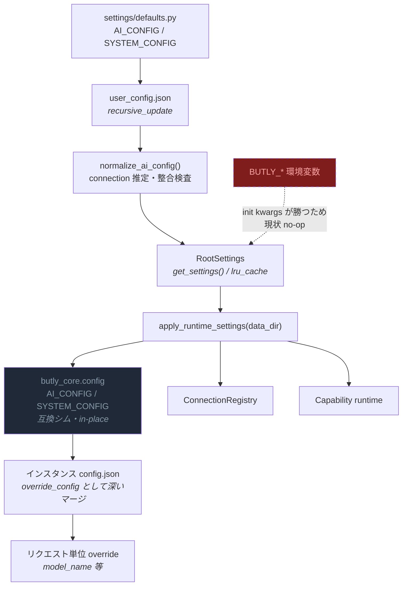

詳細は [設定レイヤー](configuration.ja.md)。

---

## 11. インスタンス別ディレクトリ構成

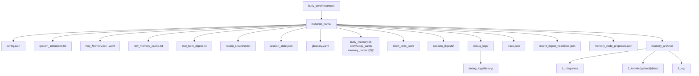

`memory_nodes` / `memory_node_sources` / `memory_maturation_runs` /
`memory_maturation_run_cards` は `knowledge_cards` と**同じ `butly_memory.db`** の中にあります。
