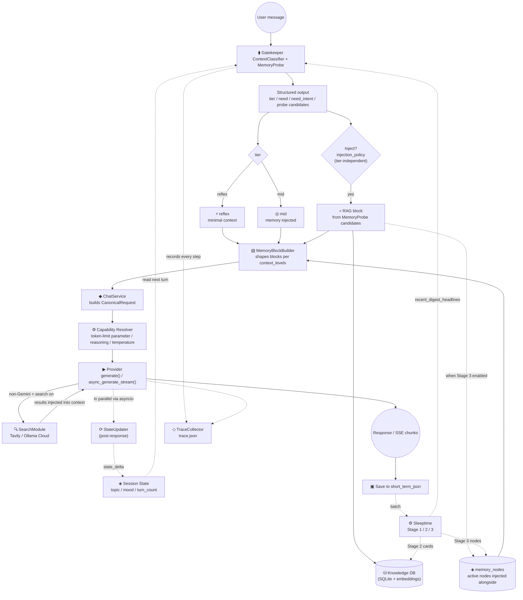
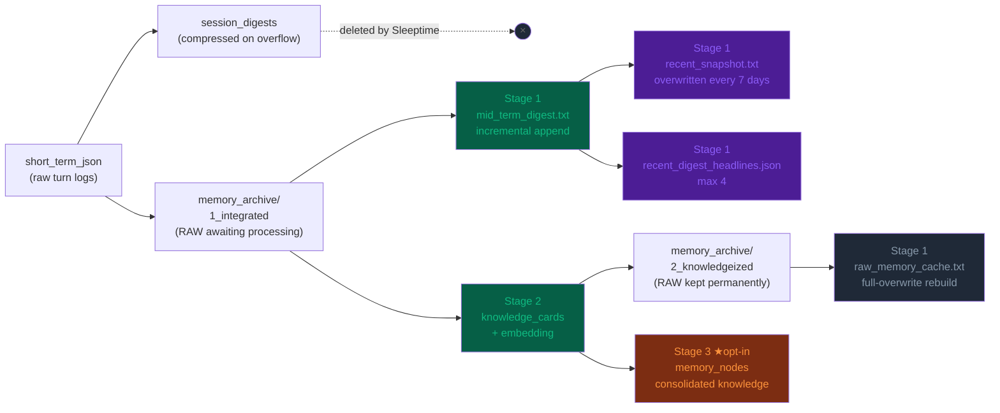
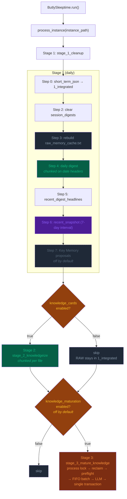
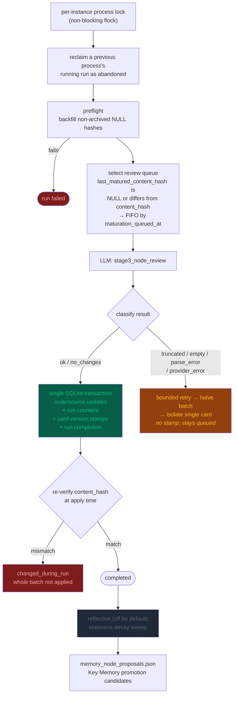
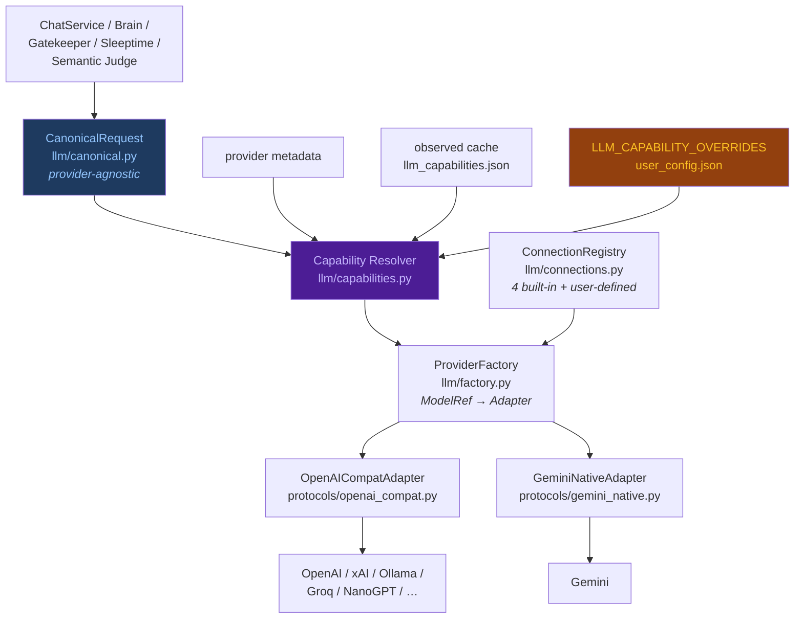
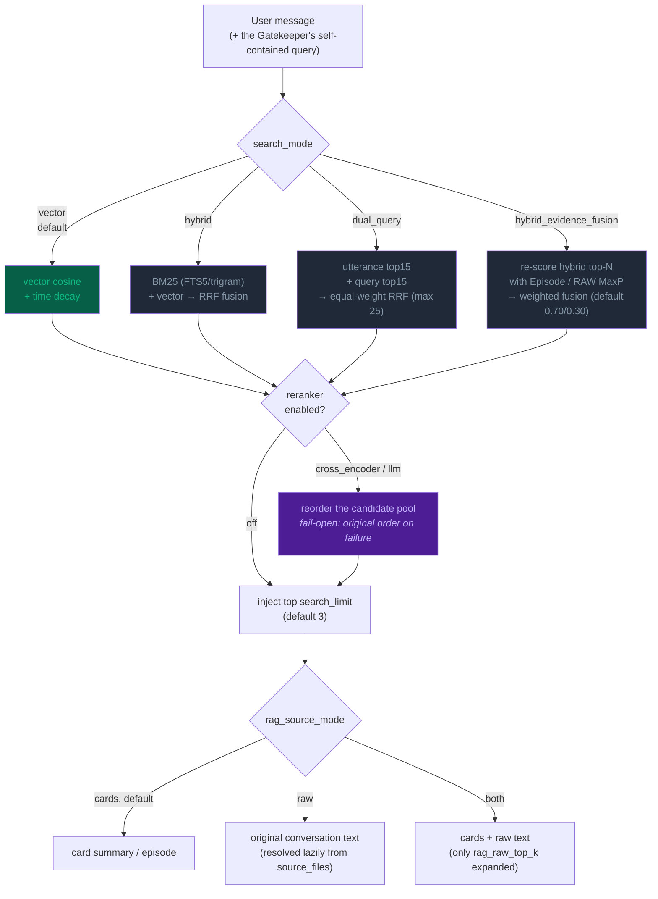
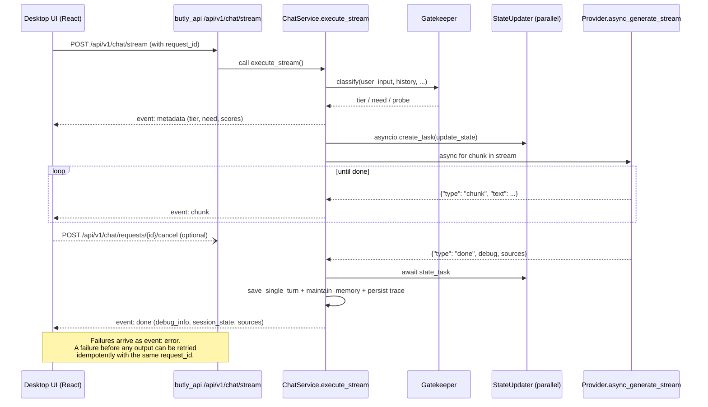
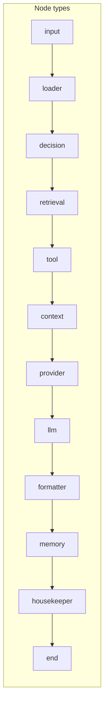
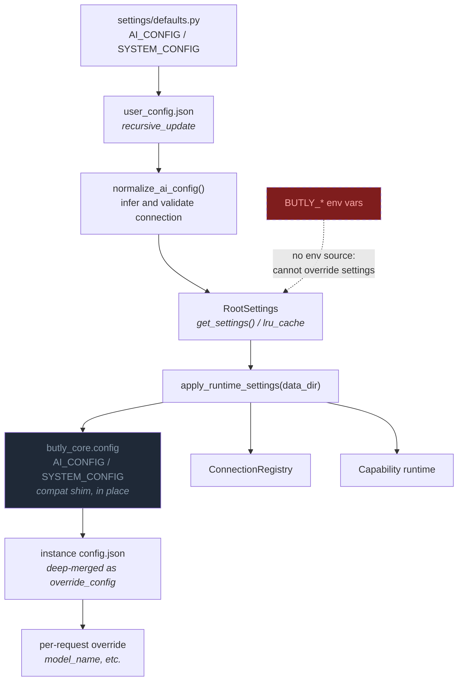
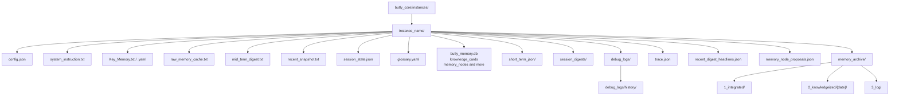

# Butly — Architecture Diagrams

[日本語](DIAGRAMS.ja.md) | 🌐 **English**

> Last updated: 2026-08-22

This file collects the Mermaid diagrams that visualize Butly's system design.
They are overviews only. For exact values and key names, defer to
[File Structure](FILE_STRUCTURE.md),
[Memory Lifecycle](memory_lifecycle.md), and
[Configuration Layer](configuration.md) — and ultimately to the current code.

---

## 1. Overall architecture (main flow)

From a user message through response generation to memory persistence.

---

## 2. Context injection order

The order in which context is assembled for the LLM. It splits into
`system_instruction` (immutable) and `context_prefix` (variable); the default order
lives in `memory_builder.DEFAULT_CONTEXT_ORDER`.

Each block's verbosity is switchable through `context_levels`
(`high` / `mid` / `low` / `off`), with three presets: `normal`, `compact`, `low`.
See [Context Levels](context_levels.md).

---

## 3. Memory pipeline

How raw turns flow into each layer. The append-to-`mid_term.txt` scheme is retired; RAW
is now **rebuilt** into `raw_memory_cache.txt` from `2_knowledgeized/`.

> Stage 1 runs before Stage 2, so `raw_memory_cache.txt` only contains conversations
> **already turned into knowledge on an earlier run**.

---

## 4. Sleeptime stages

Each gate is controlled by `sleeptime.update_targets` in the instance `config.json`.

---

## 5. Stage 3: Knowledge Maturation (opt-in)

A content-hash review queue applied inside a single transaction.

---

## 6. LLM layer (Canonical + Capability)

Core and evaluation code never pick provider-specific parameter names.

Capabilities resolve in the order **provider metadata → observed cache → manual
override**, never from the model-name prefix. See
[LLM Connections and API-key management](llm_connections.md).

---

## 7. Retrieval modes (`brain.search_mode`)

Anything beyond `vector`, including the reranker, is **promoted only after evaluation
confirms it helps**. For the comparison procedure see
[LoCoMo Evaluation Web Console](evaluation_web_console.md).

---

## 8. SSE streaming flow (`POST /api/v1/chat/stream`)

The legacy `POST /chat/stream` (Streamlit compatibility) goes through the same
`ChatService.execute_stream()`.

---

## 9. Trace Graph

Each response's internal flow is stored as nodes and edges (`trace.json`, schema version 1).

| status | Meaning | Mermaid rendering |
|---|---|---|
| `active` | Actually executed | Green fill, solid edge |
| `skipped` | A candidate that went unused | Grey, dashed |
| `fallback` | Used as a fallback | Orange fill, dashed |
| `error` | Failed | Red fill |
| `warning` | Succeeded but noteworthy | Yellow fill |

Traces are always saved in full; display filtering is controlled by `detail`
(`full` / `summary`) and `hidden_nodes` under `SYSTEM_CONFIG["trace"]`.
`butly_core/trace/mermaid.py` produces a frontend-agnostic Mermaid string, so the
desktop UI and the evaluation screens render the same output.

---

## 10. Settings resolution order

See [Configuration Layer](configuration.md).

---

## 11. Per-instance directory layout

`memory_nodes`, `memory_node_sources`, `memory_maturation_runs`, and
`memory_maturation_run_cards` live in the **same `butly_memory.db`** as `knowledge_cards`.
