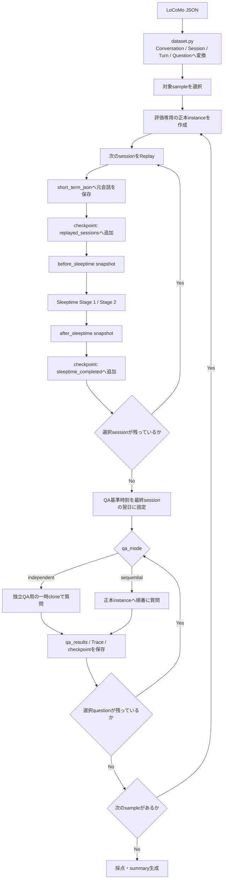
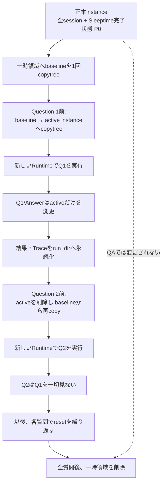
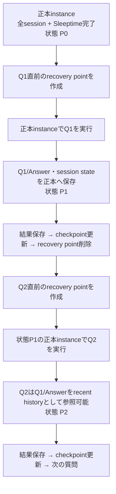

# LoCoMo評価のデータ保存・QA実行フロー

🌐 **日本語** | [English](locomo_evaluation_flow.md)

この文書は、LoCoMoの元会話がButlyへどう保存され、いつQAが始まり、
`independent`（独立QA）と`sequential`（継続QA）で何が変わるかを示す。
正本は現行の`evals/locomo/`実装であり、この文書はその処理経路を図解したもの。

## 全体像

評価は「全サンプルの会話を先に保存してから全QA」ではなく、**サンプル単位**で
次の順序を繰り返す。

1. 1サンプル用の正本instanceを作る。
2. 選択された各sessionをReplayし、そのsessionのSleeptimeを完了する。
3. そのサンプルの全sessionが完了したら、選択されたQAを実行する。
4. 次のサンプルへ進む。



## 元会話を最初に保存する経路

### 1. Datasetの解釈

`dataset.py`は公式JSONを読み、次の対応で固定DTOへ変換する。

- `sample_id` → 1つの評価instance
- `conversation.session_N` → 時系列順のsession
- 各発話の`dia_id` → evidence追跡用のID
- `qa` → 後で実行する質問・正解・カテゴリ・evidence
- 画像がある発話 → `blip_caption`を`[Image: ...]`として本文へ追加

### 2. 話者をButlyのroleへ変換

`ReplayAdapter`は話者を次のように固定する。

| LoCoMo | Butly |
|---|---|
| `speaker_a` | `user` |
| `speaker_b` | `assistant` / `model` |

基本はuser発話と直後のassistant発話を1つのButly turnとして保存する。同じroleの
発話が連続した場合は、反対側を空文字にして元の順序と全`dia_id`を失わないようにする。

### 3. `short_term_json`へ保存

Replayしたturnは通常の`ButlyMemory.save_single_turn()`を通る。保存日時には
評価実行時刻ではなく、LoCoMo sessionの元日時を渡す。

```text
LoCoMo turn
  → ReplayAdapter.replay_session()
  → ButlyMemory.save_single_turn(
        user_text,
        assistant_text,
        created_at=LoCoMoの元日時,
        meta=LoCoMo provenance
    )
  → workspace/butly_core/instances/<instance>/short_term_json/session_*.json
```

各JSONには、通常のuser/model本文に加えて次の追跡情報が入る。

- `locomo_sample_id`
- `locomo_session_id`
- `locomo_dialog_id` / `locomo_dialog_ids`
- 元話者と元timestamp
- LoCoMo話者とButly roleの対応
- 評価由来であることを示す`source=eval`

Replay結果のファイル名と`dia_id`対応は`results/replay_log.jsonl`にも保存される。

## 各session後のSleeptime

1 sessionをすべて`short_term_json`へ保存した直後に、そのinstanceへ同期的に
Sleeptimeを実行する。評価instanceの既定では次が有効になる。

- Stage 1: short-term会話のflush、mid-term digest、recent snapshot、
  RAW memory cacheなどの更新
- Stage 2: RAW会話からknowledge cardを抽出し、`butly_memory.db`へ保存
- 無効: key memory更新、knowledge maturation

主要な保存先は次のとおり。

```text
short_term_json/session_*.json
  └─ Sleeptime Stage 1
      ├─ memory_archive/1_integrated/
      ├─ mid_term_digest.txt
      ├─ recent_snapshot.txt
      └─ raw memory cache
          └─ Sleeptime Stage 2
              ├─ butly_memory.db の knowledge_cards
              └─ memory_archive/2_knowledgeized/
```

`snapshots/<instance>/<session>/before_sleeptime`と`after_sleeptime`は比較・監査用の
コンパクトなsnapshotであり、instance全体のcloneではない。digest、session state、
knowledge card一覧、各保存領域の件数などを記録する。

QAは、対象サンプルの選択sessionがすべて
`sleeptime_completed`へ入った後にだけ始まる。

## QA共通のButly内部経路

両モードとも質問への回答経路は同じで、使用するinstanceだけが異なる。

```mermaid
flowchart LR
    A["LoCoMo Question"] --> B["QARunner<br/>ChatRequestを構築"]
    B --> C["ButlyRuntime.chat()"]
    C --> D["ChatService前処理"]
    D --> E["Chronos + recent history"]
    E --> F["Gatekeeper分類"]
    F --> G["MemoryBlockBuilder"]
    G --> H["RAG<br/>knowledge cards / RAW参照"]
    H --> I["Chat modelで回答生成"]
    F --> J["StateUpdater"]
    I --> K["回答とQA turnをshort_term_jsonへ保存"]
    J --> K
    K --> L["Trace latest.json"]
    L --> M["QARunnerが永続artifactへコピー"]
    M --> N["qa_results.jsonl + traces/<sample>/<question>.json"]
    N --> O["checkpoint.qa_completedを更新"]
```



QA用`ChatRequest`は次の固定ポリシーを使う。

- `use_rag=True`
- Google検索・Web検索は無効
- LoCoMoの質問文は翻訳しない
- 回答は公式scorer互換のため英語の短答
- 「現在時刻」は選択sessionの最終日時の翌日に固定

評価instanceのSystem Instructionは、prompt内の全memory sectionを回答根拠として扱う。
特にknowledge card、参照元RAW、active nodeのいずれかが問いへ直接答える場合はその
情報を使い、元会話日時を基準に時制を解釈する。`No information available`は、
提供されたどのmemoryにも答えがない場合だけ返す。テンプレートの版は
`run_config.json`の`qa_prompt_version`へ保存し、異なる版のスコアを同一条件として
比較しない。

Gatekeeperが`need`を立てた場合、MemoryBlockBuilderがknowledge cardや設定に応じた
RAW参照をpromptへ組み込む。生成後、ChatServiceは質問と回答を通常の会話turnとして
処理対象instanceの`short_term_json`へ保存し、session stateも更新する。

`qa_results.jsonl`の`diagnostics.rag`と質問別Traceには、取得カードの実ID・日付・
参照instance・RAW参照状態を保存する。Stage 3有効時はactive nodeのlookup理由、
紐づくカードID、描画対象、最終Provider prompt内への注入判定も保存するため、
「node未取得」「context levelで除外」「promptへ入ったが回答に未利用」を事後に
区別できる。完全なprompt本文は評価artifactへ複製しない。

純粋ベクトル検索は、instance内のknowledge cardを新旧に関係なくすべて
コサイン類似度の計算対象にする。その後で時間減衰・archive補正・閾値判定を適用し、
上位`limit`件だけをRAG候補として返す。`fallback_fetch_limit`はキーワード検索の
フォールバック専用であり、純粋ベクトル検索の候補範囲を制限しない。
Traceの`memory_probe_layers.vector`では、`fetch_limit: null`が全件検索、
`fetched_count`が実際に評価したカード数を示す。
検索の時間減衰はprofileの`brain.time_decay_rate`で評価run単位に上書きできる。
Colabの既定値`0.0`は新旧カードを意味類似度だけで比較するA/B用であり、
通常インスタンスのシステム既定値は変更しない。

### ハイブリッド検索（`brain.search_mode`）

`brain.search_mode: hybrid`で、FTS5(trigram)のBM25候補とベクトル候補を
RRFで融合する検索へ切り替えられる（既定は`vector`）。profileから
`bm25_candidates` / `vector_candidates` / `rrf_k` / `bm25_weights` /
`bm25_max_df_ratio` / `bm25_min_weak_df` / `bm25_scan_limit`を上書きできる。
hybridの候補dictでは`score`が**RRFスコア**になり、cosineは`vector_score`へ入る。
`retrieval_source`（vector/bm25/both）と両者の順位も残る。

Webコンソールの「検索設定（ハイブリッド検索 A/B）」から
`search_mode` / `retrieval_execution` / `injection_policy` を選べる。
`hybrid`のときだけ`bm25_candidates` / `vector_candidates` / `rrf_k` /
`bm25_max_df_ratio`の入力欄が出て、profile YAMLの`brain`・`memory_probe`
セクションへ書き込まれる（`vector` runのprofileにBM25キーは残さない）。
run履歴と比較表には`search_exec` / `recall@3` / `bm25_rescue`列が並ぶ。

検索の実行と注入判定は`memory_probe.retrieval_execution`（既定`always`）と
`memory_probe.injection_policy`（既定`intent_gated`）で独立に制御する。
`always`では`need_intent=null`の問でもQuick Retrievalが走るため、
**`rag_trigger_rate`はもう検索実行率ではない**。実行率は
`search_execution_rate`、注入率は`memory_injection_rate`（`rag_trigger_rate`と同値）
を見る。

scorerが出す検索系の指標:

| 指標 | 分母 | 内容 |
|---|---|---|
| `search_execution_rate` | 全問 | Quick Retrievalを実行した割合 |
| `retrieval_candidate_rate` | 全問 | 候補が1件以上あった割合 |
| `memory_injection_rate` | 全問 | promptへ注入した割合（=`rag_trigger_rate`） |
| `retrieval_recall_at_1/3/20` | oracleカードがある問 | 上位k候補の`source_files`がevidenceターンを覆う割合 |
| `vector_only_recall_at_3` | 同上 | BM25を外した対照値 |
| `bm25_rescue_rate` | 同上 | 融合top3がベクトル単独top3を上回った割合 |
| `retrieval_latency_ms_p50/p95` | 実行した問 | 検索のみのレイテンシ（embedding呼び出しを含む） |
| `bm25_short_term_hit_rate` | 実行した問 | 2文字CJK語のLIKE補助候補が入った割合 |

`evidence_retrieval_rate`は**注入されたカード**で測るので注入policyの影響を受ける。
ランキング自体の良し悪しは`retrieval_recall_at_k`で見る。

評価profileの`context_levels.levels`では、`current_time`、`mid_term`、
`session_digest`、`rag`をそれぞれ`high` / `'off'`にできる。RAGを完全に止める
場合は、prompt注入を止める`rag: 'off'`に加えて`brain.use_rag: false`で検索自体も
止める。Colab Parametersセルはこの4項目をbooleanで公開し、生成YAMLへ両方の
RAG設定を正しく書く。手書きYAMLの`off`はYAML 1.1でbooleanに解釈されるため、
文字列`'off'`としてquoteする。

`chat`、`gatekeeper`、`summary`、`knowledge`は、それぞれ独立した
`generation_config.temperature`を持てる。chatは最終回答、gatekeeperは検索判断、
summaryとknowledgeはSleeptime中のdigest/card生成へ作用する。

## 同じカードでQAだけ再実行

`rerun-qa`は、既存runの正本instanceを新しいrunへ複製し、ReplayとSleeptimeを
skipしてQAだけを0問目から実行する。

```bash
python -m evals.locomo.cli rerun-qa \
  --source-run ./eval_runs/qwen3_14b_colab_v16 \
  --dataset /path/to/locomo10.json \
  --output-dir ./eval_runs \
  --run-id qwen3_14b_colab_v16_no_time \
  --all-questions \
  --profile /path/to/qa-ablation.yaml
```

安全条件と性質は次のとおり。

- 元runは`qa_mode=independent`でなければならない。独立QAだけが正本instanceを
  post-Sleeptimeのまま不変に保つ。
- datasetのSHA-256、対象sessionのReplay/Sleeptime checkpoint、正本の
  `short_term_json`が空であることを検証する。
- 元runには書き込まない。カードDBを含むinstanceとReplay/Sleeptime logを
  新runへcopyし、新しいQA結果・Trace・checkpointを作る。
- copyしたinstanceのLoCoMo回答用System Instructionは現在の
  `qa_prompt_version`へ更新する。カード・RAW・active nodeは変更しない。
- `run_config.json`の`memory_reused_from_run_id`がカードの出所を示す。
- QA-only再実行ではchat/gatekeeper temperatureとcontext切替は変化するが、
  summary/knowledge temperatureは既に完成したdigest/cardを作り直さないため
  結果へ作用しない。
- datasetを移動した場合だけ`--dataset`で新しい場所を指定できる。元run manifestの
  SHA-256と一致しないファイルは拒否する。
- 再利用runのresume時にmemory checkpointが欠落・不完全なら、二重投入を避けるため
  Replay/Sleeptimeへfallbackせず停止する。

Colabでは`SOURCE_MEMORY_RUN_ID`へ元run IDを設定し、`RUN_ID`を新しい値に変える。
空文字のままなら通常のReplay → Sleeptime → QAを行う。sample/session範囲は元runの
カード集合に固定され、question範囲だけを変更できる。

## Stage 3（memory_nodes）の ON/OFF 評価

Stage 3 の効果測定は「完全に同じ knowledge card 集合の上で node 層の有無だけを
変える」clone A/B を正式手順とする（Stage 2 の LLM 出力揺れを排除するため、
full replay を 2 本回す方式は使わない）。

```bash
# 1. baseline source run（Stage 3 は既定 OFF のまま Replay/Sleeptime まで完了）
python -m evals.locomo.cli run --dataset ... --output-dir ./eval_runs \
  --run-id stage3-source --qa-mode independent --all-questions

# 2. OFF clone: 同一カードで node 無し QA
python -m evals.locomo.cli rerun-qa --source-run ./eval_runs/stage3-source \
  --run-id stage3-off --profile evals/locomo/profiles/stage3_off.example.yaml

# 3. ON clone: カード同一性検証 → stage3-bootstrap でキュー drain → node 注入 QA
python -m evals.locomo.cli rerun-qa --source-run ./eval_runs/stage3-source \
  --run-id stage3-on --stage3-bootstrap \
  --profile evals/locomo/profiles/stage3_on.example.yaml
```

Colab NotebookではParametersセルをフォーム表示し、`RUN_ID`、
`SOURCE_MEMORY_RUN_ID`、評価範囲、主要パスを右側の入力欄から変更できる。
`RUN_MODE`は次のプルダウンから選ぶ。

| `RUN_MODE` | 動作 |
|---|---|
| `standard` | 通常評価。source IDが空ならReplayから実行し、指定時は従来どおりカードを再利用してQAだけ再実行 |
| `stage3-full` | source不要の単一run。各セッションでReplay → Stage 2 → Stage 3を実行し、そのrunで生成したnodeを最終QAへ注入する。実運用相当の統合評価であり、同一カードA/Bではない |
| `stage3-source` | 正式A/Bのpost-Stage 2正本を作成。Stage 3は明示OFF、source IDは空、`QA_MODE=independent`必須 |
| `stage3-off` | sourceの同一カードをcloneし、node無しでQA。source ID必須 |
| `stage3-on` | 同じsourceをcloneし、`--stage3-bootstrap`とnode注入を自動で有効化してQA。source ID必須 |

OFF/ONには異なる`RUN_ID`と同じ`SOURCE_MEMORY_RUN_ID`を設定する。
ローカルモデル向けに`STAGE3_BATCH_SIZE`、安全上限として
`STAGE3_BOOTSTRAP_MAX_CARDS`もフォームから変更できる。

同じパラメータはButly Web Consoleの`📊`画面からも設定できる。Web版は
Notebookの評価ロジックを移植せず、生成profileと引数を既存CLIへ渡す。
CLIの進捗を永続ログから表示し、停止後はcheckpointからresumeできる。保存済み
runの主要指標と問題別deltaも画面上で比較できる。API・状態遷移・保存先の詳細は
[LoCoMo Evaluation Web Console](evaluation_web_console.ja.md)を参照。

性質と artifact:

- clone 直後に `knowledge_cards` の id と canonical content hash
  （`butly_core/core/card_content.py` の §5.2 正規化）を source と照合し、
  1 件でも不一致なら QA 前に失敗終了する。結果は run 直下の
  `card_identity.json` に記録される（OFF/ON とも同じ source と照合するため、
  両者のカード集合は推移的に同一）。
- `--stage3-bootstrap` は ON 側専用。bootstrap の統計は
  `results/stage3_bootstrap_log.jsonl` に出力され、`status=completed` 以外
  （partial 含む）は A/B の腕として無効なので失敗終了する。bootstrap 後にも
  カード集合の不変を再検証する。
- ON bootstrap中にColabが切断され、全sampleの完了証跡
  `card_identity.json`が確定していない場合、`resume`は部分nodeのままQAへ進まず
  明示的に失敗する。新しい`RUN_ID`でON armを再実行する。
- bootstrap の clock は QA と同じ「最終会話日の翌日」を注入する。
- node 注入は `memory.knowledge_maturation_enabled=true`（stage3_on profile）
  で有効になる。自動 Key Memory 反映はこの評価では常に OFF。
- 比較指標: QA スコア（既存 scorer）、`card_identity.json` の件数・digest、
  `stage3_bootstrap_log.jsonl` の node 生成数・失敗数・LLM 呼び出し数。

### per-session で Stage 3 を走らせる統合テスト経路

Notebookの`stage3-full`（または通常の `run` に `stage3_on` profile）では、
sourceをcloneせず、profile の `sleeptime` セクションが
再帰マージで適用され、SleeptimeRunner が Stage 2 成功後に Stage 3 を実行する。
Stage 3 の clock には session の元日時を注入する（QA 時だけ設定される
`BUTLY_CHRONOS_NOW` に依存しない）。`sleeptime_log.jsonl` には
`stage_3_status` / `stage_3_reviewed_cards` / `stage_3_created_nodes` /
`stage_3_linked_sources` / `stage_3_failed_cards` / `stage_3_llm_calls` /
`stage_3_prompt_tokens` / `stage_3_completion_tokens` が Stage 1/2 と分離して
記録され、Stage 3 の失敗が Stage 2 の成功に紛れ込まない。
この経路は、実運用と同じく記憶蓄積中にnodeを生成して最終QAで利用する統合評価用。
Stage 3単独の正式な精度 A/B は上記clone方式を使う。

## `independent`: 独立QA

目的は、**すべての質問を完全に同じpost-Sleeptime状態から評価すること**。



一時領域の概念的な構成は次のとおり。

```text
/tmp/butly-locomo-qa-<instance>-*/
├─ baseline/<instance>/                 # 正本から最初に1回コピー
└─ active/butly_core/instances/<instance>/
                                          # 各質問の直前にbaselineから再作成
```

重要な性質:

- 正本instanceはQAで変更されない。
- Q1の質問・回答・session stateはQ2へ渡らない。
- 各質問でinstance cacheも持ち越さないよう、新しいRuntimeを作る。
- QA中の会話保存先は一時active instanceであり、次のresetで破棄される。
- `qa_results.jsonl`と質問別Traceだけはrun directoryへ永続化される。
- コストは正本→baselineの初回コピーに加え、質問ごとのbaseline→activeコピー。

このモードはバージョン間の回答性能比較に向く。質問順序による有利・不利を除去できる。

セッション数による影響を切り分ける場合は、モデル・profile・質問範囲を固定し、
まず`--session-limit 3 --question-limit 10`、次に
`--all-sessions --question-limit 10`を別run IDで実行する。前者は旧評価条件との
比較、後者は全会話を記憶したときの検索スケーリング確認になる。

## `sequential`: 継続QA

目的は、**実運用のようにQA会話を同じinstanceへ蓄積して耐久性を測ること**。



重要な性質:

- ReplayとSleeptimeに使った正本instanceへ、そのままQAを保存する。
- Q1の質問・回答・session stateがQ2以降へ残る。
- QA間に明示的なSleeptimeは実行しない。
- ChatServiceの通常処理として`short_term_json`保存とmemory maintenanceは行われる。
- 各質問前に正本instance、`qa_results.jsonl`の長さ、Traceを含むrecovery pointを作る。
- 中断時にcheckpoint未commitの質問があれば、resume時に質問前へrollbackする。

このモードは、100回程度の質問が連続したときの履歴汚染、topic/session stateの変化、
RAG判断のドリフトなどを含む運用耐久評価に向く。

## 2モードの比較

| 観点 | `independent` | `sequential` |
|---|---|---|
| 各質問の開始状態 | 毎回同じpost-Sleeptime baseline | 直前QAまで蓄積した状態 |
| QAの保存先 | `/tmp`の一時active instance | run directoryの正本instance |
| 前の質問・回答 | 見えない | recent historyとして見える |
| 正本instance | QAでは不変 | QAごとに変化 |
| Runtime | 質問ごとに新規 | 同じRuntimeを継続利用 |
| QA間Sleeptime | なし | なし |
| 主な用途 | モデル・バージョン比較 | 実運用・連続耐久試験 |
| 主な追加コスト | 質問ごとのinstance copy | 質問ごとのrecovery copy |

## Run directoryと永続artifact

```text
<output-dir>/<run-id>/
├─ run_config.json
├─ dataset_manifest.json
├─ environment.json
├─ workspace/
│  └─ butly_core/instances/<instance>/   # 正本instance
├─ checkpoints/
│  ├─ checkpoint.json
│  └─ sequential_qa/                     # sequential実行中だけのrecovery point
├─ snapshots/
│  └─ <instance>/<session>/
│     ├─ before_sleeptime/
│     └─ after_sleeptime/
├─ results/
│  ├─ replay_log.jsonl
│  ├─ sleeptime_log.jsonl
│  └─ qa_results.jsonl
└─ traces/
   └─ <sample>/<question-id>.json
```

独立QAの一時instanceはこのtree外のOS temp directoryに作られ、全質問後に削除される。

## CLI / Colabの進捗表示

`run`、`resume`、`rerun-qa`は、長いモデル呼び出しの開始前と完了後に、次の形式で進捗を
stderrへ即時出力する。Colabの実行セルは子プロセスのstderrをそのまま表示するため、
Notebook側で出力を読み取る処理は不要。

```text
[LoCoMo  41.2%] [11/24] sleeptime | conv-26 session_6 completed
```

全体率は経過時間の予測ではなく、完了した処理件数による簡易指標。

- Replay 1 session = 1 unit
- Sleeptime 1 session = 1 unit
- QA 1 question = 1 unit
- 上記を0〜90%へ換算
- 採点完了で96%、`summary.md`生成完了で100%

各unitは同じ重みなので、モデルやsession長によって実時間とのずれは生じる。
`resume`ではcheckpoint済みunitを初期完了数へ含めるため、表示は中断前の位置に近い
割合から再開する。進捗はstderr、従来の最終結果JSONはstdoutの最終行に出力する。

## Checkpointの読み方

`checkpoints/checkpoint.json`は、各サンプルについて次を記録する。

- `replayed_sessions`: 元会話の`short_term_json`保存までcommit済み
- `sleeptime_completed`: そのsessionのSleeptimeとafter snapshotまでcommit済み
- `qa_completed`: 結果保存後にcommit済みの質問数
- `status`: `replaying` / `qa` / `completed`

したがって、あるsessionが`replayed_sessions`にはあるが`sleeptime_completed`にない場合、
そのsessionは「Replay済み、Sleeptime実行中または未完了」を意味する。QAはまだ始まらない。
