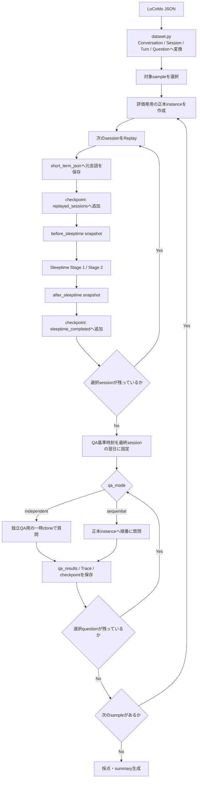
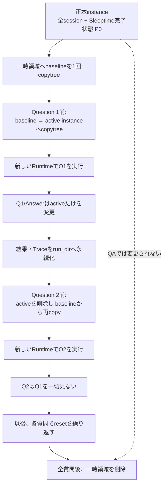
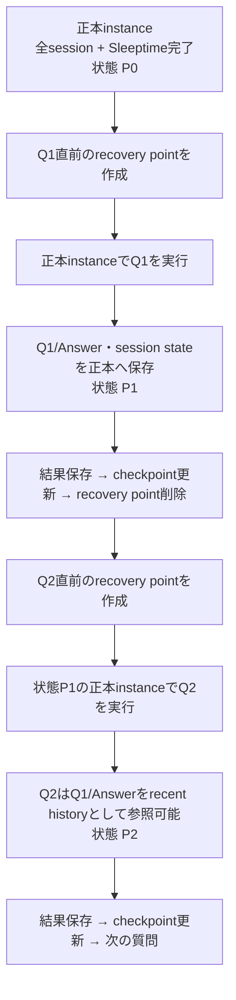

# LoCoMo評価のデータ保存・QA実行フロー

🌐 **日本語** | [English](locomo_evaluation_flow.md)

この文書は、LoCoMoの元会話がButlyへどう保存され、いつQAが始まり、
`independent`（独立QA）と`sequential`（継続QA）で何が変わるかを示す。
正本は現行の`evals/locomo/`実装であり、この文書はその処理経路を図解したもの。

## 全体像

評価は「全サンプルの会話を先に保存してから全QA」ではなく、**サンプル単位**で
次の順序を繰り返す。

1. 1サンプル用の正本instanceを作る。
2. 選択された各sessionをReplayし、そのsessionのSleeptimeを完了する。
3. そのサンプルの全sessionが完了したら、選択されたQAを実行する。
4. 次のサンプルへ進む。



## 元会話を最初に保存する経路

### 1. Datasetの解釈

`dataset.py`は公式JSONを読み、次の対応で固定DTOへ変換する。

- `sample_id` → 1つの評価instance
- `conversation.session_N` → 時系列順のsession
- 各発話の`dia_id` → evidence追跡用のID
- `qa` → 後で実行する質問・正解・カテゴリ・evidence
- 画像がある発話 → `blip_caption`を`[Image: ...]`として本文へ追加

### 2. 話者をButlyのroleへ変換

`ReplayAdapter`は話者を次のように固定する。

| LoCoMo | Butly |
|---|---|
| `speaker_a` | `user` |
| `speaker_b` | `assistant` / `model` |

基本はuser発話と直後のassistant発話を1つのButly turnとして保存する。同じroleの
発話が連続した場合は、反対側を空文字にして元の順序と全`dia_id`を失わないようにする。

### 3. `short_term_json`へ保存

Replayしたturnは通常の`ButlyMemory.save_single_turn()`を通る。保存日時には
評価実行時刻ではなく、LoCoMo sessionの元日時を渡す。

```text
LoCoMo turn
  → ReplayAdapter.replay_session()
  → ButlyMemory.save_single_turn(
        user_text,
        assistant_text,
        created_at=LoCoMoの元日時,
        meta=LoCoMo provenance
    )
  → workspace/butly_core/instances/<instance>/short_term_json/session_*.json
```

各JSONには、通常のuser/model本文に加えて次の追跡情報が入る。

- `locomo_sample_id`
- `locomo_session_id`
- `locomo_dialog_id` / `locomo_dialog_ids`
- 元話者と元timestamp
- LoCoMo話者とButly roleの対応
- 評価由来であることを示す`source=eval`

Replay結果のファイル名と`dia_id`対応は`results/replay_log.jsonl`にも保存される。

## 各session後のSleeptime

1 sessionをすべて`short_term_json`へ保存した直後に、そのinstanceへ同期的に
Sleeptimeを実行する。評価instanceの既定では次が有効になる。

- Stage 1: short-term会話のflush、mid-term digest、recent snapshot、
  RAW memory cacheなどの更新
- Stage 2: RAW会話からknowledge cardを抽出し、`butly_memory.db`へ保存
- 無効: key memory更新、knowledge maturation

主要な保存先は次のとおり。

```text
short_term_json/session_*.json
  └─ Sleeptime Stage 1
      ├─ memory_archive/1_integrated/
      ├─ mid_term_digest.txt
      ├─ recent_snapshot.txt
      └─ raw memory cache
          └─ Sleeptime Stage 2
              ├─ butly_memory.db の knowledge_cards
              └─ memory_archive/2_knowledgeized/
```

`snapshots/<instance>/<session>/before_sleeptime`と`after_sleeptime`は比較・監査用の
コンパクトなsnapshotであり、instance全体のcloneではない。digest、session state、
knowledge card一覧、各保存領域の件数などを記録する。

QAは、対象サンプルの選択sessionがすべて
`sleeptime_completed`へ入った後にだけ始まる。

## QA共通のButly内部経路

両モードとも質問への回答経路は同じで、使用するinstanceだけが異なる。

```mermaid
flowchart LR
    A["LoCoMo Question"] --> B["QARunner<br/>ChatRequestを構築"]
    B --> C["ButlyRuntime.chat()"]
    C --> D["ChatService前処理"]
    D --> E["Chronos + recent history"]
    E --> F["Gatekeeper分類"]
    F --> G["MemoryBlockBuilder"]
    G --> H["RAG<br/>knowledge cards / RAW参照"]
    H --> I["Chat modelで回答生成"]
    F --> J["StateUpdater"]
    I --> K["回答とQA turnをshort_term_jsonへ保存"]
    J --> K
    K --> L["Trace latest.json"]
    L --> M["QARunnerが永続artifactへコピー"]
    M --> N["qa_results.jsonl + traces/<sample>/<question>.json"]
    N --> O["checkpoint.qa_completedを更新"]
```



QA用`ChatRequest`は次の固定ポリシーを使う。

- `use_rag=True`
- Google検索・Web検索は無効
- LoCoMoの質問文は翻訳しない
- 回答は公式scorer互換のため英語の短答
- 「現在時刻」は選択sessionの最終日時の翌日に固定

Gatekeeperが`need`を立てた場合、MemoryBlockBuilderがknowledge cardや設定に応じた
RAW参照をpromptへ組み込む。生成後、ChatServiceは質問と回答を通常の会話turnとして
処理対象instanceの`short_term_json`へ保存し、session stateも更新する。

## `independent`: 独立QA

目的は、**すべての質問を完全に同じpost-Sleeptime状態から評価すること**。



一時領域の概念的な構成は次のとおり。

```text
/tmp/butly-locomo-qa-<instance>-*/
├─ baseline/<instance>/                 # 正本から最初に1回コピー
└─ active/butly_core/instances/<instance>/
                                          # 各質問の直前にbaselineから再作成
```

重要な性質:

- 正本instanceはQAで変更されない。
- Q1の質問・回答・session stateはQ2へ渡らない。
- 各質問でinstance cacheも持ち越さないよう、新しいRuntimeを作る。
- QA中の会話保存先は一時active instanceであり、次のresetで破棄される。
- `qa_results.jsonl`と質問別Traceだけはrun directoryへ永続化される。
- コストは正本→baselineの初回コピーに加え、質問ごとのbaseline→activeコピー。

このモードはバージョン間の回答性能比較に向く。質問順序による有利・不利を除去できる。

## `sequential`: 継続QA

目的は、**実運用のようにQA会話を同じinstanceへ蓄積して耐久性を測ること**。



重要な性質:

- ReplayとSleeptimeに使った正本instanceへ、そのままQAを保存する。
- Q1の質問・回答・session stateがQ2以降へ残る。
- QA間に明示的なSleeptimeは実行しない。
- ChatServiceの通常処理として`short_term_json`保存とmemory maintenanceは行われる。
- 各質問前に正本instance、`qa_results.jsonl`の長さ、Traceを含むrecovery pointを作る。
- 中断時にcheckpoint未commitの質問があれば、resume時に質問前へrollbackする。

このモードは、100回程度の質問が連続したときの履歴汚染、topic/session stateの変化、
RAG判断のドリフトなどを含む運用耐久評価に向く。

## 2モードの比較

| 観点 | `independent` | `sequential` |
|---|---|---|
| 各質問の開始状態 | 毎回同じpost-Sleeptime baseline | 直前QAまで蓄積した状態 |
| QAの保存先 | `/tmp`の一時active instance | run directoryの正本instance |
| 前の質問・回答 | 見えない | recent historyとして見える |
| 正本instance | QAでは不変 | QAごとに変化 |
| Runtime | 質問ごとに新規 | 同じRuntimeを継続利用 |
| QA間Sleeptime | なし | なし |
| 主な用途 | モデル・バージョン比較 | 実運用・連続耐久試験 |
| 主な追加コスト | 質問ごとのinstance copy | 質問ごとのrecovery copy |

## Run directoryと永続artifact

```text
<output-dir>/<run-id>/
├─ run_config.json
├─ dataset_manifest.json
├─ environment.json
├─ workspace/
│  └─ butly_core/instances/<instance>/   # 正本instance
├─ checkpoints/
│  ├─ checkpoint.json
│  └─ sequential_qa/                     # sequential実行中だけのrecovery point
├─ snapshots/
│  └─ <instance>/<session>/
│     ├─ before_sleeptime/
│     └─ after_sleeptime/
├─ results/
│  ├─ replay_log.jsonl
│  ├─ sleeptime_log.jsonl
│  └─ qa_results.jsonl
└─ traces/
   └─ <sample>/<question-id>.json
```

独立QAの一時instanceはこのtree外のOS temp directoryに作られ、全質問後に削除される。

## CLI / Colabの進捗表示

`run`と`resume`は、長いモデル呼び出しの開始前と完了後に、次の形式で進捗を
stderrへ即時出力する。Colabの実行セルは子プロセスのstderrをそのまま表示するため、
Notebook側で出力を読み取る処理は不要。

```text
[LoCoMo  41.2%] [11/24] sleeptime | conv-26 session_6 completed
```

全体率は経過時間の予測ではなく、完了した処理件数による簡易指標。

- Replay 1 session = 1 unit
- Sleeptime 1 session = 1 unit
- QA 1 question = 1 unit
- 上記を0〜90%へ換算
- 採点完了で96%、`summary.md`生成完了で100%

各unitは同じ重みなので、モデルやsession長によって実時間とのずれは生じる。
`resume`ではcheckpoint済みunitを初期完了数へ含めるため、表示は中断前の位置に近い
割合から再開する。進捗はstderr、従来の最終結果JSONはstdoutの最終行に出力する。

## Checkpointの読み方

`checkpoints/checkpoint.json`は、各サンプルについて次を記録する。

- `replayed_sessions`: 元会話の`short_term_json`保存までcommit済み
- `sleeptime_completed`: そのsessionのSleeptimeとafter snapshotまでcommit済み
- `qa_completed`: 結果保存後にcommit済みの質問数
- `status`: `replaying` / `qa` / `completed`

したがって、あるsessionが`replayed_sessions`にはあるが`sleeptime_completed`にない場合、
そのsessionは「Replay済み、Sleeptime実行中または未完了」を意味する。QAはまだ始まらない。
