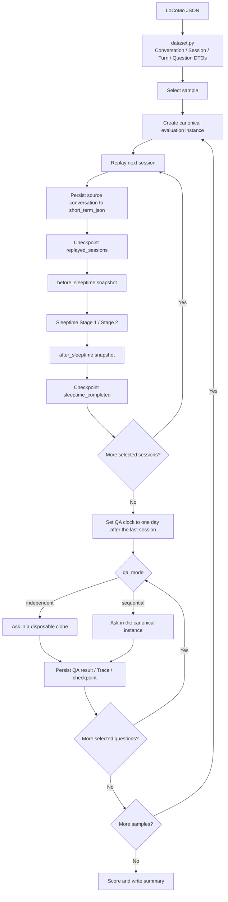
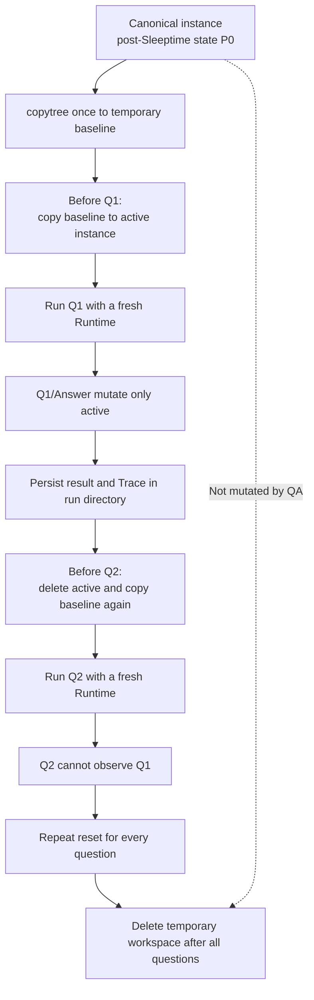
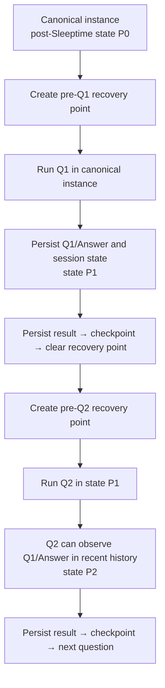

# LoCoMo Evaluation Data and QA Flow

[日本語](locomo_evaluation_flow.ja.md) | **English**

This document shows how the current `evals/locomo/` implementation persists
LoCoMo conversations, when QA begins, and how `independent` and `sequential`
QA modes differ.

## End-to-end order

The evaluator does not ingest every sample before starting all QA. It repeats
the following sequence **per sample**:

1. Create one canonical evaluation instance.
2. Replay each selected session and complete Sleeptime for that session.
3. After every selected session in that sample is complete, run its selected
   questions.
4. Move to the next sample.



## Initial conversation persistence

### Dataset mapping

`dataset.py` maps the official JSON into immutable DTOs:

- one `sample_id` becomes one evaluation instance;
- `conversation.session_N` entries become chronological sessions;
- each `dia_id` is retained for evidence provenance;
- `qa` entries become questions, reference answers, categories, and evidence;
- an image caption is appended to turn text as `[Image: ...]`.

### Speaker mapping

`ReplayAdapter` applies a fixed role mapping:

| LoCoMo | Butly |
|---|---|
| `speaker_a` | `user` |
| `speaker_b` | `assistant` / `model` |

A user utterance and the following assistant utterance are normally persisted
as one Butly turn. Consecutive utterances from the same role use an empty
opposite side so source order and every `dia_id` remain intact.

### `short_term_json`

Replay uses the normal `ButlyMemory.save_single_turn()` writer. It passes the
source session timestamp rather than the evaluation wall-clock time.

```text
LoCoMo turn
  → ReplayAdapter.replay_session()
  → ButlyMemory.save_single_turn(
        user_text,
        assistant_text,
        created_at=source LoCoMo timestamp,
        meta=LoCoMo provenance
    )
  → workspace/butly_core/instances/<instance>/short_term_json/session_*.json
```

The metadata retains the sample ID, session ID, dialog IDs, original speaker
and timestamp, role mapping, and `source=eval`. `results/replay_log.jsonl`
also records the saved filenames and dialog IDs.

## Per-session Sleeptime

Immediately after all turns in one session are saved, the evaluator runs
Sleeptime synchronously on that instance. Its default evaluation targets are:

- Stage 1: flush short-term conversation data and update the mid-term digest,
  recent snapshot, RAW memory cache, and related derived memory;
- Stage 2: extract knowledge cards from RAW conversation data and store them in
  `butly_memory.db`;
- disabled: key-memory updates and knowledge maturation.

```text
short_term_json/session_*.json
  └─ Sleeptime Stage 1
      ├─ memory_archive/1_integrated/
      ├─ mid_term_digest.txt
      ├─ recent_snapshot.txt
      └─ RAW memory cache
          └─ Sleeptime Stage 2
              ├─ knowledge_cards in butly_memory.db
              └─ memory_archive/2_knowledgeized/
```

The `before_sleeptime` and `after_sleeptime` directories are compact audit
snapshots, not full instance clones. QA begins only after every selected
session in the current sample is listed in `sleeptime_completed`.

## Shared QA path

Both modes use the same Butly chat path; only the target instance differs.

```mermaid
flowchart LR
    A["LoCoMo Question"] --> B["QARunner builds ChatRequest"]
    B --> C["ButlyRuntime.chat()"]
    C --> D["ChatService preparation"]
    D --> E["Chronos + recent history"]
    E --> F["Gatekeeper"]
    F --> G["MemoryBlockBuilder"]
    G --> H["RAG<br/>knowledge cards / RAW references"]
    H --> I["Chat model generation"]
    F --> J["StateUpdater"]
    I --> K["Persist question and answer to short_term_json"]
    J --> K
    K --> L["Trace latest.json"]
    L --> M["QARunner copies durable artifacts"]
    M --> N["qa_results.jsonl + per-question Trace"]
    N --> O["Advance checkpoint.qa_completed"]
```



The fixed QA request policy enables RAG, disables Google and web search, keeps
the original LoCoMo question text, and requests concise English answers for
official-scorer compatibility. The QA clock is fixed to one day after the last
selected session.

After generation, ChatService persists the question and answer as a normal
conversation turn in the target instance and updates session state.

Pure vector retrieval scores every knowledge card in the instance regardless
of age. It then applies time decay, archive weighting, and the score threshold
before returning the top `limit` RAG candidates. `fallback_fetch_limit` belongs
only to keyword-search fallback and does not restrict this vector candidate
pool. In `memory_probe_layers.vector` traces, `fetch_limit: null` denotes the
full-card scan and `fetched_count` is the number of cards actually scored.
An evaluation profile can override retrieval recency through
`brain.time_decay_rate`. The Colab default of `0.0` is an ablation that ranks
old and new cards by semantic similarity alone; it does not change the system
default for normal instances.

An evaluation profile can set `current_time`, `mid_term`, `session_digest`,
and `rag` independently under `context_levels.levels` to `high` or `'off'`.
Fully disabling RAG requires both `rag: 'off'` to suppress prompt injection and
`brain.use_rag: false` to skip retrieval. The Colab Parameters cell exposes all
four as booleans and writes both RAG settings. Quote `'off'` in hand-written
YAML because YAML 1.1 parses an unquoted `off` as boolean false.

The `chat`, `gatekeeper`, `summary`, and `knowledge` roles can each carry an
independent `generation_config.temperature`. Chat controls final answers,
gatekeeper controls retrieval decisions, and summary/knowledge operate during
Sleeptime digest/card construction.

## Rerun QA with the same cards

`rerun-qa` clones a source run's canonical instance into a new run, skips
Replay and Sleeptime, and starts QA again at question zero.

```bash
python -m evals.locomo.cli rerun-qa \
  --source-run ./eval_runs/qwen3_14b_colab_v16 \
  --dataset /path/to/locomo10.json \
  --output-dir ./eval_runs \
  --run-id qwen3_14b_colab_v16_no_time \
  --all-questions \
  --profile /path/to/qa-ablation.yaml
```

The following safety properties apply:

- The source must use `qa_mode=independent`; only independent QA preserves the
  canonical post-Sleeptime instance.
- The command verifies the dataset SHA-256, selected-session Replay/Sleeptime
  checkpoint, and an empty canonical `short_term_json` directory.
- It never writes to the source. The instance (including its card database)
  and Replay/Sleeptime logs are copied, while QA results, Traces, and a new
  checkpoint are created in the destination.
- `memory_reused_from_run_id` in `run_config.json` records card provenance.
- Chat/gatekeeper temperatures and context switches affect a QA-only rerun.
  Summary/knowledge temperatures do not rebuild the already-complete memory.
- If the dataset moved, `--dataset` can point to its new location; a file whose
  SHA-256 differs from the source manifest is rejected.
- Resume stops instead of falling back to Replay/Sleeptime when a reuse run's
  pre-completed memory checkpoint is missing or incomplete.

In Colab, set `SOURCE_MEMORY_RUN_ID` to the source run ID and choose a new
`RUN_ID`. Leaving it blank executes the normal Replay → Sleeptime → QA path.
The sample/session scope stays fixed to the source card corpus; only question
scope can change.

## Stage 3 (memory_nodes) ON/OFF evaluation

Measuring Stage 3 uses a clone A/B that varies **only the node layer over the
exact same knowledge-card set** (two full replays would differ through Stage 2
LLM variance, so that approach is not used).

```bash
# 1. Baseline source run (Stage 3 stays off by default)
python -m evals.locomo.cli run --dataset ... --output-dir ./eval_runs \
  --run-id stage3-source --qa-mode independent --all-questions

# 2. OFF clone: QA over identical cards without nodes
python -m evals.locomo.cli rerun-qa --source-run ./eval_runs/stage3-source \
  --run-id stage3-off --profile evals/locomo/profiles/stage3_off.example.yaml

# 3. ON clone: verify card identity → drain the queue via stage3-bootstrap → QA with node injection
python -m evals.locomo.cli rerun-qa --source-run ./eval_runs/stage3-source \
  --run-id stage3-on --stage3-bootstrap \
  --profile evals/locomo/profiles/stage3_on.example.yaml
```

Properties and artifacts:

- Right after cloning, `knowledge_cards` ids and canonical content hashes
  (the normalization in `butly_core/core/card_content.py`) are compared with
  the source; any mismatch fails the run before QA. The result is written to
  `card_identity.json` in the run directory. Since OFF and ON both verify
  against the same source, their card sets are transitively identical.
- `--stage3-bootstrap` is the ON arm. Bootstrap statistics go to
  `results/stage3_bootstrap_log.jsonl`; any status other than `completed`
  (including `partial`) invalidates the arm and fails the run. Card identity
  is re-verified after bootstrap.
- Bootstrap injects the same clock as QA: the day after the last session.
- Node injection is enabled by `memory.knowledge_maturation_enabled=true`
  (the stage3_on profile). Automatic Key Memory application stays off here.
- Comparison metrics: QA scores (existing scorer), counts/digests in
  `card_identity.json`, and node/failure/LLM-call counts in
  `stage3_bootstrap_log.jsonl`.

### Integration path: per-session Stage 3

Passing the `stage3_on` profile to a normal `run` merges its `sleeptime`
section recursively, and the SleeptimeRunner executes Stage 3 after a
successful Stage 2, injecting the session's original timestamp as the clock
(no dependency on `BUTLY_CHRONOS_NOW`, which is only set during QA).
`sleeptime_log.jsonl` records `stage_3_status` / `stage_3_reviewed_cards` /
`stage_3_created_nodes` / `stage_3_linked_sources` / `stage_3_failed_cards` /
`stage_3_llm_calls` / `stage_3_prompt_tokens` / `stage_3_completion_tokens`
separately from Stages 1/2, so a Stage 3 failure never masquerades as a
Stage 2 success. This path exists for behavioral testing; the official
accuracy A/B is the clone procedure above.

## `independent` QA

The goal is to start every question from exactly the same post-Sleeptime state.



Conceptual temporary layout:

```text
/tmp/butly-locomo-qa-<instance>-*/
├─ baseline/<instance>/                 # copied once from canonical
└─ active/butly_core/instances/<instance>/
                                          # recreated before each question
```

Properties:

- QA never mutates the canonical instance.
- A previous question, answer, or session state is invisible to the next one.
- A fresh Runtime prevents per-instance cache leakage.
- QA turns written to the active instance are discarded at the next reset.
- `qa_results.jsonl` and per-question Traces remain durable.
- Copy cost is one canonical-to-baseline copy plus one baseline-to-active copy
  per question.

This is the default mode for comparable model and version measurements.

To isolate the effect of session count, keep the model, profile, and question
scope fixed and use separate run IDs for
`--session-limit 3 --question-limit 10` and
`--all-sessions --question-limit 10`. The first reproduces the older bounded
condition; the second exercises retrieval after the full conversation has
been stored.

## `sequential` QA

The goal is to accumulate QA conversation in one instance, like an operational
endurance run.



Properties:

- QA runs directly in the canonical instance used for Replay and Sleeptime.
- Each question, answer, and session-state change carries into later questions.
- No explicit Sleeptime pass runs between QA questions.
- Normal ChatService short-term persistence and memory maintenance still run.
- A durable recovery point protects the instance, QA-results offset, and Trace
  before every question.
- Resume rolls back an uncommitted interrupted question to its pre-question
  state.

This mode measures history contamination, topic/session-state drift, and RAG
behavior across long operational question sequences.

## Mode comparison

| Dimension | `independent` | `sequential` |
|---|---|---|
| Start state | Same post-Sleeptime baseline every time | State accumulated through prior QA |
| QA persistence target | Temporary active instance under `/tmp` | Canonical instance in the run directory |
| Prior questions and answers | Invisible | Available as recent history |
| Canonical instance | Unchanged by QA | Mutated after each QA |
| Runtime | Fresh per question | Reused |
| Sleeptime between questions | None | None |
| Primary use | Model/version comparison | Operational endurance |
| Main extra cost | Per-question instance copy | Per-question recovery copy |

## Durable run artifacts

```text
<output-dir>/<run-id>/
├─ run_config.json
├─ dataset_manifest.json
├─ environment.json
├─ workspace/
│  └─ butly_core/instances/<instance>/   # canonical instance
├─ checkpoints/
│  ├─ checkpoint.json
│  └─ sequential_qa/                     # in-flight sequential recovery
├─ snapshots/
│  └─ <instance>/<session>/
│     ├─ before_sleeptime/
│     └─ after_sleeptime/
├─ results/
│  ├─ replay_log.jsonl
│  ├─ sleeptime_log.jsonl
│  └─ qa_results.jsonl
└─ traces/
   └─ <sample>/<question-id>.json
```

Independent QA instances live outside this tree in the OS temporary directory
and are deleted after all questions for the sample.

## CLI and Colab live progress

`run`, `resume`, and `rerun-qa` emit flushed progress before and after long
model operations.
The Colab run cell inherits the child process's stderr, so no notebook-side
output reader is required.

```text
[LoCoMo  41.2%] [11/24] sleeptime | conv-26 session_6 completed
```

The overall percentage is a simple completed-work indicator rather than an
elapsed-time estimate:

- one replayed session is one unit;
- one Sleeptime pass is one unit;
- one answered question is one unit;
- those units map to 0–90%;
- scoring completes at 96%, and `summary.md` generation completes at 100%.

Units have equal weight, so wall-clock progress varies with model and session
length. A resumed run includes checkpointed units in its initial percentage and
therefore continues near its prior position. Progress uses stderr, while the
existing final result JSON remains the last stdout line.

## Reading the checkpoint

For each sample, `checkpoints/checkpoint.json` records:

- `replayed_sessions`: source turns have been committed to `short_term_json`;
- `sleeptime_completed`: Sleeptime and the after-snapshot are committed;
- `qa_completed`: number of questions committed after result persistence;
- `status`: `replaying`, `qa`, or `completed`.

A session present in `replayed_sessions` but absent from
`sleeptime_completed` therefore means “Replay complete, Sleeptime in progress
or incomplete.” QA has not started yet.
