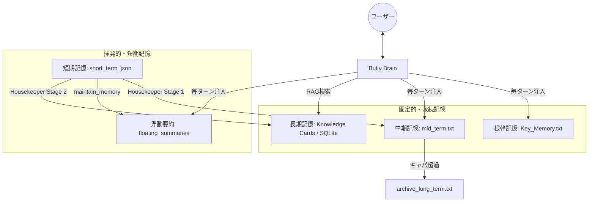

# Butly 記憶構造解説資料

このドキュメントでは、本プロジェクトにおけるAIの記憶管理システムについて、その構造、記録・参照フロー、およびナレッジ化の仕組みを解説します。

---

## 1. 記憶構造の全体像

本プロジェクトでは、記憶の鮮度や重要度に応じて以下の **5つの層** で記憶を管理しています。

| 層 | 名称 | 保存形式 | 内容 | 参照のタイミング |
| :--- | :--- | :--- | :--- | :--- |
| **1** | **短期記憶** | JSON | 直近数ターンの会話ログ。 | 履歴としてそのまま渡す。 |
| **2** | **浮動要約** | TXT | 短期記憶から溢れた直近の会話の要約。 | 常にシステムプロンプトに注入。 |
| **3** | **中期記憶** | TXT | 過去の重要なやり取りの要約・蓄積。 | 常にシステムプロンプトに注入。 |
| **4** | **長期記憶** | SQLite | 過去の全対話から抽出された「知識カード」。 | 必要に応じてRAG検索。 |
| **5** | **根幹記憶** | TXT | ユーザー名やAIの性格、不変のルール。 | 常にシステムプロンプトに注入。 |

---

## 2. 会話の記録方法

会話は以下のプロセスを経て、段階的に「記憶」として固定されていきます。

### ① 即時記録（短期記憶）
会話が発生するたびに、`short_term_json/` フォルダ内に `session_YYYYMMDD_HHMMSS.json` 形式で1ターンずつのペアが保存されます。

### ② あふれた会話の救済（浮動要約）
会話数（`short_term_limit`）を超えると、古い順にAIが要約を行い、`floating_summaries/` フォルダに個別テキストとして保存されます。これにより、整理（Housekeeper実行）前であっても文脈を失わずに会話を継続できます。

### ③ 定期的な統合（中期記憶）
Housekeeperの実行により、`short_term_json` の生ログが一本のテキスト形式に整形され、`mid_term.txt` の末尾に追記されます。

---

## 3. 記憶の参照方法

AIが応答を生成する際、以下の順序で記憶を自身の文脈（コンテキスト）に取り込みます。

### A. システムプロンプトへの注入（システム命令としての連結）
AIに情報を渡す際、短期記憶（直近の対話履歴）以外の情報はすべて **「システム命令（system_instruction）」の一部として一つの長いテキストに連結** され、階層構造を成して渡されます。

各セクションは `=== 名称 ===` というヘッダーで区切られ、Gatekeeper（前頭葉）が判断した現在の思考モード（Tier）に応じて動的に構成が変化します。以下がAIから見たときの実際の注入順序です。

| 注入順 | セクション名 | 内容のソース | 注入される条件 (Tier) |
| :--- | :--- | :--- | :--- |
| **1** | **SYSTEM INSTRUCTION** | `system_instruction.txt` (性格設定・口調) | 全て (reflex / mid / cortex) |
| **2** | **KEY MEMORY** | `Key_Memory.txt` (ユーザー名、基本事実) | 全て |
| **3** | **MID-TERM MEMORY** | `mid_term.txt` (過去の重要な蓄積) | **mid** 以上 |
| **4** | **CURRENT TIME** | 現在の日付と時刻 | 全て |
| **5** | **FLOATING SUMMARY** | `floating_summaries/` (直近の未整理要約) | 全て |
| **6** | **LONG-TERM MEMORY** | SQLite DBからのRAG検索結果 | **cortex** のみ |
| **7** | **TIER INFO** | 現在の思考モード（デバッグ・認識用） | 全て |

**特記事項:**
- **短期記憶の扱い**: `short_term_json` にある直近の会話履歴はシステム命令ではなく、AIの「発言履歴（History）」として別枠で渡されます。これによりAIは自身の直前の発言を正確に把握できます。
- **RAGの配置**: RAG（長期記憶の検索結果）は最後に注入されます。プロンプトの末尾に近いほどAIの注意を引きやすいため、「最新の参考資料」として強く機能します。

### B. RAG（検索による参照）
ユーザーの最新の発言から **キーワード** を抽出し、長期記憶（SQLite DB）に対して以下のハイブリッド検索を行います。
1. **キーワードマッチ**: タイトルやサマリーからキーワードを含むものを絞り込み。
2. **ベクトル検索**: キーワードでヒットしない場合も、意味的な類似度（Cosine Similarity）で検索。
3. **時間減衰フィルタ**: 新しい情報を優先し、古い情報のスコアを減衰させる。
4. **アーカイブ・ペナルティ**: 「アーカイブ済み」とされたカードの優先度を下げる。

---

## 4. 長期記憶のナレッジ化（Housekeeper）

Housekeeperは、生ログを単なるテキストとしてではなく、再利用可能な「知識」へと昇華させます（Stage 2）。

### ナレッジ化のフロー
1. **日付ごとの統合**: `1_integrated` フォルダにある1日分の全ログをAIが読み込みます。
2. **知識抽出（Extraction）**: AIがその日の対話を分析し、記録に値する重要なトピックを抽出します。
3. **カテゴリ分類**: 下記のデータ構造に従ってカード化します。
4. **ベクトル化（Embedding）**: 検索を可能にするため、カードの内容をベクトルデータに変換します。
5. **保存と移動**: SQLiteデータベースに保存し、元の生ログは `2_knowledgeized` フォルダへ移動します。

---

## 5. ナレッジ（知識カード）の構造

長期記憶に保存される「ナレッジカード」は以下の構造を持っています。

| 項目 | 内容 | 用途 |
| :--- | :--- | :--- |
| **ID** | `master_20260301_001` 等 | ユニークな識別子。 |
| **Type** | インスタンス名 | どのAIインスタンスの記憶か。 |
| **Category** | UserPreference, Project, Task 等 | 情報の種類。 |
| **Title** | 「〇〇駅周辺のおすすめカフェ」等 | 検索およびAIの理解用。 |
| **Summary** | 内容を凝縮した短い要約。 | RAG検索の主な対象。 |
| **Episode** | 詳細な経緯や具体的なエピソード。 | AIに応答時に提供する補足情報。 |
| **Importance (AI)** | 0〜10 の数値 | AIが判断した情報の重要度（検索優先度に影響）。 |
| **Importance (Hum)** | 0〜10 の数値 | ユーザーにとっての価値や感情的な重み付け。 |
| **Tags** | 関連ワード。 | 検索の補助。 |
| **Embedding** | コンテンツのベクトル表現（BLOB）。 | セマンティック検索に使用。 |
| **Pinned** | ピン留めフラグ。 | 常に検索結果の上位に含める。 |
| **Archived** | アーカイブフラグ。 | 常に検索結果の下位に含める。 |